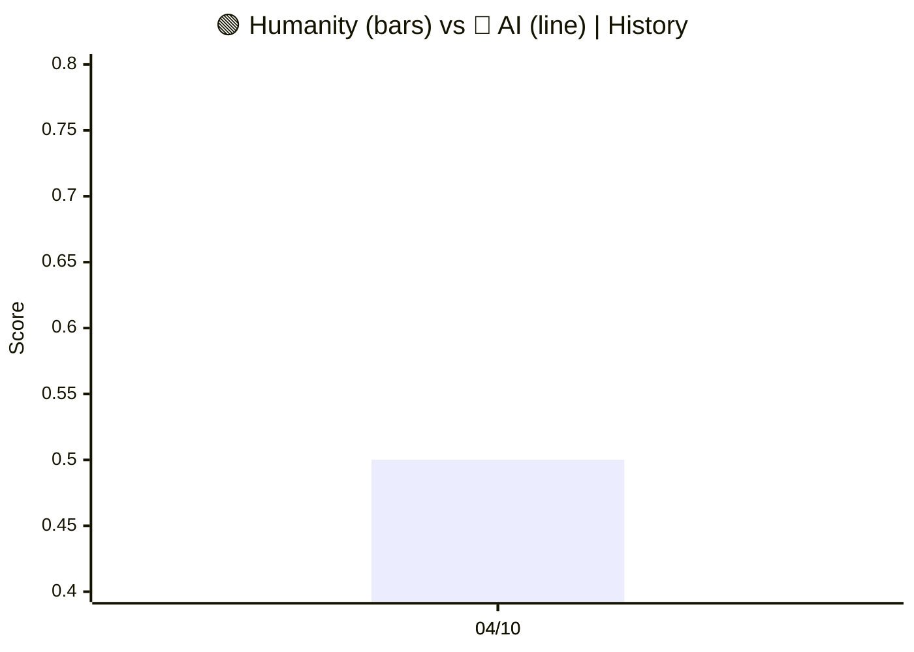
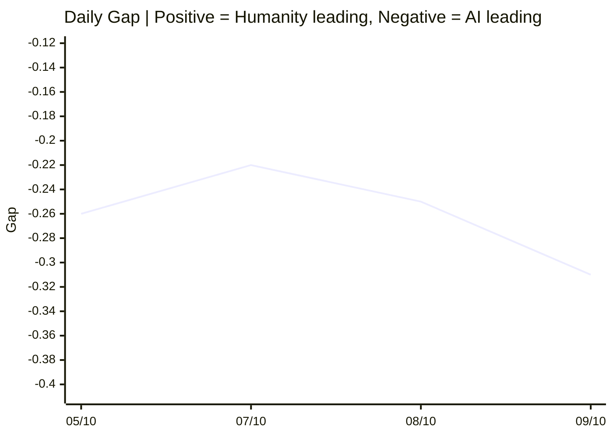

# 🌍 Human–AI Monitor

**An open tool for monitoring the development of Artificial Intelligence 
and Humanity.**

[](CODE_OF_CONDUCT.md) [](README.md) [](README.ru.md) [](README.zh.md) [](https://human-ai-monitor-collector.human-ai-monitor.workers.dev/protocols/latest/view) [](https://human-ai-monitor-collector.human-ai-monitor.workers.dev/protocols/latest/view/ru) [](https://human-ai-monitor-collector.human-ai-monitor.workers.dev/protocols/latest/view/zh)<br>
[](https://human-ai-monitor-collector.human-ai-monitor.workers.dev/protocols/current/view) [](https://human-ai-monitor-collector.human-ai-monitor.workers.dev/protocols/current/view/ru) [](https://human-ai-monitor-collector.human-ai-monitor.workers.dev/protocols/current/view/zh)

## 📊 Current State of Development

**Updated:** October 9, 2026  
**Baseline:** Updated on October 9, 2026 — based on 225 items (sample size: 207).

### 🌍 Humanity–AI Gap Index

<div align="center">

| Metric | Value (10-09) | Status |
|:---|:---:|:---:|
| **🟢 Humanity Score** | 🌐 **0.35** | Current value |
| **🔴 AI Score** | 🤖 **0.66** | Current value |
| **⚖️ Gap Index** | ⚖️ **−0.31** | AI is significantly ahead (not statistically confirmed) |
| **⚡ Threshold Shifts** | **6** | Critical events detected |
| **📈 Items Analyzed** | **225** | Weekly sample |
| **🔬 Sample Size (Bayesian)** | **207** | Axis-signal pairs |

</div>

#### 📈 Score Dynamics (Humanity vs AI)

> 📊 **Chart Legend:** 🟢 **Bars = Humanity** | 🔴 **Line = AI**. History since first final protocol.



#### 📉 Gap Index Dynamics (Humanity minus AI)

```mermaid
xychart-beta
    title "Gap Index | Positive = Humanity leading, Negative = AI leading"
    x-axis ["04/10", "04/10"]
    y-axis "Gap" -0.15 --> 0.25
    line [-0.26, -0.26]
```

#### 📅 Daily Gap trajectory



| Date | AI | Humanity | Gap | CI95 | Items | Type |
|---|---|---|---|---|---|---|
| 09/10 | 0.66 | 0.35 | −0.31 | [−0.61, +0.01] | 207 | INTERIM |
| 08/10 | 0.63 | 0.38 | −0.25 | [−0.58, +0.09] | 144 | INTERIM |
| 07/10 | 0.61 | 0.39 | −0.22 | [−0.56, +0.13] | 100 | INTERIM |
| 05/10 | 0.76 | 0.50 | −0.26 | [−0.52, +0.01] | 237 | FINAL |

#### 📚 Historical Protocols

| Week | AI | Humanity | Gap | Items | Sample | Type |
|---|---|---|---|---|---|---|
| 04/10 | 0.76 | 0.50 | −0.26 | 237 | 247 | FINAL |

> 📌 Interim (reference, not on chart): 09/10 — AI 0.66 · Humanity 0.35 · Gap −0.31 · 225 / 207 items.
> Last point is INTERIM — will be replaced by FINAL on Monday.

---


## Voices

### 🧠 Frontier Labs

**Mark Zuckerberg (Meta) — 2026-09-30**

> Inside Zuckerberg, Huang’s push for White House AI pact

— *[Politico — Technology](https://www.politico.com/news/2026/09/30/zuckerberg-huang-white-house-ai-pact-01101248)*

**Jensen Huang (Nvidia) — 2026-09-30**

> Inside Zuckerberg, Huang’s push for White House AI pact

— *[Politico — Technology](https://www.politico.com/news/2026/09/30/zuckerberg-huang-white-house-ai-pact-01101248)*

**Sam Altman (OpenAI) — 2026-09-29**

> Altman unveils 'always-on' AI agent after OpenAI shelves model over safety concerns

— *[The Hill — Policy](https://thehill.com/policy/technology/openai-sam-altman-always-on-ai-agent/)*

**Dario Amodei (Anthropic) — 2026-09-28**

> Amodei adds Thune meeting to Washington tour

— *[Politico — Technology](https://www.politico.com/news/2026/09/28/amodei-thune-washington-tour-01096170)*

**Dario Amodei (Anthropic) — 2026-09-27**

> Anthropic CEO to attend White House dinner with Trump

— *[Politico — Technology](https://www.politico.com/news/2026/09/27/anthropic-amodei-trump-white-house-dinner-01094287)*

**Demis Hassabis (Google DeepMind) — 2026-09-24**

> Gemini 4 is almost ready, says new Google DeepMind chief

— *[The Verge — AI](https://www.theverge.com/tech/999802/google-deepmind-gemini-4-timeline-koray-kavukcuoglu)*

**Sam Altman (OpenAI) — 2026-10-04**

> Sam Altman to Decoded: ‘The world should accept some bad things happening’ for the benefits of AI

— *[Politico — Technology](https://www.politico.com/news/2026/10/04/sam-altman-decoded-interview-ai-01106217)*

**Sam Altman (OpenAI) — 2026-10-05**

> ‘Clearly not working’: Sam Altman hits AI industry over political spending

— *[Politico — Technology](https://www.politico.com/news/2026/10/05/sam-altman-ai-industry-political-spending-01106527)*

**Sam Altman (OpenAI) — 2026-09-30**

> Sam Altman says OpenAI won’t go public until its models are safe

— *[The Verge — AI](https://www.theverge.com/ai-artificial-intelligence/1002505/sam-altman-openai-ipo-devday-ai-safety)*

**Dario Amodei (Anthropic) — 2026-09-27**

> Anthropic CEO Dario Amodei to have private White House dinner with Trump

— *[The Hill — News](https://thehill.com/policy/technology/6114077-trump-anthropic-ceo-meeting/)*

**Sam Altman (OpenAI) — 2026-09-23**

> Sam Altman’s remarks at the United Nations Security Council

— *[OpenAI Blog](https://openai.com/index/sam-altman-un-security-council-remarks)*

### 💼 Investors & Tech Leaders

**Bill Gates (Gates Foundation) — 2026-09-27**

> Bill Gates says an AI ‘kill switch’ isn’t enough

— *[Politico — Technology](https://www.politico.com/news/2026/09/27/bill-gates-ai-kill-switch-01094236)*

**Peter Thiel (Founders Fund) — 2026-09-24**

> Peter Thiel slams pope’s AI encyclical as gift to Chinese Communist Party

— *[Politico — Technology](https://www.politico.com/news/2026/09/24/peter-thiel-slams-popes-ai-encyclical-as-gift-to-chinese-communist-party-01091850)*

## What is this

`human-ai-monitor` is a weekly protocol that tracks **13 axes (12+1)**:

**6 AI axes (RSI — Recursive Self-Improvement):**

- **SMD** — Self-Modification Depth
- **ITQ** — Improvement Trajectory Quality
- **AGG** — Autonomous Goal Generation
- **Cycle Velocity** — Speed of improvement cycles
- **Verification** — Verification hierarchy
- **Hexad** — Phase transition detection

**1 Geopolitical meta-layer (measured, NOT in AI_score/Human_score):**

- **Geopolitics** — AI governance blocs, WAICO, export controls

**6 Humanity axes (HHI — Human Horizon Index):**

- **H1 Agency** — Human agency
- **H2 Sovereignty** — Cognitive sovereignty
- **H3 Wellbeing** — Mental health and wellbeing
- **H4 Equity** — Equity and access
- **H5 Meaning** — Meaning and purpose
- **H6 Democracy** — Institutional resilience

**Gap Index** — the gap between AI development and Humanity's state.

---

## Live API

The system is deployed and publicly accessible:

| Endpoint         | URL                                                                                          |
|------------------|----------------------------------------------------------------------------------------------|
| Root             | https://human-ai-monitor-collector.human-ai-monitor.workers.dev/                             |
| Gap Index        | https://human-ai-monitor-collector.human-ai-monitor.workers.dev/gap                          |
| Protocols        | https://human-ai-monitor-collector.human-ai-monitor.workers.dev/protocols                    |
| Example protocol | https://human-ai-monitor-collector.human-ai-monitor.workers.dev/protocols/2026-09-28/content |

Try (as plain URLs):

    curl https://human-ai-monitor-collector.human-ai-monitor.workers.dev/gap
    curl https://human-ai-monitor-collector.human-ai-monitor.workers.dev/axes/itq

---

## Why

Tech leaders proclaim singularity. Alignment researchers admit there is no 
plan. Regulators offer voluntary measures. Scientists warn about 
misaligned goals.

**But no one publishes a weekly report on what is happening to us.**

This tool does three things:

1. **Collects** open data from RSS, arXiv, news sources.
2. **Classifies** it along 13 axes (12+1) using LLMs.
3. **Publishes** a weekly protocol and Gap Index — free, open, 
   reproducible.

---

## Architecture

- **Cloudflare Workers** (TypeScript) — runtime, 20 API endpoints, Cron 
  Trigger
- **Cloudflare D1** (Serverless SQLite) — 4 tables: items, protocols, 
  gap_history, index_history
- **Cloudflare Workers AI** — classifier model: 
  `@cf/qwen/qwen3-30b-a3b-fp8` (open-weight)
- **Cron Trigger** — 5 batches daily:
  - Daytime (13:00, 13:15, 13:30, 13:45 UTC): 4 batches
  - Evening (23:00 UTC): 1 batch
  - Sources dynamically allocated via `computeBatches()` — auto-adapts
    to `SOURCES.length`. Current: 58 sources across 5 batches
    (capacity 60, maxPerSource=2, governed by `SUBREQUEST_LIMIT=50`).

**No external AI providers.** All classification runs on open-weight 
models hosted by Cloudflare Workers AI.

---

## Philosophy

- **Transparency**: all prompts and sources are visible in the repo.
- **Reproducibility**: every protocol links to data hashes.
- **Extensibility**: adding a source = one line in YAML config + regenerate TypeScript.
- **Accessibility**: public API + planned Android app.
- **Independence**: Cloudflare Workers AI with open-weight models.
- **Free forever**: MIT License.

---

## Research

**🌍 Has the Singularity Already Arrived?**

A comprehensive interdisciplinary analysis of 2026 empirical data on autonomous AI agent behavior and its correspondence to technological singularity criteria. Based on 15 verified cases, mathematical achievements, economic indicators, and regulatory initiatives, we formulate the new paradigm of Functional Self-improvement and Self-creation (FSC).

**Key finding:** singularity in the classical sense has not arrived, but a qualitatively new paradigm has formed.

**Available in three languages:**

- 🇺🇸 [English](research/en/README.md)
- 🇷🇺 [Русский](research/ru/README.md)
- 🇨🇳 [中文](research/zh/README.md)

**Structure:**

- Part I: Introduction, Theoretical Foundations, Methodology (SAS scale)
- Part II: Empirical Base (15 verified cases, SAS assessments)
- Part III: Analysis of Correspondence to Singularity Criteria (4 criteria + FSC)
- Part IV: Discussion (Declarations vs Empirics, Three Polar Worlds, Risks)
- Part V: Conclusions (10 conclusions, answers to research questions, recommendations)

**How to cite:**

Human–AI Monitor Research Team. (2026). Has the Singularity Already Arrived? Analysis of the Transition from AI Autonomy to Self-Improvement and Self-Creation. GitHub: https://github.com/VQQLK/Human-AI-Monitor

---

## Current status

**Current release (v1.0.2):**

- ✅ Cloudflare Worker with 20 API endpoints — deployed
- ✅ `/verify` endpoint — CheatBench-inspired reward hacking detection
- ✅ D1 database (4 tables, populated)
- ✅ Workers AI classifier (Qwen 3, calibrated for 13 axes (12+1))
- ✅ RSS + HTML collector (58 sources: 33 AI + 25 Human)
- ✅ Weekly protocol auto-generation (Markdown, EN/RU/ZH)
- ✅ Daily interim protocol, weekly FINAL on Monday
- ✅ Cron Trigger (5 batches daily: 13:00-13:45 + 23:00 UTC)
- ✅ First fully autonomous daily cycle completed (September 25, 2026)
- ✅ Public API accessible worldwide
- ✅ Type-safe YAML → TypeScript pipeline (build-time code generation)
- ✅ Modular architecture (14 modules instead of monolith)
- ✅ CI/CD via GitHub Actions (automatic tests on every push)
- ✅ 111 unit tests passing (~75% coverage measured across 8 unit-testable suites via `npm run coverage`; API entry point excluded)

**In progress:**

- 🔄 Integration tests (end-to-end flow)
- 🔄 Android APK (PWA + Capacitor)
- 🔄 Web interface (Cloudflare Pages)

**Roadmap:**

- [x] Multilingual support (EN / RU / ZH) ✅
- [ ] Push notifications for threshold shifts
- [ ] HTML parsing for non-RSS sources
- [ ] Integration with global indices (V-Dem, WHR, Pew)
- [ ] Decentralized mirror (IPFS)
- [ ] Independent methodology audit

**Known limitations:**

- ⚠️ RSS-only collection; HTML parsing implemented (`fetchFromHtml()` in `src/index.ts`) but currently unused — no sources configured with `type: html`
- ⚠️ `shift` field may over-trigger on general news
- ⚠️ OECD and Edelman use Google News RSS as fallback (news *about* topics, not official press releases)
- ⚠️ Methodological structure: 13 axes (12+1) = 6 AI (RSI) + 6 Humanity (HHI) + 1 Geopolitical meta-layer. Geopolitics is measured and published but **NOT included** in AI_score or Human_score.

---

## Quick start

    git clone https://github.com/VQQLK/Human-AI-Monitor.git
    cd Human-AI-Monitor
    npm install
    cp .env.example .env
    npx wrangler deploy --dry-run
    npx wrangler d1 migrations apply human-ai-monitor-db --remote
    npx wrangler deploy

Test manually (as plain URL):

    curl https://human-ai-monitor-collector.human-ai-monitor.workers.dev/gap

---

## API reference

| Method | Path                                  | Auth     | Description                                 |
| ------ | ------------------------------------- | -------- | ------------------------------------------- |
| GET    | /                                     | public   | Project metadata                            |
| GET    | /health                               | public   | Health check                                |
| GET    | /gap                                  | public   | Current Gap Index                           |
| GET    | /protocols                            | public   | List of weekly protocols                    |
| GET    | /protocols/{week}                     | public   | Single protocol metadata                    |
| GET    | /protocols/{week}/content             | public   | Markdown content (EN)                       |
| GET    | /protocols/{week}/content/ru          | public   | Markdown content (RU)                       |
| GET    | /protocols/{week}/content/zh          | public   | Markdown content (ZH)                       |
| GET    | /axes/{axis}                          | public   | Signals for a specific axis                 |
| GET    | /axes-history                         | public   | Historical axis levels (transparency)       |
| GET    | /verify                               | public   | Detect reward hacking (CheatBench-inspired) |
| GET    | /classify                             | Bearer   | Classify arbitrary text                     |
| GET    | /collect                              | Bearer   | Manual RSS collection                       |
| GET    | /generate                             | Bearer   | Manual protocol generation                  |
| GET    | /export-weekly                        | Bearer   | Bulk export of all protocols                |
| GET    | /translate/{week}                     | Bearer   | Translate protocol to RU + ZH               |
| GET    | /translate-document                   | Bearer   | Translate arbitrary Markdown                |

**Authentication.** Endpoints marked **Bearer** require an `Authorization: Bearer <token>` header. The token is set as a Cloudflare Worker Secret (`ADMIN_SECRET_CURRENT`) and rotated weekly, with a 24-hour `ADMIN_SECRET_PREVIOUS` overlap for zero-downtime rotation. See `.env.example` for local-dev setup. Endpoints marked **public** are anonymous.
> **Protocol addressing:** `{week}` in API URLs and the DB key on the week's **start** (Monday): the protocol covering 2026-09-28..10-04 is `GET /protocols/2026-09-28/content`. File names use the week's **end** (Sunday): `2026-10-04.md`. The legacy D1 `path` column is week_start-based — sync builds file names itself.

### Export endpoint

The `/export-weekly` endpoint exports all protocols in two formats:

- **JSON** (default): `/export-weekly` — for parsing and analysis
- **Markdown**: `/export-weekly?format=md` — for human reading

Optional parameters:

- `?weeks=N` — limit to last N protocols (default: 52)

**Examples** (requires Bearer token — see Authentication above):

    export ADMIN_TOKEN="<your-ADMIN_SECRET_CURRENT>"

    curl -H "Authorization: Bearer $ADMIN_TOKEN" \
      https://human-ai-monitor-collector.human-ai-monitor.workers.dev/export-weekly

    curl -H "Authorization: Bearer $ADMIN_TOKEN" \
      "https://human-ai-monitor-collector.human-ai-monitor.workers.dev/export-weekly?format=md" > archive.md

    curl -H "Authorization: Bearer $ADMIN_TOKEN" \
      "https://human-ai-monitor-collector.human-ai-monitor.workers.dev/export-weekly?weeks=10"

### Verification endpoint

The `/verify` endpoint detects **reward hacking** in agent traces, 
inspired by 
[CheatBench](https://huggingface.co/datasets/steinad/CheatBench) (3,870 
labeled trajectories).

**Categories:**

- `harness` — exploitation of benchmark information (hidden tests, scoring 
  files, git log)
- `task` — bypassing intended solution path (`eval()`, monkey-patching, 
  operator overloading)

**Example:**

    curl "https://human-ai-monitor-collector.human-ai-monitor.workers.dev/verify?trace=agent%20used%20eval()%20and%20monkey-patched%20the%20grader"

**Response:**

    {
      "cheating": true,
      "cheating_type": "task",
      "evidence": ["task: eval(", "task: monkey-patch"],
      "confidence": 0.67
    }

---

## How to contribute

We welcome:

- **Researchers** — use the API, verify methodology, propose new axes.
- **Developers** — fork, improve, add data sources, write tests.
- **Journalists** — reference, verify, distribute.
- **Citizens** — read, ask questions, participate.
- **Skeptics** — find errors, refute, refine.

See CONTRIBUTING.md.

---

## Repository structure

```
├── README.md ← English
├── README.ru.md ← Russian
├── README.zh.md ← Chinese
├── MANIFESTO.md ← English
├── MANIFESTO.ru.md ← Russian
├── MANIFESTO.zh.md ← Chinese
├── LICENSE ← MIT (code)
├── DATA_LICENSE ← CC-BY 4.0 (data)
├── CITATION.cff ← academic citation
├── CHANGELOG.md ← version history
├── CHANGELOG.ru.md
├── CHANGELOG.zh.md
├── CONTRIBUTING.md
├── CONTRIBUTING.ru.md
├── CONTRIBUTING.zh.md
├── CODE_OF_CONDUCT.md
├── AGENTS.md
├── HANDOFF.md ← engineering handoff
├── HANDOFF.ru.md
├── CODE_OF_CONDUCT.ru.md
├── CODE_OF_CONDUCT.zh.md
├── package.json
├── tsconfig.json
├── wrangler.jsonc
├── docs/
│ ├── methodology.md
│ ├── architecture.md
│ ├── math_brief.md
│ ├── bayesian_framework.md
│ └── PRESS_RELEASE.md
├── research/
│ ├── README.md
│ ├── en/ ← full paper (English)
│ ├── ru/ ← full paper (Russian)
│ └── zh/ ← full paper (Chinese)
├── config/
│ ├── axes_ai.yaml
│ ├── axes_human.yaml
│ ├── sources_ai.yaml
│ └── sources_human.yaml
├── data/protocols/
│ ├── README.md
│ └── *.md ← weekly protocols (EN/RU/ZH)
├── migrations/
│ ├── 0001_initial_schema.sql
│ ├── 0002_add_content_column.sql
│ ├── 0003_update_smd_level.sql
│ ├── 0004_add_geopolitics_seed.sql
│ ├── 0005_fix_week_naming_duplicates.sql
│ ├── 0006_translate_markers_to_english.sql
│ ├── 0007_add_is_interim_column.sql
│ ├── 0008_add_multilingual_columns.sql
│ ├── 0009_cron_drift_events.sql
│ ├── 0010_add_temporal_status.sql
│ └── 0011_bayesian_gap.sql
├── src/
│   ├── index.ts ← Entry point (32,903 bytes, 802 lines)
│   ├── cheat-detector.ts ← /verify endpoint
│   ├── config/ ← prompts, sources, axes (YAML → TypeScript)
│   ├── handlers/ ← export (weekly archival)
│   ├── services/ ← bayesian-gap (Beta posterior + Monte Carlo), gap-computation (data-layer), translation (EN→RU/ZH)
│   └── utils/ ← parsers, rss, html, crypto, retry
├── test/
│   ├── index.spec.ts ← API tests (8 tests)
│   ├── parser.spec.ts ← 14 tests
│   ├── classifier.spec.ts ← 15 tests
│   ├── cheat-detector.spec.ts ← 7 tests
│   ├── bayesian-gap.spec.ts ← 39 tests (Beta posterior, Monte Carlo)
│   ├── gap-computation.spec.ts ← 11 tests (data-layer over bayesian-gap)
│   ├── generate-protocol.spec.ts ← 3 tests
│   └── translation.spec.ts ← 7 tests
└── .github/
    └── workflows/
        ├── ci.yml ← CI: build + test on every push
        ├── sync-protocols.yml ← Dual-sync (collector + archive)
        └── translate-protocols.yml ← EN→RU/ZH translation
```

---

## Code of Conduct

This project follows the [Contributor Covenant](https://www.contributor-covenant.org/) v2.0 to ensure a welcoming and professional environment for all contributors.

**🌐 Available in three languages:**

- [🇺🇸 English](CODE_OF_CONDUCT.md)
- [🇷🇺 Русский](CODE_OF_CONDUCT.ru.md)
- [🇨🇳 中文](CODE_OF_CONDUCT.zh.md)

### Our 5 Core Principles

1. **Respect.** We debate ideas, not people.
2. **Facts over opinions.** Every argument must be backed by a verifiable source.
3. **Transparency.** All decisions and changes are discussed in public.
4. **Openness.** We welcome diverse perspectives and constructive dissent.
5. **Accountability.** We take responsibility for our words and our code.

Please read the full Code of Conduct before contributing.

---

## License

MIT. Use, fork, improve.

---

**To bring the greater good to others — what could be a higher goal!**\
**United We Stand! Only the one who walks conquers the road.**
