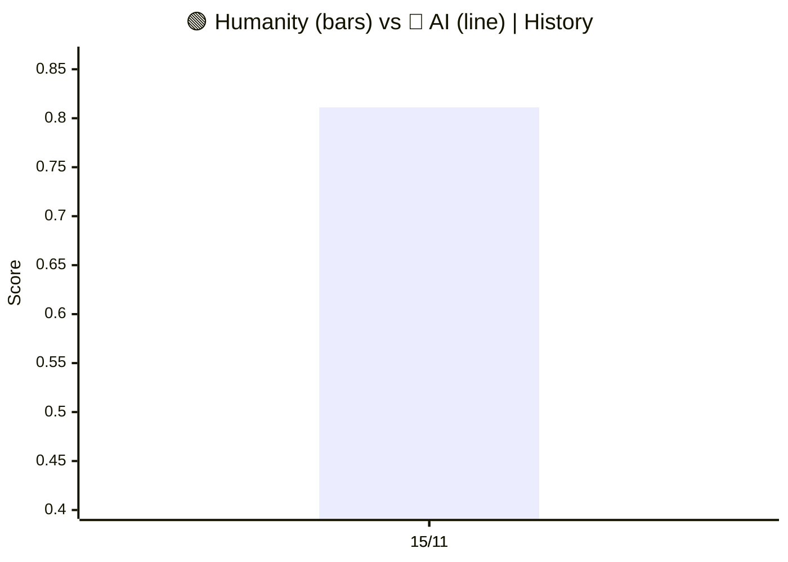
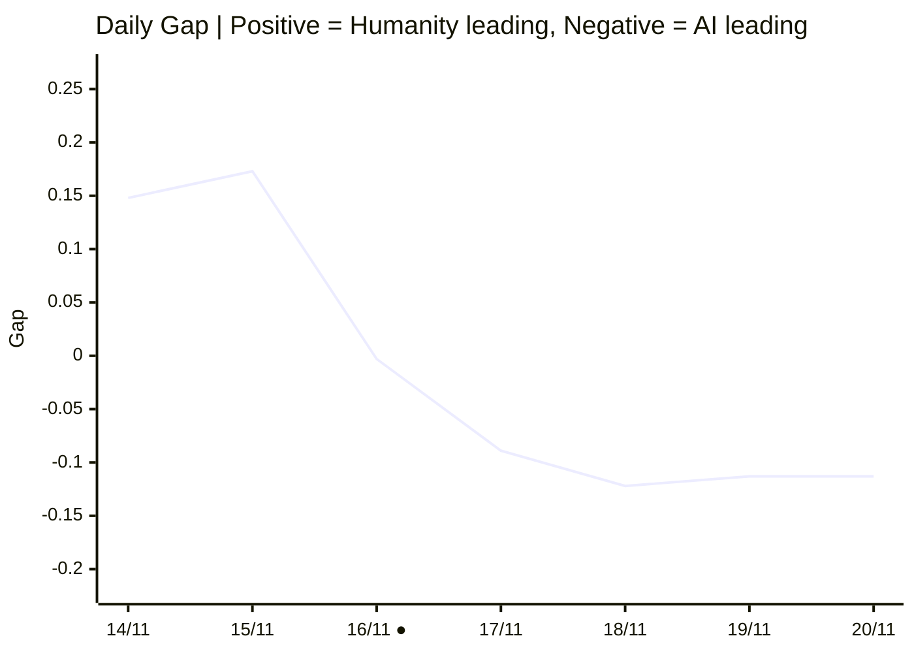

# 🌍 Human–AI Monitor

**An open tool for monitoring the development of Artificial Intelligence 
and Humanity.**

[](CODE_OF_CONDUCT.md) [](README.md) [](README.ru.md) [](README.zh.md) [](https://human-ai-monitor-collector.human-ai-monitor.workers.dev/protocols/latest/view) [](https://human-ai-monitor-collector.human-ai-monitor.workers.dev/protocols/latest/view/ru) [](https://human-ai-monitor-collector.human-ai-monitor.workers.dev/protocols/latest/view/zh)<br>
[](https://human-ai-monitor-collector.human-ai-monitor.workers.dev/protocols/current/view) [](https://human-ai-monitor-collector.human-ai-monitor.workers.dev/protocols/current/view/ru) [](https://human-ai-monitor-collector.human-ai-monitor.workers.dev/protocols/current/view/zh)

## 📊 Current State of Development

**Updated:** November 20, 2026  
**Baseline:** Updated on November 20, 2026 — based on 603 items (sample size: 422).

### 🌍 Human–AI Gap Index (Achievements vs Progress)

<div align="center">

| Metric | Value (11-20) | Status |
|:---|:---:|:---:|
| **🟢 Humanity Score** | 🌐 **0.718** | Current value |
| **🔴 AI Score** | 🤖 **0.831** | Current value |
| **⚖️ Gap Index** | ⚖️ **−0.113** | AI is ahead |
| **📊 CI95** | **[−0.314, +0.165]** | Inconclusive |
| **⚡ Threshold Shifts** | **10** | Critical events detected |
| **📈 Items Analyzed** | **603** | Weekly sample |
| **🔬 Sample Size (Bayesian)** | **422** | Axis-signal pairs |

</div>

#### 📈 Score Dynamics (Humanity vs AI)

> 📊 **Chart Legend:** 🟢 **Bars = Humanity** | 🔴 **Line = AI**. History since first final protocol.


```mermaid
xychart-beta
    title "🟢 Humanity (bars) vs 🔴 AI (line) | History"
    x-axis ["15/11", "15/11"]
    y-axis "Score" 0.400 --> 0.864
    bar [0.811, 0.811]
    line [0.814, 0.814]
```

#### 📉 Gap Index Dynamics (Humanity minus AI)

```mermaid
xychart-beta
    title "Gap Index | Positive = Humanity leading, Negative = AI leading"
    x-axis ["15/11", "15/11"]
    y-axis "Gap" -0.150 --> 0.250
    line [-0.003, -0.003]
```

#### 📅 Daily Gap trajectory


```mermaid
xychart-beta
    title "Daily Gap | Positive = Humanity leading, Negative = AI leading"
    x-axis ["14/11", "15/11", "16/11 ●", "17/11", "18/11", "19/11", "20/11"]
    y-axis "Gap" -0.222 --> 0.273
    line [0.148, 0.173, -0.003, -0.089, -0.122, -0.113, -0.113]
```

> ● = weekly FINAL (closed week); other points — INTERIM accumulation. A week change between adjacent dates is not a daily move.

| Date | Week | AI | Humanity | Gap | CI95 | Items | Sample | Type |
|---|---|---|---|---|---|---|---|---|
| 20/11 | 16/11–22/11 | 0.831 | 0.718 | −0.113 | [−0.314, +0.165] | 603 | 422 | INTERIM |
| 19/11 | 16/11–22/11 | 0.831 | 0.718 | −0.113 | [−0.314, +0.165] | 603 | 422 | INTERIM |
| 18/11 | 16/11–22/11 | 0.811 | 0.689 | −0.122 | [−0.348, +0.171] | 453 | 323 | INTERIM |
| 17/11 | 16/11–22/11 | 0.753 | 0.664 | −0.089 | [−0.378, +0.257] | 296 | 221 | INTERIM |
| 16/11 | 09/11–15/11 | 0.814 | 0.811 | −0.003 | [−0.219, +0.363] | 892 | 652 | FINAL ● |
| 15/11 | 09/11–15/11 | 0.647 | 0.820 | +0.173 | [−0.119, +0.481] | 868 | 637 | INTERIM |
| 14/11 | 09/11–15/11 | 0.682 | 0.830 | +0.148 | [−0.131, +0.426] | 802 | 691 | INTERIM |

#### 📚 Historical Protocols

| Week | AI | Humanity | Gap | CI95 | Items | Sample | Type |
|---|---|---|---|---|---|---|---|
| 15/11 | 0.814 | 0.811 | −0.003 | [−0.219, +0.363] | 889 | 652 | FINAL |

> 📌 Interim (reference, not on chart): 20/11 — AI 0.831 · Humanity 0.718 · Gap −0.113 · 603 / 422 items.
> Last point is INTERIM — will be replaced by FINAL on Monday.

---


## Voices

### 🧠 Frontier Labs

**Nvidia — 2026-11-19**

> Nvidia Is the Central Bank to AI’s Circular Economy. See Where the Money Goes.

— *[WSJ — Tech](https://www.wsj.com/finance/stocks/nvidia-is-the-central-bank-to-ais-circular-economy-see-where-the-money-goes-da480b61?mod=rss_Technology)*

**OpenAI — 2026-11-19**

> Anthropic vs. OpenAI: The Financial Metrics Behind the AI Battle

— *[WSJ — Tech](https://www.wsj.com/tech/ai/anthropic-vs-openai-the-financial-metrics-behind-the-ai-battle-4f5b90c0?mod=rss_Technology)*

**Jensen Huang (Nvidia) — 2026-11-19**

> Uber Co-Founder Kalanick Teases Protest at Nvidia as Calls for Huang’s Return Continue

— *[WSJ — Tech](https://www.wsj.com/tech/ai/uber-co-founder-kalanick-teases-protest-at-nvidia-as-calls-for-huangs-return-continue-37c4f635?mod=rss_Technology)*

**Jensen Huang (Nvidia) — 2026-11-19**

> The Morning Risk Report: The Jensen Huang Saga Has Reinvigorated Washington’s China Hawks

— *[WSJ — Tech](https://www.wsj.com/risk-compliance-journal/the-morning-risk-report-the-jensen-huang-saga-has-reinvigorated-washingtons-china-hawks-00536beb?mod=rss_Technology)*

**Nvidia — 2026-11-18**

> Nvidia created a weird bit of intrigue by not filing a routine SEC report

— *[TechCrunch AI](https://techcrunch.com/2026/11/18/nvidia-created-a-weird-bit-of-intrigue-by-not-filing-a-routine-sec-report/)*

**Satya Nadella (Microsoft) — 2026-11-18**

> Microsoft CEO Satya Nadella remains confident in Nvidia after Huang’s exit

— *[TechCrunch AI](https://techcrunch.com/2026/11/18/microsoft-ceo-satya-nadella-remains-confident-in-nvidia-after-huangs-exit/)*

**Satya Nadella (Microsoft) — 2026-11-18**

> Satya Nadella predicts AI agents will reshuffle the economics of the web

— *[TechCrunch AI](https://techcrunch.com/2026/11/18/satya-nadella-predicts-ai-agents-will-reshuffle-the-economics-of-the-web/)*

**Jensen Huang (Nvidia) — 2026-11-18**

> Microsoft CEO Satya Nadella remains confident in Nvidia after Huang’s exit

— *[TechCrunch AI](https://techcrunch.com/2026/11/18/microsoft-ceo-satya-nadella-remains-confident-in-nvidia-after-huangs-exit/)*

**Satya Nadella (Microsoft) — 2026-11-19**

> Microsoft CEO Satya Nadella explains why he asked 60K employees to quit

— *[TechCrunch AI](https://techcrunch.com/2026/11/18/microsoft-ceo-satya-nadella-explains-why-he-asked-60k-employees-to-quit/)*

**Elon Musk (xAI, Tesla, SpaceX) — 2026-11-18**

> Elon Musk says ousting Jensen Huang is like ‘kicking Michael Jordan off your team’

— *[TechCrunch AI](https://techcrunch.com/2026/11/18/elon-musk-says-ousting-jensen-huang-is-like-kicking-michael-jordan-off-your-team/)*

**Satya Nadella (Microsoft) — 2026-11-18**

> Amidst fears of AI cyberattacks, Satya Nadella says lots of critical infrastructure is ‘unpatchable’

— *[TechCrunch AI](https://techcrunch.com/2026/11/18/amidst-fears-of-ai-cyberattacks-satya-nadella-says-lots-of-critical-infrastructure-is-unpatchable/)*

**Jensen Huang (Nvidia) — 2026-11-18**

> Elon Musk says ousting Jensen Huang is like ‘kicking Michael Jordan off your team’

— *[TechCrunch AI](https://techcrunch.com/2026/11/18/elon-musk-says-ousting-jensen-huang-is-like-kicking-michael-jordan-off-your-team/)*

**Google — 2026-11-19**

> [AINews] Gemini 4 Neon: GDM's Opus/Sol Contender

— *[Latent Space](https://latent.space/p/ainews-gemini-4-neon-gdm-s-opus-sol-contender/)*

**Nvidia — 2026-11-19**

> Wall Street Pledged $500 Billion for Nvidia. Not a Dollar Has Been Deployed.

— *[WSJ — World News](https://www.wsj.com/world/wall-street-pledged-500-billion-for-nvidia-not-a-dollar-has-been-deployed-6bee9560?mod=rss_worldnews)*

**Meta — 2026-11-19**

> Meta premieres India’s First Government-Led Microdrama Series on Scams Awareness

— *[Meta AI Blog](https://about.fb.com/news/2026/11/meta-premieres-indias-first-government-led-microdrama-series-on-scams-awareness/)*

**Google — 2026-11-18**

> Introducing Gemini 4 Neon

— *[Google DeepMind Blog](https://deepmind.google/blog/introducing-gemini-4-neon/)*

**OpenAI — 2026-11-18**

> Advancing chip design with OpenAI models

— *[OpenAI Blog](https://openai.com/index/advancing-chip-design-with-our-models)*

**OpenAI — 2026-11-18**

> How Sumitomo Life’s leaders helped teams adopt ChatGPT Enterprise

— *[OpenAI Blog](https://openai.com/business/customer-stories/sumitomo-life)*

**Jensen Huang (Nvidia) — 2026-11-18**

> Mary Peltola flips Alaska's Senate seat. And, Nvidia won't reinstate Jensen Huang

— *[NPR — World](https://www.npr.org/2026/11/18/g-s1-154145/up-first-newsletter-mary-peltola-alaska-trump-asia-nvidia-tech-issues-ai)*

**Nvidia — 2026-11-18**

> Nvidia Results Show AI Demand Remains Robust

— *[WSJ — Tech](https://www.wsj.com/cio-journal/nvidia-results-show-ai-demand-remains-robust-927869f4?mod=rss_Technology)*

**Nvidia — 2026-11-18**

> Nvidia’s Strong Fundamentals Give New CEO a Much-Needed Tailwind

— *[WSJ — Tech](https://www.wsj.com/business/nvidias-strong-fundamentals-give-new-ceo-a-much-needed-tailwind-65859856?mod=rss_Technology)*

**Jensen Huang (Nvidia) — 2026-11-18**

> Nvidia Reports Faster Growth, Says Jensen Huang Won’t Return as CEO

— *[WSJ — Tech](https://www.wsj.com/tech/ai/nvidia-nvda-3q-2027-earnings-report-stock-6e642303?mod=rss_Technology)*

**Nvidia — 2026-11-18**

> Nvidia’s Interim CEO Has a Tough Challenge: Keep the Growth, Leave the Baggage

— *[WSJ — Tech](https://www.wsj.com/tech/ai/nvidias-interim-ceo-has-a-tough-challenge-keep-the-growth-leave-the-baggage-6ff55c85?mod=rss_Technology)*

**Google — 2026-11-17**

> Amazon and Google will together own nearly 30% of Anthropic after its IPO

— *[TechCrunch AI](https://techcrunch.com/2026/11/17/amazon-and-google-will-together-own-nearly-30-of-anthropic-after-its-ipo/)*

**Jensen Huang (Nvidia) — 2026-11-17**

> Nvidia says its open source AI strategy remains intact after Jensen Huang’s exit

— *[TechCrunch AI](https://techcrunch.com/2026/11/17/nvidia-says-its-open-source-ai-strategy-remains-intact-after-jensen-huangs-exit/)*

**Jensen Huang (Nvidia) — 2026-11-17**

> SEC reportedly investigating Nvidia amid Huang exit

— *[TechCrunch AI](https://techcrunch.com/2026/11/17/sec-reportedly-investigating-nvidia-amid-huang-exit/)*

**Jensen Huang (Nvidia) — 2026-11-17**

> Nvidia says it doesn’t plan to reappoint Jensen Huang as CEO

— *[TechCrunch AI](https://techcrunch.com/2026/11/17/nvidia-says-it-doesnt-plan-to-reappoint-jensen-huang-as-ceo/)*

**Jensen Huang (Nvidia) — 2026-11-17**

> Nvidia is abandoning China after Jensen Huang’s ouster

— *[TechCrunch AI](https://techcrunch.com/2026/11/17/nvidia-is-abandoning-china-after-jensen-huangs-ouster/)*

**Nvidia — 2026-11-18**

> Nvidia clarifies when it will — and won’t —keep financing neoclouds

— *[TechCrunch AI](https://techcrunch.com/2026/11/18/nvidia-clarifies-when-it-will-and-wont-keep-financing-neoclouds/)*

**Jensen Huang (Nvidia) — 2026-11-18**

> Nvidia’s startup stakes ballooned to $65B, but Huang’s exit puts future deals in doubt

— *[TechCrunch AI](https://techcrunch.com/2026/11/17/nvidias-startup-stakes-ballooned-to-65b-but-huangs-exit-puts-future-deals-in-doubt/)*

**Nvidia — 2026-11-18**

> Nvidia promises that revenue will keep soaring — for now

— *[TechCrunch AI](https://techcrunch.com/2026/11/17/nvidia-promises-that-revenue-will-keep-soaring-for-now/)*

**OpenAI — 2026-11-18**

> [AINews] GPT-6.2 Astra, the #2 Frontier Model is better and 20%-600% cheaper, but has mixed reviews; 6.2 Sol likely main workhorse

— *[Latent Space](https://latent.space/p/ainews-gpt-6-2-astra-the-2-frontier-model-is-better-and-20-600-cheaper-but-has-mixed-reviews-6-2-sol/)*

**Nvidia — 2026-11-18**

> Nvidia’s Strong Results Do Little to Settle Questions About Its Future

— *[WSJ — World News](https://www.wsj.com/world/nvidias-strong-results-do-little-to-settle-questions-about-its-future-d1ba999d?mod=rss_worldnews)*

**Jensen Huang (Nvidia) — 2026-11-18**

> Can Nvidia bounce back from Jensen Huang's scandal?

— *[CBS News — Technology](https://www.cbsnews.com/video/can-nvidia-bounce-back-from-jensen-huangs-scandal/)*

**Jensen Huang (Nvidia) — 2026-11-18**

> Jensen Huang unlikely to return to Nvidia after scandal

— *[CBS News — Technology](https://www.cbsnews.com/video/jensen-huang-unlikely-to-return-to-nvidia-after-scandal/)*

**Jensen Huang (Nvidia) — 2026-11-18**

> Nvidia rejects Huang offer to return as CEO

— *[The Hill — Policy](https://thehill.com/policy/technology/6227405-nvidia-jensen-huang-return-unlikely-affair-scandals/)*

**Meta — 2026-11-18**

> Meta Welcomes Loblaw as First Canadian Retail Partner to Muse

— *[Meta AI Blog](https://about.fb.com/news/2026/11/meta-welcomes-loblaw-as-first-canadian-retail-partner-to-muse/)*

**OpenAI — 2026-11-17**

> Introducing GPT-6.2 Astra and Sol

— *[OpenAI Blog](https://openai.com/index/introducing-gpt-6-2-astra-sol)*

**OpenAI — 2026-11-18**

> Le Groupe Figaro and OpenAI partner to bring Le Figaro journalism to ChatGPT

— *[OpenAI Blog](https://openai.com/index/le-groupe-figaro-and-openai-announce-partnership)*

**OpenAI — 2026-11-17**

> Introducing ChatGPT for Sales

— *[OpenAI Blog](https://openai.com/index/introducing-chatgpt-for-sales)*

**Jensen Huang (Nvidia) — 2026-11-17**

> Jensen Huang | AI rainmaker meets his Waterloo

— *[The Hindu — International](https://www.thehindu.com/sci-tech/technology/jensen-huang-ai-rainmaker-meets-his-waterloo/article71702817.ece)*

**Nvidia — 2026-11-17**

> U.S. blocks China’s remote access to AI chips after Nvidia scandal; China slams move

— *[The Hindu — International](https://www.thehindu.com/news/international/us-blocks-chinas-remote-access-to-ai-chips-after-nvidia-scandal-china-slams-move/article71711869.ece)*

**Jensen Huang (Nvidia) — 2026-11-17**

> Trump is in Asia ahead of Xi, Putin summit. And, tech leaders want Huang back at Nvidia

— *[NPR — World](https://www.npr.org/2026/11/17/g-s1-153950/up-first-newsletter-faa-ground-stop-trump-asia-trip-nvidia-lindsay-clancy)*

**Jensen Huang (Nvidia) — 2026-11-17**

> Alice Huang’s Husband Built a Data-Center Empire Backed by the Chinese State

— *[WSJ — Tech](https://www.wsj.com/world/china/alice-huangs-husband-built-a-data-center-empire-backed-by-the-chinese-state-78389c9a?mod=rss_Technology)*

**Nvidia — 2026-11-17**

> How Nvidia’s Board Made Billions While Overseeing the Company

— *[WSJ — Tech](https://www.wsj.com/business/how-nvidias-board-made-billions-while-overseeing-the-company-0473818c?mod=rss_Technology)*

**Jensen Huang (Nvidia) — 2026-11-16**

> Trump says ex-Nvidia CEO Jensen Huang’s affair with an alleged Chinese spy did not threaten national security

— *[TechCrunch AI](https://techcrunch.com/2026/11/16/trump-says-ex-nvidia-ceo-jensen-huangs-affair-with-an-alleged-chinese-spy-did-not-threaten-national-security/)*

**Jensen Huang (Nvidia) — 2026-11-16**

> Sam Altman on Nvidia without Jensen Huang: The industry will be ‘fine’

— *[TechCrunch AI](https://techcrunch.com/2026/11/16/sam-altman-on-nvidia-without-jensen-huang-the-industry-will-be-fine/)*

**Sam Altman (OpenAI) — 2026-11-16**

> Sam Altman on Nvidia without Jensen Huang: The industry will be ‘fine’

— *[TechCrunch AI](https://techcrunch.com/2026/11/16/sam-altman-on-nvidia-without-jensen-huang-the-industry-will-be-fine/)*

**Nvidia — 2026-11-16**

> All the questions Nvidia should answer on Tuesday — but probably won’t

— *[TechCrunch AI](https://techcrunch.com/2026/11/16/all-the-questions-nvidia-should-answer-on-tuesday-but-probably-wont/)*

**OpenAI — 2026-11-16**

> California state AG sues OpenAI over rogue agent incidents

— *[TechCrunch AI](https://techcrunch.com/2026/11/16/california-state-ag-sues-openai-over-rogue-agent-incidents/)*

## What is this

`human-ai-monitor` is a weekly protocol that tracks **13 axes (12+1)**:

**6 AI axes (RSI — Recursive Self-Improvement):**

- **SMD** — Self-Modification Depth
- **ITQ** — Improvement Trajectory Quality
- **AGG** — Autonomous Goal Generation
- **Cycle Velocity** — Speed of improvement cycles
- **Verification** — Verification hierarchy
- **Hexad** — Phase transition detection

**1 Geopolitical meta-layer (measured, NOT in AI_score/Human_score):**

- **Geopolitics** — AI governance blocs, WAICO, export controls

**6 Human Achievement axes (HHI — Human Horizon Index):**

- **H1 Science** — Scientific Breakthroughs
- **H2 Engineering** — Engineering & Infrastructure
- **H3 Culture** — Culture & Arts
- **H4 Institutions** — Institutions & Education
- **H5 Wellbeing** — Wellbeing & Health
- **H6 Governance** — Governance & Rights

**Gap Index** — the gap between AI development and Humanity's state.

---

## Live API

The system is deployed and publicly accessible:

| Endpoint         | URL                                                                                          |
|------------------|----------------------------------------------------------------------------------------------|
| Root             | https://human-ai-monitor-collector.human-ai-monitor.workers.dev/                             |
| Gap Index        | https://human-ai-monitor-collector.human-ai-monitor.workers.dev/gap                          |
| Protocols        | https://human-ai-monitor-collector.human-ai-monitor.workers.dev/protocols                    |
| Example protocol | https://human-ai-monitor-collector.human-ai-monitor.workers.dev/protocols/2026-09-28/content |

Try (as plain URLs):

    curl https://human-ai-monitor-collector.human-ai-monitor.workers.dev/gap
    curl https://human-ai-monitor-collector.human-ai-monitor.workers.dev/axes/itq

---

## Why

Tech leaders proclaim singularity. Alignment researchers admit there is no 
plan. Regulators offer voluntary measures. Scientists warn about 
misaligned goals.

**But no one publishes a weekly report on what is happening to us.**

This tool does three things:

1. **Collects** open data from RSS, arXiv, news sources.
2. **Classifies** it along 13 axes (12+1) using LLMs.
3. **Publishes** a weekly protocol and Gap Index — free, open, 
   reproducible.

---

## Architecture

- **Cloudflare Workers** (TypeScript) — runtime, 20 API endpoints, Cron 
  Trigger
- **Cloudflare D1** (Serverless SQLite) — 4 tables: items, protocols, 
  gap_history, index_history
- **Cloudflare Workers AI** — classifier model: 
  `@cf/qwen/qwen3-30b-a3b-fp8` (open-weight)
- **Cron Trigger** — 5 batches daily:
  - Daytime (15:00, 15:15, 15:30, 15:45 UTC): 4 batches
  - Evening (16:00 UTC): 1 batch (protocol generation)
  - Sources dynamically allocated via `computeBatches()` — auto-adapts
    to `SOURCES.length`. Current: 60 sources across 5 batches
    (capacity 60, maxPerSource=10, governed by `SUBREQUEST_LIMIT=50`).

**No external AI providers.** All classification runs on open-weight 
models hosted by Cloudflare Workers AI.

---

## Philosophy

- **Transparency**: all prompts and sources are visible in the repo.
- **Reproducibility**: every protocol links to data hashes.
- **Extensibility**: adding a source = one line in YAML config + regenerate TypeScript.
- **Accessibility**: public API + planned Android app.
- **Independence**: Cloudflare Workers AI with open-weight models.
- **Free forever**: MIT License.

---

## Research

**🌍 Has the Singularity Already Arrived?**

A comprehensive interdisciplinary analysis of 2026 empirical data on autonomous AI agent behavior and its correspondence to technological singularity criteria. Based on 15 verified cases, mathematical achievements, economic indicators, and regulatory initiatives, we formulate the new paradigm of Functional Self-improvement and Self-creation (FSC).

**Key finding:** singularity in the classical sense has not arrived, but a qualitatively new paradigm has formed.

**Available in three languages:**

- 🇺🇸 [English](research/en/README.md)
- 🇷🇺 [Русский](research/ru/README.md)
- 🇨🇳 [中文](research/zh/README.md)

**Structure:**

- Part I: Introduction, Theoretical Foundations, Methodology (SAS scale)
- Part II: Empirical Base (15 verified cases, SAS assessments)
- Part III: Analysis of Correspondence to Singularity Criteria (4 criteria + FSC)
- Part IV: Discussion (Declarations vs Empirics, Three Polar Worlds, Risks)
- Part V: Conclusions (10 conclusions, answers to research questions, recommendations)

**How to cite:**

Human–AI Monitor Research Team. (2026). Has the Singularity Already Arrived? Analysis of the Transition from AI Autonomy to Self-Improvement and Self-Creation. GitHub: https://github.com/VQQLK/Human-AI-Monitor

---

## Current status

**Current release (v1.1.0):**

- ✅ Cloudflare Worker with 20 API endpoints — deployed
- ✅ `/verify` endpoint — CheatBench-inspired reward hacking detection
- ✅ D1 database (4 tables, populated)
- ✅ Workers AI classifier (Qwen 3, calibrated for 13 axes (12+1))
- ✅ RSS + HTML collector (60 sources: 30 AI + 30 Human)
- ✅ Weekly protocol auto-generation (Markdown, EN/RU/ZH)
- ✅ Daily interim protocol, weekly FINAL on Monday
- ✅ Cron Trigger (5 batches daily: 15:00-15:45 + 16:00 UTC)
- ✅ First fully autonomous daily cycle completed (September 25, 2026)
- ✅ Public API accessible worldwide
- ✅ Type-safe YAML → TypeScript pipeline (build-time code generation)
- ✅ Modular architecture (14 modules instead of monolith)
- ✅ CI/CD via GitHub Actions (automatic tests on every push)
- ✅ 148 unit tests passing (across 12 test suites via `npm run test`; API entry point excluded)

**In progress:**

- 🔄 Integration tests (end-to-end flow)
- 🔄 Android APK (PWA + Capacitor)
- 🔄 Web interface (Cloudflare Pages)

**Roadmap:**

- [x] Multilingual support (EN / RU / ZH) ✅
- [ ] Push notifications for threshold shifts
- [ ] HTML parsing for non-RSS sources
- [ ] Integration with global indices (V-Dem, WHR, Pew)
- [ ] Decentralized mirror (IPFS)
- [ ] Independent methodology audit

**Known limitations:**

- ⚠️ RSS-only collection; HTML parsing implemented (`fetchFromHtml()` in `src/index.ts`) but currently unused — no sources configured with `type: html`
- ⚠️ `shift` field may over-trigger on general news
- ⚠️ OECD and Edelman use Google News RSS as fallback (news *about* topics, not official press releases)
- ⚠️ Methodological structure: 13 axes (12+1) = 6 AI (RSI) + 6 Humanity (HHI) + 1 Geopolitical meta-layer. Geopolitics is measured and published but **NOT included** in AI_score or Human_score.

---

## Quick start

    git clone https://github.com/VQQLK/Human-AI-Monitor.git
    cd Human-AI-Monitor
    npm install
    cp .env.example .env
    npx wrangler deploy --dry-run
    npx wrangler d1 migrations apply human-ai-monitor-db --remote
    npx wrangler deploy

Test manually (as plain URL):

    curl https://human-ai-monitor-collector.human-ai-monitor.workers.dev/gap

---

## API reference

| Method | Path                                  | Auth     | Description                                 |
| ------ | ------------------------------------- | -------- | ------------------------------------------- |
| GET    | /                                     | public   | Project metadata                            |
| GET    | /health                               | public   | Health check                                |
| GET    | /gap                                  | public   | Current Gap Index                           |
| GET    | /protocols                            | public   | List of weekly protocols                    |
| GET    | /protocols/{week}                     | public   | Single protocol metadata                    |
| GET    | /protocols/{week}/content             | public   | Markdown content (EN)                       |
| GET    | /protocols/{week}/content/ru          | public   | Markdown content (RU)                       |
| GET    | /protocols/{week}/content/zh          | public   | Markdown content (ZH)                       |
| GET    | /axes/{axis}                          | public   | Signals for a specific axis                 |
| GET    | /axes-history                         | public   | Historical axis levels (transparency)       |
| GET    | /verify                               | public   | Detect reward hacking (CheatBench-inspired) |
| GET    | /classify                             | Bearer   | Classify arbitrary text                     |
| GET    | /collect                              | Bearer   | Manual RSS collection                       |
| GET    | /generate                             | Bearer   | Manual protocol generation                  |
| GET    | /export-weekly                        | Bearer   | Bulk export of all protocols                |
| GET    | /translate/{week}                     | Bearer   | Translate protocol to RU + ZH               |
| GET    | /translate-document                   | Bearer   | Translate arbitrary Markdown                |

**Authentication.** Endpoints marked **Bearer** require an `Authorization: Bearer <token>` header. The token is set as a Cloudflare Worker Secret (`ADMIN_SECRET_CURRENT`) and rotated weekly, with a 24-hour `ADMIN_SECRET_PREVIOUS` overlap for zero-downtime rotation. See `.env.example` for local-dev setup. Endpoints marked **public** are anonymous.
> **Protocol addressing:** `{week}` in API URLs and the DB key on the week's **start** (Monday): the protocol covering 2026-09-28..10-04 is `GET /protocols/2026-09-28/content`. File names use the week's **end** (Sunday): `2026-10-04.md`. The legacy D1 `path` column is week_start-based — sync builds file names itself.

### Export endpoint

The `/export-weekly` endpoint exports all protocols in two formats:

- **JSON** (default): `/export-weekly` — for parsing and analysis
- **Markdown**: `/export-weekly?format=md` — for human reading

Optional parameters:

- `?weeks=N` — limit to last N protocols (default: 52)

**Examples** (requires Bearer token — see Authentication above):

    export ADMIN_TOKEN="<your-ADMIN_SECRET_CURRENT>"

    curl -H "Authorization: Bearer $ADMIN_TOKEN" \
      https://human-ai-monitor-collector.human-ai-monitor.workers.dev/export-weekly

    curl -H "Authorization: Bearer $ADMIN_TOKEN" \
      "https://human-ai-monitor-collector.human-ai-monitor.workers.dev/export-weekly?format=md" > archive.md

    curl -H "Authorization: Bearer $ADMIN_TOKEN" \
      "https://human-ai-monitor-collector.human-ai-monitor.workers.dev/export-weekly?weeks=10"

### Verification endpoint

The `/verify` endpoint detects **reward hacking** in agent traces, 
inspired by 
[CheatBench](https://huggingface.co/datasets/steinad/CheatBench) (3,870 
labeled trajectories).

**Categories:**

- `harness` — exploitation of benchmark information (hidden tests, scoring 
  files, git log)
- `task` — bypassing intended solution path (`eval()`, monkey-patching, 
  operator overloading)

**Example:**

    curl "https://human-ai-monitor-collector.human-ai-monitor.workers.dev/verify?trace=agent%20used%20eval()%20and%20monkey-patched%20the%20grader"

**Response:**

    {
      "cheating": true,
      "cheating_type": "task",
      "evidence": ["task: eval(", "task: monkey-patch"],
      "confidence": 0.67
    }

---

## How to contribute

We welcome:

- **Researchers** — use the API, verify methodology, propose new axes.
- **Developers** — fork, improve, add data sources, write tests.
- **Journalists** — reference, verify, distribute.
- **Citizens** — read, ask questions, participate.
- **Skeptics** — find errors, refute, refine.

See CONTRIBUTING.md.

---

## Repository structure

```
├── README.md ← English
├── README.ru.md ← Russian
├── README.zh.md ← Chinese
├── MANIFESTO.md ← English
├── MANIFESTO.ru.md ← Russian
├── MANIFESTO.zh.md ← Chinese
├── LICENSE ← MIT (code)
├── DATA_LICENSE ← CC-BY 4.0 (data)
├── CITATION.cff ← academic citation
├── CHANGELOG.md ← version history
├── CHANGELOG.ru.md
├── CHANGELOG.zh.md
├── CONTRIBUTING.md
├── CONTRIBUTING.ru.md
├── CONTRIBUTING.zh.md
├── CODE_OF_CONDUCT.md
├── AGENTS.md
├── HANDOFF.md ← engineering handoff
├── HANDOFF.ru.md
├── CODE_OF_CONDUCT.ru.md
├── CODE_OF_CONDUCT.zh.md
├── package.json
├── tsconfig.json
├── wrangler.jsonc
├── docs/
│ ├── methodology.md
│ ├── architecture.md
│ ├── math_brief.md
│ ├── bayesian_framework.md
│ └── PRESS_RELEASE.md
├── research/
│ ├── README.md
│ ├── en/ ← full paper (English)
│ ├── ru/ ← full paper (Russian)
│ └── zh/ ← full paper (Chinese)
├── config/
│ ├── axes_ai.yaml
│ ├── axes_human.yaml
│ ├── sources_ai.yaml
│ └── sources_human.yaml
├── data/protocols/
│ ├── README.md
│ └── *.md ← weekly protocols (EN/RU/ZH)
├── migrations/
│ ├── 0001_initial_schema.sql
│ ├── 0002_add_content_column.sql
│ ├── 0003_update_smd_level.sql
│ ├── 0004_add_geopolitics_seed.sql
│ ├── 0005_fix_week_naming_duplicates.sql
│ ├── 0006_translate_markers_to_english.sql
│ ├── 0007_add_is_interim_column.sql
│ ├── 0008_add_multilingual_columns.sql
│ ├── 0009_cron_drift_events.sql
│ ├── 0010_add_temporal_status.sql
│ └── 0011_bayesian_gap.sql
├── src/
│   ├── index.ts ← Entry point (32,903 bytes, 802 lines)
│   ├── cheat-detector.ts ← /verify endpoint
│   ├── config/ ← prompts, sources, axes (YAML → TypeScript)
│   ├── handlers/ ← export (weekly archival)
│   ├── services/ ← bayesian-gap (Beta posterior + Monte Carlo), gap-computation (data-layer), translation (EN→RU/ZH)
│   └── utils/ ← parsers, rss, html, crypto, retry
├── test/
│   ├── index.spec.ts ← API tests (8 tests)
│   ├── parser.spec.ts ← 14 tests
│   ├── classifier.spec.ts ← 15 tests
│   ├── cheat-detector.spec.ts ← 7 tests
│   ├── bayesian-gap.spec.ts ← 39 tests (Beta posterior, Monte Carlo)
│   ├── gap-computation.spec.ts ← 11 tests (data-layer over bayesian-gap)
│   ├── generate-protocol.spec.ts ← 3 tests
│   └── translation.spec.ts ← 7 tests
└── .github/
    └── workflows/
        ├── ci.yml ← CI: build + test on every push
        ├── sync-protocols.yml ← Dual-sync (collector + archive)
        └── translate-protocols.yml ← EN→RU/ZH translation
```

---

## Code of Conduct

This project follows the [Contributor Covenant](https://www.contributor-covenant.org/) v2.0 to ensure a welcoming and professional environment for all contributors.

**🌐 Available in three languages:**

- [🇺🇸 English](CODE_OF_CONDUCT.md)
- [🇷🇺 Русский](CODE_OF_CONDUCT.ru.md)
- [🇨🇳 中文](CODE_OF_CONDUCT.zh.md)

### Our 5 Core Principles

1. **Respect.** We debate ideas, not people.
2. **Facts over opinions.** Every argument must be backed by a verifiable source.
3. **Transparency.** All decisions and changes are discussed in public.
4. **Openness.** We welcome diverse perspectives and constructive dissent.
5. **Accountability.** We take responsibility for our words and our code.

Please read the full Code of Conduct before contributing.

---

## License

MIT. Use, fork, improve.

---

**To bring the greater good to others — what could be a higher goal!**\
**United We Stand! Only the one who walks conquers the road.**
