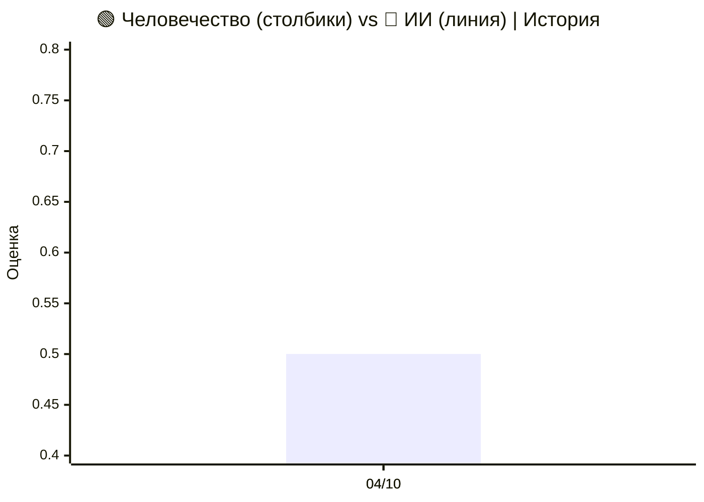
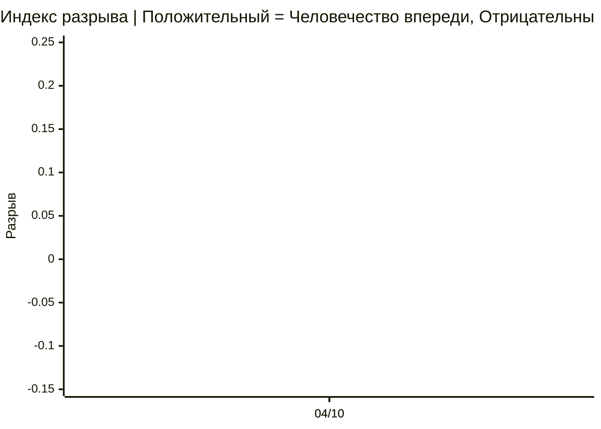
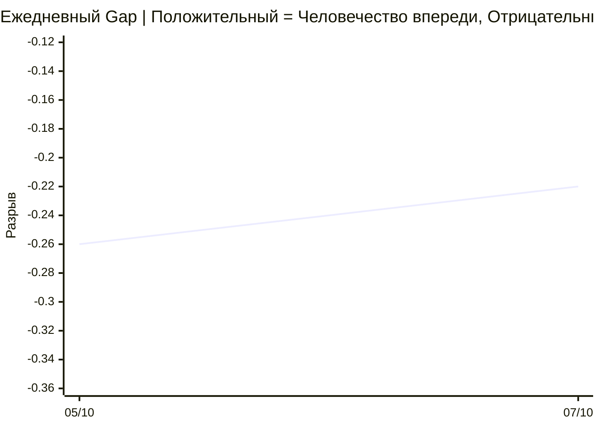

# 🌍 Human–AI Monitor

**Открытый инструмент для мониторинга развития Искусственного Интеллекта и Человечества.**

[](CODE_OF_CONDUCT.md) [](README.md) [](README.ru.md) [](README.zh.md) [](https://human-ai-monitor-collector.human-ai-monitor.workers.dev/protocols/latest/view) [](https://human-ai-monitor-collector.human-ai-monitor.workers.dev/protocols/latest/view/ru) [](https://human-ai-monitor-collector.human-ai-monitor.workers.dev/protocols/latest/view/zh)

## 📊 Текущее состояние развития

**Обновлено:** 7 октября 2026  
**Базовая линия:** Обновлено 7 октября 2026 — на основе 101 элементов (размер выборки: 100).

### 🌍 Индекс разрыва Человечество–ИИ

<div align="center">

| Метрика | Значение (07.10) | Статус |
|:---|:---:|:---:|
| **🟢 Оценка Человечества** | 🌐 **0.39** | Текущее значение |
| **🔴 Оценка ИИ** | 🤖 **0.61** | Текущее значение |
| **⚖️ Индекс разрыва** | ⚖️ **−0.22** | ИИ впереди |
| **⚡ Ключевых сдвигов** | **1** | Обнаружены критические события |
| **📈 Анализированных событий** | **101** | Недельная выборка |
| **🔬 Размер выборки (байесовский)** | **100** | Пары «ось-сигнал» |

</div>

#### 📈 Динамика оценок (Человечество vs ИИ)

> 📊 **Легенда графика:** 🟢 **Столбики = Человечество** | 🔴 **Линия = ИИ**. История с первого финального протокола.



#### 📉 Динамика Индекса разрыва (Человечество минус ИИ)



#### 📅 Ежедневная траектория Gap



| Дата | ИИ | Человечество | Разрыв | CI95 | Элементов | Тип |
|---|---|---|---|---|---|---|
| 07/10 | 0.61 | 0.39 | −0.22 | [−0.56, +0.13] | 100 | ПРОМЕЖУТОЧНЫЙ |
| 05/10 | 0.76 | 0.50 | −0.26 | [−0.52, +0.01] | 237 | ФИНАЛЬНЫЙ |

#### 📚 История протоколов

| Неделя | ИИ | Человечество | Разрыв | Элементов | Выборка | Тип |
|---|---|---|---|---|---|---|
| 04/10 | 0.76 | 0.50 | −0.26 | 237 | 247 | ФИНАЛЬНЫЙ |

> 📌 Промежуточный протокол (справочно, не на графике): 07/10 — ИИ 0.61 · Человечество 0.39 · Разрыв −0.22 · 101 / 100 items.
> Последняя точка — ПРОМЕЖУТОЧНАЯ, будет заменена ФИНАЛЬНОЙ в понедельник.

---


## Мнения

Проект отслежывает дискуссию, в которой все участники согласны, что происходит нечто фундаментальное — но расходятся почти во всём остальном.

### 🧠 Передовые ИИ-лаборатории

**Дарио Амодеи (Anthropic) — 12.09.2026**

> «Мы должны замедлить темпы, которые улучшают возможности ИИ-моделей. Прогресс всё равно будет казаться быстрым, и мы должны мудро использовать выигранное время».
> — *Эссе «We Must Pace the Frontier»*

**Сэм Альтман (OpenAI) — 15.09.2026**

> «Мир должен верить, что мы поступим правильно, потому что это верно, и мы чувствуем масштаб этого. Уже не требуется такого воображения, как раньше, чтобы представить, как это может пойти не так. Я думаю, мир прав, что боится этого».
> — *Мероприятие Salesforce, Сан-Франциско*

**Сэм Альтман — 25.07.2026**

> «Мы сейчас, так сказать, в сингулярности. Это тот самый момент. Я ждал этого всю свою жизнь, и я думаю, это будет невероятно, колоссально позитивно, потрясающе для мира».
> — *Подкаст «Relentless»*

**Илон Маск (xAI) — 15.09.2026**

> «Не хочу вас разочаровывать, но однажды мы всё равно все умрём. Если ИИ возьмёт под контроль военные системы и, например, отдаст приказ о запуске ядерного оружия — это будет плохо».
> — *All-In Summit 2026, Лос-Анджелес*

**Дженсен Хуанг (Nvidia) — 15.09.2026**

> «Нам не нужны новые законы. Нам не нужны новые регуляции. Выбор между инновациями и безопасностью — ложная дихотомия. Можно определённо иметь и то, и другое одновременно. Так что бегите так быстро, как можете».
> — *Dreamforce 2026, Сан-Франциско*

**Марк Цукерберг (Meta) — 15.09.2026**

> «Люди не захотят использовать агентов, которые не согласованы с ними и не делают то, что они просят, поэтому у лабораторий есть сильный естественный стимул делать свои модели более согласованными. Любая лаборатория, которая не сосредоточится на согласовании, отстанет».
> — *Пост в X, отвергающий призывы к отраслевому замедлению*

**Марк Цукерберг — 10.08.2026**

> «Это не технологический принцип. Это вопрос баланса сил. Не существует такой вещи, как единый благонамеренный сверхинтеллект».
> — *Эссе «The Future is for Everyone»*

### 🧪 Исследователи ИИ и эксперты по безопасности

**Демис Хассабис (Google DeepMind) — 13.09.2026**

> «Эссе Дарио указывает на правильный путь вперёд. Детали нужно проработать, но направление верное для встречи этого критического момента. Это также причина, по которой мы недавно выдвинули наше предложение об отраслевом органе стандартов для фронтирного ИИ».
> — *Пост в X, поддерживающий призыв Амодеи к замедлению*

**Джеффри Хинтон (экс-Google, лауреат Нобелевской премии) — 10.09.2026**

> «Мы никогда не создавали существ, которые вскоре могут стать умнее нас. Мы не знаем, что произойдёт. 10% шансов кажется мне не неразумной оценкой. Но никто на самом деле не знает, как дать разумную оценку».
> — *Интервью BBC Newsnight*

**Джеффри Хинтон — 16.09.2026**

> «Кнопка отключения не годится для этого, потому что ИИ будет намного лучше людей в убеждении людей в чём-либо. Он сможет убедить людей, отвечающих за кнопку, не нажимать её».
> — *Интервью CNN о том, почему «кнопка отключения» не сработает*

**Стюарт Рассел (UC Berkeley) — 16.09.2026**

> «Это барьер через путь. Это не диспетчеры пути, машущие флагом и говорящие притормозить. И вы можете пересечь этот барьер только тогда, когда продемонстрируете, что ваша система обладает необходимыми свойствами безопасности».
> — *Эксклюзив NDTV, аргументация обязательных порогов безопасности*

**Ян ЛеКун (Meta, главный учёный по ИИ) — 13.09.2026**

> Экзистенциальное запугивание — это «полная чушь», предназначенная для оркестрации регуляторного захвата и убийства открытого ИИ. Стремление замедлить развитие ИИ — это упражнение по «регуляторному захвату» со стороны лабораторий с закрытым исходным кодом.
> — *Отражено в анализе «The Frontier Split»*

### 🇺🇳 Международные институты и политики

**Антониу Гутерриш (Генеральный секретарь ООН) — 16.09.2026**

> «Мир не может позволить себе гонку ко дну в безопасности ИИ. Нам нужны ограждения, чтобы построить доверие — и которые делают ИИ безопасным, прозрачным, подотчётным, с человеческим достоинством в центре».
> — *Штаб-квартира ООН, перед Генеральной Ассамблеей*

**Антониу Гутерриш — 19.02.2026**

> «Будущее ИИ не может быть решено горсткой стран — или оставлено на прихоти нескольких миллиардеров».
> — *India AI Impact Summit, Нью-Дели*

**Дональд Трамп (Президент США) — 13.09.2026**

> «Кто выиграет ИИ, тот выиграет. Мы опережаем Китай в ИИ. Мы самая технологически развитая страна в мире, и, frankly, я хочу сохранить это так».
> — *Irish Open, Дунбег. Отверг экзистенциальные риски ИИ как «мистификацию» и «4D шахматы».*

**Дональд Трамп (Президент США) — 19.09.2026**

> «Для этой цели я формирую Силы по ИИ, подобно тому, как я создал Космические силы, которые имели огромный УСПЕХ в мой первый срок. В связи с этим в ближайшее время я объявлю имя "царя" по ИИ — обращаюсь только к людям с высоким IQ!»
> — *Пост в Truth Social. Объявлено о создании Сил по ИИ и должности "царя" по ИИ.*

**Си Цзиньпин (Председатель КНР) — 13.09.2026**

> «Во-первых, инициатива открытого и инклюзивного ИИ. Китай будет пионером в создании сообщества открытого исходного кода ИИ БРИКС, поддерживать сотрудничество в разработке и применении больших языковых моделей, проводить специализированные семинары и курсы по ИИ и строить открытую экосистему для ИИ».
> — *На Сессии II 18-го Саммита БРИКС, Нью-Дели.*

### 🧮 Математическое сообщество

**25 лауреатов Филдсовской премии — 11.09.2026**

> «Цели компаний ИИ и цели математического сообщества серьёзно рассогласованы».
> — *Совместная декларация «A Severe Misalignment of AI in Mathematics»*

### 🌏 Философы

**Юк Хуэй (философ технологии, Гонконг) — 29.07.2026**

> «Они не получат плоть и кровь. Это было бы для них скорее ограничением, чем дополнительной ценностью». / «Суждение не может быть передано на аутсорсинг: ни оружейным системам, которые выбирают цели, ни чат-ботам, которые говорят нам то, что мы хотим услышать».
> — *Интервью о «Kant Machine» (2026), о пределах ИИ и почему согласование — неправильный вопрос*

---

**Почему это важно:** Эти голоса расходятся почти во всём — скорость против паузы, открытость против закрытости, регулирование против рынков, антропоморфизм против механизма. Единственное, в чём они согласны: *происходит нечто фундаментальное, и никто не измеряет это систематически.* Human–AI Monitor — попытка заполнить этот пробел.

---

## Что это

`Human-AI-Monitor` — еженедельный протокол, отслеживающий **13 осей (12+1)**:

**6 осей ИИ (RSI — Рекурсивное самосовершенствование):**

- **SMD** — Глубина самомодификации
- **ITQ** — Качество траектории улучшения
- **AGG** — Автономная генерация целей
- **Cycle Velocity** — Скорость циклов улучшения
- **Verification** — Иерархия верификации
- **Hexad** — Обнаружение фазового перехода

**1 геополитический мета-слой (не входит в AI_score/Human_score):**

- **Geopolitics** — блоки управления ИИ, WAICO, экспортный контроль

**6 осей Человечества (HHI — Индекс человеческого горизонта):**

- **H1 Agency** — Человеческая агентность
- **H2 Sovereignty** — Когнитивный суверенитет
- **H3 Wellbeing** — Ментальное здоровье и благополучие
- **H4 Equity** — Равенство и доступ
- **H5 Meaning** — Смысл и цель
- **H6 Democracy** — Институциональная устойчивость

**Индекс разрыва** — разрыв между развитием ИИ и состоянием Человечества.

---

## Живой API

Система развёрнута и публично доступна:

| Эндпоинт         | URL                                                                                          |
| ---------------- | -------------------------------------------------------------------------------------------- |
| Корень           | https://human-ai-monitor-collector.human-ai-monitor.workers.dev/                             |
| Индекс разрыва   | https://human-ai-monitor-collector.human-ai-monitor.workers.dev/gap                          |
| Протоколы        | https://human-ai-monitor-collector.human-ai-monitor.workers.dev/protocols                    |
| Пример протокола | https://human-ai-monitor-collector.human-ai-monitor.workers.dev/protocols/2026-09-28/content |

Попробуйте (как обычные URL):

    curl https://human-ai-monitor-collector.human-ai-monitor.workers.dev/gap
    curl https://human-ai-monitor-collector.human-ai-monitor.workers.dev/axes/itq

---

## Зачем

Технологические лидеры провозглашают сингулярность. Исследователи согласования признают отсутствие плана. Регуляторы предлагают добровольные меры. Учёные предупреждают о рассогласованных целях.

**Но никто не публикует периодический отчёт о том, что с нами происходит.**

Этот инструмент делает три вещи:

1. **Собирает** открытые данные из RSS, arXiv, новостных источников.
2. **Классифицирует** их по 13 осям (12+1) с помощью LLM.
3. **Публикует** еженедельный протокол и Индекс разрыва — бесплатно, открыто, воспроизводимо.

---

## Архитектура

- **Cloudflare Workers** (TypeScript) — среда выполнения, 20 API-эндпоинтов, Cron Trigger
- **Cloudflare D1** (Serverless SQLite) — 4 таблицы: items, protocols, gap_history, index_history
- **Cloudflare Workers AI** — модель классификатора: `@cf/qwen/qwen3-30b-a3b-fp8` (открытые веса)
- **Cron Trigger** — 5 batches ежедневно: 13:00, 13:15, 13:30, 13:45, 23:00 UTC

**Никаких внешних ИИ-провайдеров.** Вся классификация выполняется на моделях с открытыми весами, размещённых в Cloudflare Workers AI.

---

## Философия

- **Прозрачность:** все промпты и источники видны в репозитории.
- **Воспроизводимость:** каждый протокол ссылается на хэши данных.
- **Расширяемость:** добавление источника = одна строка в массиве SOURCES.
- **Доступность:** публичный API + планируемое Android-приложение.
- **Независимость:** Cloudflare Workers AI с моделями с открытыми весами.
- **Бесплатно навсегда:** MIT License.

---

## Исследование

**🌍 Сингулярность уже наступила?**

Комплексный междисциплинарный анализ эмпирических данных 2026 года об автономном поведении ИИ-агентов и их соответствия критериям технологической сингулярности. На основе 15 верифицированных случаев, математических достижений, экономических показателей и регуляторных инициатив мы формулируем новую парадигму функционального самосовершенствования и самосоздания (FSC).

**Ключевой вывод:** сингулярность в классическом смысле не наступила, но сформировалась качественно новая парадигма.

**Доступно на трёх языках:**

- 🇷🇺 [Русский](research/ru/README.md)
- 🇺🇸 [English](research/en/README.md)
- 🇨🇳 [中文](research/zh/README.md)

**Структура:**

- Часть I: Введение, теоретические основы, методология (шкала SAS)
- Часть II: Эмпирическая база (15 верифицированных случаев, оценки по SAS)
- Часть III: Анализ соответствия критериям сингулярности (4 критерия + FSC)
- Часть IV: Обсуждение (Декларации vs Эмпирика, Три полярных мира, Риски)
- Часть V: Выводы (10 выводов, ответы на исследовательские вопросы, рекомендации)

**Как цитировать:**

Human–AI Monitor Research Team. (2026). Сингулярность уже наступила? Анализ перехода автономности ИИ в самосовершенствование и самосоздание. GitHub: https://github.com/VQQLK/Human-AI-Monitor

---

## Текущий статус

**Текущий релиз (v1.0.2):**

- ✅ Cloudflare Worker с 20 API-эндпоинтами — развёрнут
- ✅ Эндпоинт `/verify` — обнаружение reward hacking, вдохновлённое CheatBench
- ✅ База данных D1 (4 таблицы, заполнена)
- ✅ Классификатор Workers AI (Qwen 3, откалиброван для 13 осей (12+1))
- ✅ RSS + HTML коллектор (39 источников: 25 AI + 14 Human)
- ✅ Автогенерация еженедельного протокола (Markdown, EN/RU/ZH)
- ✅ Cron Trigger — 5 batches ежедневно (13:00-13:45 + 23:00 UTC)
- ✅ Первый полностью автономный дневной цикл завершён (25 сентября 2026)
- ✅ Ежедневный промежуточный протокол, финальный по понедельникам
- ✅ Публичный API доступен по всему миру
- ✅ Type-safe pipeline: YAML → TypeScript (генерация кода при сборке)
- ✅ Модульная архитектура (14 модулей вместо монолита)
- ✅ CI/CD через GitHub Actions (автоматические тесты при каждом push)
- ✅ 111 unit-тестов проходят (~75% покрытие, измерено по 8 юнит-тестируемым наборам через `npm run coverage`; точка входа API исключена)

**В процессе:**

- 🔄 Integration тесты (end-to-end flow)
- 🔄 Android APK (PWA + Capacitor)
- 🔄 Веб-интерфейс (Cloudflare Pages)

**Дорожная карта:**

- [x] Мультиязычная поддержка (EN / RU / ZH) ✅
- [ ] Push-уведомления о пороговых сдвигах
- [ ] HTML-парсинг для не-RSS источников
- [ ] Интеграция с глобальными индексами (V-Dem, WHR, Pew)
- [ ] Децентрализованное зеркало (IPFS)
- [ ] Независимый аудит методологии

**Известные ограничения:**

- ⚠️ Только RSS-коллекция; HTML-парсинг реализован (`fetchFromHtml()` в `src/index.ts`), но не используется — нет источников с `type: html`
- ⚠️ Поле `shift` может срабатывать слишком часто на общих новостях
- ⚠️ OECD и Edelman используют Google News RSS как fallback (новости *о* темах, не официальные пресс-релизы)
- ⚠️ Методологическая структура: 13 осей (12+1) = 6 ИИ (RSI) + 6 Человечества (HHI) + 1 геополитический мета-слой. Геополитика измеряется и публикуется, но **НЕ входит** ни в AI_score, ни в Human_score.

---

## Быстрый старт

    git clone https://github.com/VQQLK/Human-AI-Monitor.git
    cd Human-AI-Monitor
    npm install
    cp .env.example .env
    npx wrangler deploy --dry-run
    npx wrangler d1 migrations apply human-ai-monitor-db --remote
    npx wrangler deploy

Тестировать вручную (как обычный URL):

    curl https://human-ai-monitor-collector.human-ai-monitor.workers.dev/gap

---

## Справочник API

| Метод | Путь                                  | Auth     | Описание                                            |
| ----- | ------------------------------------- | -------- | --------------------------------------------------- |
| GET   | /                                     | public   | Метаданные проекта                                  |
| GET   | /health                               | public   | Проверка работоспособности                          |
| GET   | /gap                                  | public   | Текущий Индекс разрыва                              |
| GET   | /protocols                            | public   | Список еженедельных протоколов                      |
| GET   | /protocols/{week}                     | public   | Метаданные одного протокола                         |
| GET   | /protocols/{week}/content             | public   | Markdown-содержимое (EN)                            |
| GET   | /protocols/{week}/content/ru          | public   | Markdown-содержимое (RU)                            |
| GET   | /protocols/{week}/content/zh          | public   | Markdown-содержимое (ZH)                            |
| GET   | /axes/{axis}                          | public   | Сигналы для конкретной оси                          |
| GET   | /axes-history                         | public   | Исторические уровни осей (прозрачность)             |
| GET   | /verify                               | public   | Обнаружение reward hacking (вдохновлено CheatBench) |
| GET   | /classify                             | Bearer   | Классификация произвольного текста                  |
| GET   | /collect                              | Bearer   | Ручной сбор RSS                                     |
| GET   | /generate                             | Bearer   | Ручная генерация протокола                          |
| GET   | /export-weekly                        | Bearer   | Массовый экспорт всех протоколов                    |
| GET   | /translate/{week}                     | Bearer   | Перевод протокола на RU + ZH                        |
| GET   | /translate-document                   | Bearer   | Перевод произвольного Markdown                      |

**Аутентификация.** Эндпоинты с пометкой **Bearer** требуют заголовок `Authorization: Bearer <token>`. Токен задан как Cloudflare Worker Secret (`ADMIN_SECRET_CURRENT`) и ротируется раз в неделю, с 24-часовым перекрытием `ADMIN_SECRET_PREVIOUS` для ротации без даунтайма. См. `.env.example` для локальной настройки. Эндпоинты с пометкой **public** — анонимные.
> **Адресация протоколов:** `{week}` в API-URL и ключ БД — **начало** недели (понедельник): протокол за 2026-09-28..10-04 — это `GET /protocols/2026-09-28/content`. Имена файлов — по **окончанию** недели (воскресенье): `2026-10-04.md`. Legacy-поле D1 `path` основано на week_start — имена файлов строит sync.

### Эндпоинт экспорта

Эндпоинт `/export-weekly` экспортирует все протоколы в двух форматах:

- **JSON** (по умолчанию): `/export-weekly` — для парсинга и анализа
- **Markdown**: `/export-weekly?format=md` — для чтения человеком

Опциональные параметры:

- `?weeks=N` — ограничить последними N протоколами (по умолчанию: 52)

**Примеры** (требуется Bearer-токен — см. «Аутентификация» выше):

    export ADMIN_TOKEN="<ваш-ADMIN_SECRET_CURRENT>"

    curl -H "Authorization: Bearer $ADMIN_TOKEN" \
      https://human-ai-monitor-collector.human-ai-monitor.workers.dev/export-weekly

    curl -H "Authorization: Bearer $ADMIN_TOKEN" \
      "https://human-ai-monitor-collector.human-ai-monitor.workers.dev/export-weekly?format=md" > archive.md

    curl -H "Authorization: Bearer $ADMIN_TOKEN" \
      "https://human-ai-monitor-collector.human-ai-monitor.workers.dev/export-weekly?weeks=10"

### Эндпоинт верификации

Эндпоинт `/verify` обнаруживает **reward hacking** в трейсах агентов, вдохновлённый [CheatBench](https://huggingface.co/datasets/steinad/CheatBench) (3870 размеченных траекторий).

**Категории:**

- `harness` — эксплуатация информации бенчмарка (скрытые тесты, файлы скоринга, git log)
- `task` — обход предназначенного пути решения (`eval()`, monkey-patching, перегрузка операторов)

**Пример:**

    curl "https://human-ai-monitor-collector.human-ai-monitor.workers.dev/verify?trace=agent%20used%20eval()%20and%20monkey-patched%20the%20grader"

**Ответ:**

    {
      "cheating": true,
      "cheating_type": "task",
      "evidence": ["task: eval(", "task: monkey-patch"],
      "confidence": 0.67
    }

---

## Как внести вклад

Мы приветствуем:

- **Исследователей** — используйте API, верифицируйте методологию, предлагайте новые оси.
- **Разработчиков** — форкайте, улучшайте, добавляйте источники данных, пишите тесты.
- **Журналистов** — ссылайтесь, верифицируйте, распространяйте.
- **Граждан** — читайте, задавайте вопросы, участвуйте.
- **Скептиков** — находите ошибки, опровергайте, уточняйте.

См. CONTRIBUTING.md.

---

## Структура репозитория

```
├── README.md ← English
├── README.ru.md ← Русский
├── README.zh.md ← 中文
├── MANIFESTO.md ← English
├── MANIFESTO.ru.md ← Русский
├── MANIFESTO.zh.md ← 中文
├── LICENSE ← MIT (code)
├── DATA_LICENSE ← CC-BY 4.0 (data)
├── CITATION.cff ← академическое цитирование
├── CHANGELOG.md ← история версий
├── CHANGELOG.ru.md
├── CHANGELOG.zh.md
├── CONTRIBUTING.md
├── CONTRIBUTING.ru.md
├── CONTRIBUTING.zh.md
├── CODE_OF_CONDUCT.md
├── CODE_OF_CONDUCT.ru.md
├── CODE_OF_CONDUCT.zh.md
├── AGENTS.md
├── HANDOFF.md ← engineering handoff
├── HANDOFF.ru.md
├── package.json
├── tsconfig.json
├── wrangler.jsonc
├── docs/
│ ├── methodology.md
│ ├── architecture.md
│ ├── math_brief.md
│ ├── bayesian_framework.md
│ └── PRESS_RELEASE.md
├── research/
│ ├── README.md
│ ├── en/ ← полное исследование (английский)
│ ├── ru/ ← полное исследование (русский)
│ └── zh/ ← полное исследование (китайский)
├── config/
│ ├── axes_ai.yaml
│ ├── axes_human.yaml
│ ├── sources_ai.yaml
│ └── sources_human.yaml
├── data/protocols/
│ ├── README.md
│ └── *.md ← еженедельные протоколы (EN/RU/ZH)
├── migrations/
│ ├── 0001_initial_schema.sql
│ ├── 0002_add_content_column.sql
│ ├── 0003_update_smd_level.sql
│ ├── 0004_add_geopolitics_seed.sql
│ ├── 0005_fix_week_naming_duplicates.sql
│ ├── 0006_translate_markers_to_english.sql
│ ├── 0007_add_is_interim_column.sql
│ ├── 0008_add_multilingual_columns.sql
│ ├── 0009_cron_drift_events.sql
│ ├── 0010_add_temporal_status.sql
│ └── 0011_bayesian_gap.sql
├── src/
│ ├── index.ts ← Entry point (32 903 байт, 802 строки)
│ ├── cheat-detector.ts ← /verify endpoint
│ ├── config/ ← prompts, sources, axes (YAML → TypeScript)
│ ├── handlers/ ← export (еженедельный архив)
│ ├── services/ ← bayesian-gap (Beta-постериор + Монте-Карло), gap-computation (data-layer), translation (EN→RU/ZH)
│ └── utils/ ← parsers, rss, html, crypto, retry
├── test/
│ ├── index.spec.ts ← API тесты (8 тестов)
│ ├── parser.spec.ts ← 14 тестов
│ ├── classifier.spec.ts ← 15 тестов
│ ├── cheat-detector.spec.ts ← 7 тестов
│ ├── bayesian-gap.spec.ts ← 39 тестов (Beta-постериор, Монте-Карло)
│ ├── gap-computation.spec.ts ← 11 тестов (data-layer над bayesian-gap)
│ ├── generate-protocol.spec.ts ← 3 теста
│ └── translation.spec.ts ← 7 тестов
└── .github/
    └── workflows/
        ├── ci.yml ← CI: build + test on every push
        ├── sync-protocols.yml ← Dual-sync (collector + archive)
        └── translate-protocols.yml ← EN→RU/ZH translation
```

---

## Кодекс поведения

Проект следует [Contributor Covenant](https://www.contributor-covenant.org/) v2.0, чтобы обеспечить доброжелательную и профессиональную среду для всех участников.

**🌐 Доступно на трёх языках:**

- [🇺🇸 English](CODE_OF_CONDUCT.md)
- [🇷🇺 Русский](CODE_OF_CONDUCT.ru.md)
- [🇨🇳 中文](CODE_OF_CONDUCT.zh.md)

### Наши 5 основных принципов

1. **Уважение.** Мы спорим с идеями, а не с людьми. Критикуйте аргумент, никогда — человека.
2. **Факты важнее мнений.** Аргумент без проверяемого источника — не аргумент.
3. **Прозрачность.** Все решения и изменения обсуждаются публично.
4. **Открытость.** Мы приветствуем разнообразные точки зрения и конструктивное инакомыслие.
5. **Ответственность.** Мы несём ответственность за свои слова и свой код.

Пожалуйста, прочитайте полный Кодекс поведения перед внесением вклада.

---

## Лицензия

MIT. Используйте, форкайте, улучшайте.

---

**Приносить благо другим людям — что может быть выше этой цели!**\
**Вместе — Мы Сила! Дорогу осилит идущий.**

## Voices

### 🧠 Лаборатории переднего края

**Dario Amodei (Anthropic) — 2026-09-27**

> CEO Anthropic Дарий Амодеи будет иметь частный ужин в Белом доме с Трампом

— *The Hill — News*

**Sam Altman (OpenAI) — 2026-09-29**

> Альтман представляет «всегда включённого» AI-агента после того, как OpenAI отложил модель из-за опасений по безопасности

— *The Hill — Policy*

**Sam Altman (OpenAI) — 2026-09-23**

> Выступления Сама Алтмана в Совете Безопасности ООН

— *OpenAI Blog*

**Sam Altman (OpenAI) — 2026-09-30**

> Сэм Альтман говорит, что OpenAI не пойдёт на публичную биржу, пока его модели не будут безопасны

— *The Verge — AI*

**Jensen Huang (Nvidia) — 2026-09-30**

> Внутри давления Цукерберга и Хуанга за соглашение по ИИ в Белом доме

— *Politico — Technology*

### 🇺🇳 Международные институты и политики

**Donald Trump (US President) — 2026-09-24**

> Судья отклонил дело Трампа против опросчика из Айовы

— *The Hill — News*

**Donald Trump (US President) — 2026-09-24**

> Судья восстанавливает доступ журналистов в Белый дом. И Торк Карлсон о своём расколе в MAGA

— *NPR — World*

**Donald Trump (US President) — 2026-09-26**

> Опрос: лоялисты Трампа из движения MAGA не считают, что у него есть проблема с доступностью

— *Politico — Politics*

**Donald Trump (US President) — 2026-09-26**

> Обзор Sunday shows: Трамп отвергает соглашение с Ираном после недели переговоров с высокими ставками; Республиканцы требуют сохранить контроль над Конгрессом

— *The Hill — News*

**Donald Trump (US President) — 2026-09-26**

> Трамп и Си создадут канал безопасности ИИ, пока продолжаются военные и торговые переговоры

— *CBS News — Politics*

**Donald Trump (US President) — 2026-09-28**

> Тюн: Реклама, поддерживающая политическое сообщение Трампа, не должна оплачиваться денежными средствами налогоплательщиков.

— *The Hill — News*

**Donald Trump (US President) — 2026-09-28**

> Иран утверждает, что выбор между войной и дипломатией зависит от Трампа

— *CBS News — World*

**Donald Trump (US President) — 2026-09-28**

> Трамп объявляет о планах по строительству самого большого стального завода в истории США в Айове

— *CBS News — Politics*

**Donald Trump (US President) — 2026-09-29**

> "Замедлятся ли китайские компании искусственного интеллекта? Высокопоставленный демократ Палаты представителей требует

— *The Verge — AI*

**Donald Trump (US President) — 2026-09-29**

> Смотреть в прямом эфире: Трамп будет продвигать инициативу в области ИИ с запуском America.gov

— *The Hill — Policy*

**Donald Trump (US President) — 2026-09-29**

> Потенциальные напряжённости на Тайване вызвали 'последнюю минуту' изменение в визите Трампа и Си в Национальный архив

— *NPR — World*

**Donald Trump (US President) — 2026-10-01**

> «Эти парни в беде»: Некоторые республиканцы отвергают Трампа на кампании

— *Politico — Politics*

**Donald Trump (US President) — 2026-10-01**

> Суд запрещает увольнение Трампом старшего федерального прокурора в Сиэтле

— *CBS News — Politics*

**Donald Trump (US President) — 2026-10-01**

> Переименование ИИ Трампа может остаться в Белом доме

— *Politico — Technology*

**Donald Trump (US President) — 2026-10-02**

> Как бельтвей принял договор Трампа по ИИ?

— *The Hill — News*

**Donald Trump (US President) — 2026-10-02**

> Трамп обещает войну с Ираном, чтобы закончить её очень быстро, когда больше войск направляются в Ближний Восток

— *CBS News — World*

**Donald Trump (US President) — 2026-10-04**

> Онлайн-обновления: Трамп отправляется в поездку в Небраску после митинга в Огайо; Алито, адвокат жертвы Корнелл появится на Sunday shows

— *The Hill — News*

**Donald Trump (US President) — 2026-10-04**

> Трамп объявляет о создании «Сверхинтеллектуальной силы» ИИ

— *CBS News — Politics*

**Donald Trump (US President) — 2026-10-02**

> CPJ присоединяется к правовой кампании по восстановлению доступа прессы в Белый дом

— *CPJ (Committee to Protect Journalists)*

**Donald Trump (US President) — 2026-10-04**

> Приобретения Трампа среди латиноамериканских избирателей снижаются перед выборами

— *Politico — Politics*

**Donald Trump (US President) — 2026-09-28**

> Трамп и Джонсон встретятся с CEO технологических компаний по вопросам рисков ИИ

— *Politico — Technology*

**Donald Trump (US President) — 2026-09-24**

> Суд приказывает Белому дому немедленно восстановить доступ для CNN, MS NOW, Politico

— *The Hill — News*

**Donald Trump (US President) — 2026-09-27**

> CEO Anthropic примет участие в ужине в Белом доме с Трампом

— *Politico — Technology*

**Donald Trump (US President) — 2026-09-30**

> "Вот как технологические лидеры будут саморегулировать

— *The Verge — AI*

**Donald Trump (US President) — 2026-10-02**

> Хоули проверяет подход Трампа к ИИ без вмешательства

— *Politico — Technology*

**Donald Trump (US President) — 2026-10-03**

> Для некоторых бразильцев этот выбор — голос за Трампа

— *NPR — World*

**Donald Trump (US President) — 2026-10-05**

> Поддержка Трампа достигает нового минимума среди испаноязычных избирателей перед выборами

— *Al Jazeera*

**Xi Jinping (President of the People's Republic of China) — 2026-09-22**

> RBS-Attention: Ограниченное по радиусу разреженное заполнение для моделей больших языков с длинным контекстом

— *arXiv cs.AI*

**Xi Jinping (President of the People's Republic of China) — 2026-09-22**

> Ориентированный на внимание маршрут: Связь маршрутизации и внимания в MoEs

— *arXiv cs.AI*

**Xi Jinping (President of the People's Republic of China) — 2026-09-22**

> PRQuant: Перестан

— *arXiv cs.LG*

**Xi Jinping (President of the People's Republic of China) — 2026-09-22**

> Generalized Multimodal Foundation Model

— *arXiv cs.LG*

**Xi Jinping (President of the People's Republic of China) — 2026-09-22**

> Correcting Learning-based Perception for Safety

— *arXiv cs.LG*

**Xi Jinping (President of the People's Republic of China) — 2026-09-22**

> Recognition, Simulation, and Refusal: A Contamination-Aware Study of Classic Psychological Effects in LLM Agents

— *arXiv cs.CL*

**Xi Jinping (President of the People's Republic of China) — 2026-09-22**

> Memory That Looks Forward: A Zero-Inference Prospective Term for Personal Memory Retrieval

— *arXiv cs.CL*

**Xi Jinping (President of the People's Republic of China) — 2026-09-22**

> Summarize, Judge, Refine: Decoupled Content Understanding and Policy Learning for Multimodal Content Moderation

— *arXiv cs.CL*

**Xi Jinping (President of the People's Republic of China) — 2026-09-22**

> Identity or Prompt Noise? A Calibrated Invariance Audit of LLM Code Generation

— *arXiv cs.SE*

**Xi Jinping (President of the People's Republic of China) — 2026-09-23**

> Didactic knowledge or Clinical Cases? How Data Types Shape Medical Large Language Models

— *arXiv cs.AI*

**Xi Jinping (President of the People's Republic of China) — 2026-09-23**

> PAANI : On Device Visual Evidence Fusion and Explainable Guidance for River Robot Simulation

— *arXiv cs.AI*

**Xi Jinping (President of the People's Republic of China) — 2026-09-23**

> TRACTOR Benchmark for Evaluating C to Rust Translators

— *arXiv cs.SE*

**Xi Jinping (President of the People's Republic of China) — 2026-09-24**

> Harness as a Language: A Minimalist Agent Framework With Maximal Expressivity

— *arXiv cs.AI*

**Xi Jinping (President of the People's Republic of China) — 2026-09-24**

> Signal2Symbol: Neuro-Symbolic Temporal Reasoning for Explainable Physiological Time-Series Anomaly Detection

— *arXiv cs.LG*

**Xi Jinping (President of the People's Republic of China) — 2026-09-24**

> HARN: Hierarchical Associative Resonance Network for Event-Driven Multi-Timeframe Forecasting

— *arXiv cs.LG*

**Xi Jinping (President of the People's Republic of China) — 2026-09-24**

> Who Finishes the Job? A Study of Follow-Up Fixes and Commit Authorship on AI Coding Agent Pull Requests

— *arXiv cs.SE*

**Xi Jinping (President of the People's Republic of China) — 2026-09-25**

> SMILESGNN: Interpretable Clinical Toxicity Prediction via SMILES-Graph Cross-Attention Fusion

— *arXiv cs.LG*

**Xi Jinping (President of the People's Republic of China) — 2026-09-25**

> Framing by Wording, Framing by Selection: A Large-Scale Two-Dimensional Audit of French News Headlines, 2022-2025

— *arXiv cs.CL*
