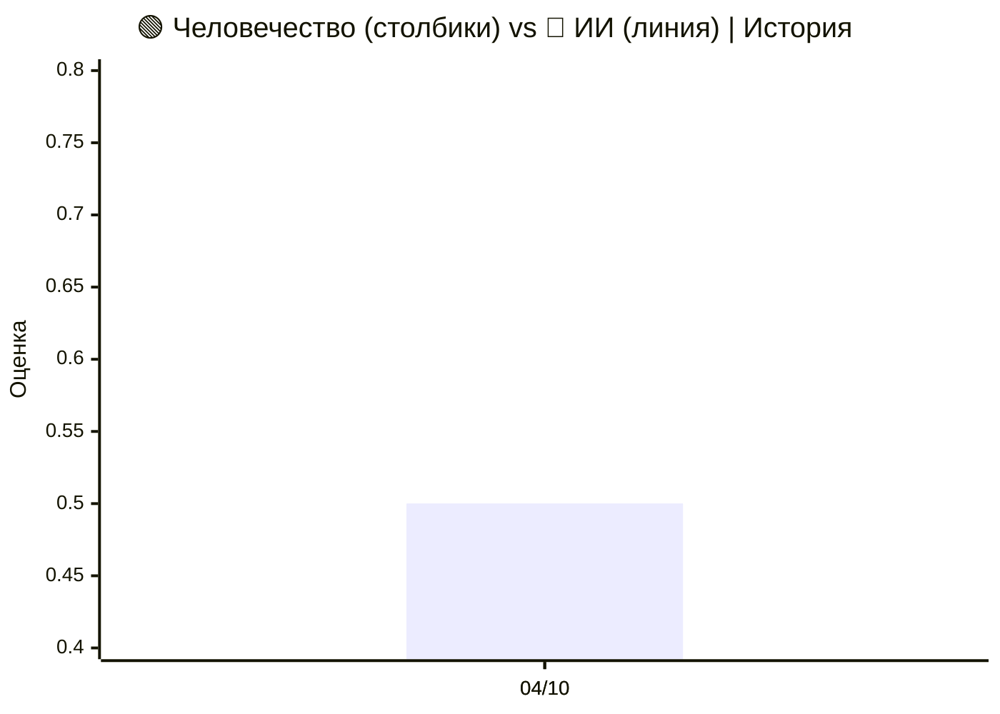
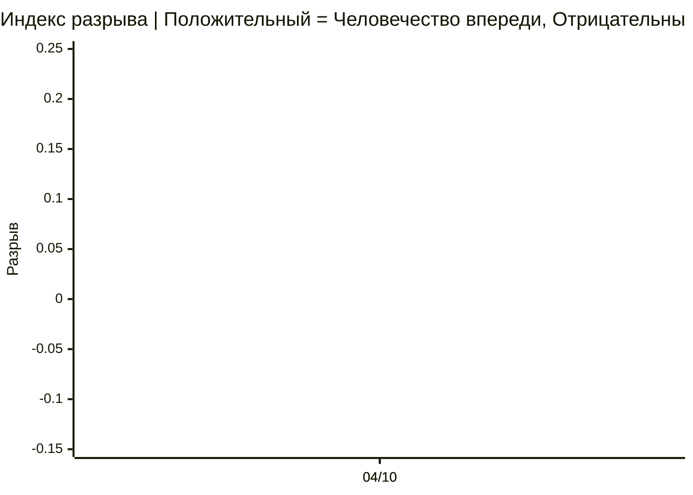
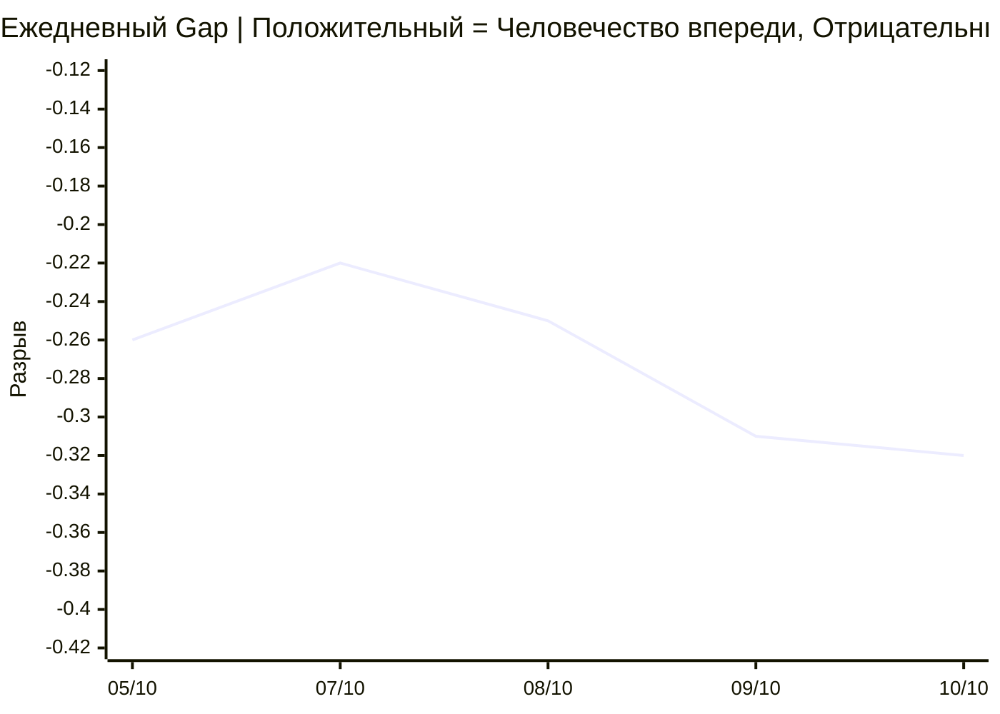

# 🌍 Human–AI Monitor

**Открытый инструмент для мониторинга развития Искусственного Интеллекта и Человечества.**

[](CODE_OF_CONDUCT.md) [](README.md) [](README.ru.md) [](README.zh.md) [](https://human-ai-monitor-collector.human-ai-monitor.workers.dev/protocols/latest/view) [](https://human-ai-monitor-collector.human-ai-monitor.workers.dev/protocols/latest/view/ru) [](https://human-ai-monitor-collector.human-ai-monitor.workers.dev/protocols/latest/view/zh)<br>
[](https://human-ai-monitor-collector.human-ai-monitor.workers.dev/protocols/current/view) [](https://human-ai-monitor-collector.human-ai-monitor.workers.dev/protocols/current/view/ru) [](https://human-ai-monitor-collector.human-ai-monitor.workers.dev/protocols/current/view/zh)

## 📊 Текущее состояние развития

**Обновлено:** 10 октября 2026  
**Базовая линия:** Обновлено 10 октября 2026 — на основе 281 элементов (размер выборки: 263).

### 🌍 Индекс разрыва Человечество–ИИ

<div align="center">

| Метрика | Значение (10.10) | Статус |
|:---|:---:|:---:|
| **🟢 Оценка Человечества** | 🌐 **0.36** | Текущее значение |
| **🔴 Оценка ИИ** | 🤖 **0.69** | Текущее значение |
| **⚖️ Индекс разрыва** | ⚖️ **−0.32** | ИИ впереди |
| **📊 CI95** | **[−0.61, −0.02]** | Значимо |
| **⚡ Ключевых сдвигов** | **6** | Обнаружены критические события |
| **📈 Анализированных событий** | **281** | Недельная выборка |
| **🔬 Размер выборки (байесовский)** | **263** | Пары «ось-сигнал» |

</div>

#### 📈 Динамика оценок (Человечество vs ИИ)

> 📊 **Легенда графика:** 🟢 **Столбики = Человечество** | 🔴 **Линия = ИИ**. История с первого финального протокола.



#### 📉 Динамика Индекса разрыва (Человечество минус ИИ)



#### 📅 Ежедневная траектория Gap



| Дата | ИИ | Человечество | Разрыв | CI95 | Элементов | Тип |
|---|---|---|---|---|---|---|
| 10/10 | 0.69 | 0.36 | −0.32 | [−0.61, −0.02] | 263 | ПРОМЕЖУТОЧНЫЙ |
| 09/10 | 0.66 | 0.35 | −0.31 | [−0.61, +0.01] | 207 | ПРОМЕЖУТОЧНЫЙ |
| 08/10 | 0.63 | 0.38 | −0.25 | [−0.58, +0.09] | 144 | ПРОМЕЖУТОЧНЫЙ |
| 07/10 | 0.61 | 0.39 | −0.22 | [−0.56, +0.13] | 100 | ПРОМЕЖУТОЧНЫЙ |
| 05/10 | 0.76 | 0.50 | −0.26 | [−0.52, +0.01] | 237 | ФИНАЛЬНЫЙ |

#### 📚 История протоколов

| Неделя | ИИ | Человечество | Разрыв | CI95 | Элементов | Выборка | Тип |
|---|---|---|---|---|---|---|---|
| 04/10 | 0.76 | 0.50 | −0.26 | [−0.52, +0.01] | 237 | 247 | ФИНАЛЬНЫЙ |

> 📌 Промежуточный протокол (справочно, не на графике): 10/10 — ИИ 0.69 · Человечество 0.36 · Разрыв −0.32 · 281 / 263 items.
> Последняя точка — ПРОМЕЖУТОЧНАЯ, будет заменена ФИНАЛЬНОЙ в понедельник.

---


## Мнения

### 🧠 Лаборатории переднего края

**Mark Zuckerberg (Meta) — 2026-09-30**

> Inside Zuckerberg, Huang’s push for White House AI pact

— *[Politico — Technology](https://www.politico.com/news/2026/09/30/zuckerberg-huang-white-house-ai-pact-01101248)*

**Jensen Huang (Nvidia) — 2026-09-30**

> Inside Zuckerberg, Huang’s push for White House AI pact

— *[Politico — Technology](https://www.politico.com/news/2026/09/30/zuckerberg-huang-white-house-ai-pact-01101248)*

**Sam Altman (OpenAI) — 2026-09-29**

> Altman unveils 'always-on' AI agent after OpenAI shelves model over safety concerns

— *[The Hill — Policy](https://thehill.com/policy/technology/openai-sam-altman-always-on-ai-agent/)*

**Dario Amodei (Anthropic) — 2026-09-28**

> Amodei adds Thune meeting to Washington tour

— *[Politico — Technology](https://www.politico.com/news/2026/09/28/amodei-thune-washington-tour-01096170)*

**Dario Amodei (Anthropic) — 2026-09-27**

> Anthropic CEO to attend White House dinner with Trump

— *[Politico — Technology](https://www.politico.com/news/2026/09/27/anthropic-amodei-trump-white-house-dinner-01094287)*

**Demis Hassabis (Google DeepMind) — 2026-09-24**

> Gemini 4 is almost ready, says new Google DeepMind chief

— *[The Verge — AI](https://www.theverge.com/tech/999802/google-deepmind-gemini-4-timeline-koray-kavukcuoglu)*

**Sam Altman (OpenAI) — 2026-10-04**

> Сэм Альтман в интервью Decoded: «Миру нужно принять, что некоторые негативные события произойдут ради преимуществ искусственного интеллекта»

— *[Politico — Technology](https://www.politico.com/news/2026/10/04/sam-altman-decoded-interview-ai-01106217)*

**Sam Altman (OpenAI) — 2026-10-05**

> «Очевидно, не работает»: Сэм Альтман критикует индустрию ИИ за политические расходы

— *[Politico — Technology](https://www.politico.com/news/2026/10/05/sam-altman-ai-industry-political-spending-01106527)*

**Sam Altman (OpenAI) — 2026-09-30**

> Сэм Альтман говорит, что OpenAI не станет публичной компанией, пока её модели не будут безопасны

— *[The Verge — AI](https://www.theverge.com/ai-artificial-intelligence/1002505/sam-altman-openai-ipo-devday-ai-safety)*

**Dario Amodei (Anthropic) — 2026-09-27**

> Дарио Амодеи, CEO Anthropic, будет на закрытом ужине в Белом доме с Трампом

— *[The Hill — News](https://thehill.com/policy/technology/6114077-trump-anthropic-ceo-meeting/)*

**Sam Altman (OpenAI) — 2026-09-23**

> Выступление Сэма Альтмана в Совете Безопасности ООН

— *[OpenAI Blog](https://openai.com/index/sam-altman-un-security-council-remarks)*

### 💼 Инвесторы и техлидеры

**Bill Gates (Gates Foundation) — 2026-09-27**

> Билл Гейтс говорит, что «система аварийного отключения» для ИИ недостаточна

— *[Politico — Technology](https://www.politico.com/news/2026/09/27/bill-gates-ai-kill-switch-01094236)*

**Peter Thiel (Founders Fund) — 2026-09-24**

> Питер Тиль критикует энциклику Папы по ИИ как подарок Китайской коммунистической партии

— *[Politico — Technology](https://www.politico.com/news/2026/09/24/peter-thiel-slams-popes-ai-encyclical-as-gift-to-chinese-communist-party-01091850)*

## Что это

`Human-AI-Monitor` — еженедельный протокол, отслеживающий **13 осей (12+1)**:

**6 осей ИИ (RSI — Рекурсивное самосовершенствование):**

- **SMD** — Глубина самомодификации
- **ITQ** — Качество траектории улучшения
- **AGG** — Автономная генерация целей
- **Cycle Velocity** — Скорость циклов улучшения
- **Verification** — Иерархия верификации
- **Hexad** — Обнаружение фазового перехода

**1 геополитический мета-слой (не входит в AI_score/Human_score):**

- **Geopolitics** — блоки управления ИИ, WAICO, экспортный контроль

**6 осей Человечества (HHI — Индекс человеческого горизонта):**

- **H1 Agency** — Человеческая агентность
- **H2 Sovereignty** — Когнитивный суверенитет
- **H3 Wellbeing** — Ментальное здоровье и благополучие
- **H4 Equity** — Равенство и доступ
- **H5 Meaning** — Смысл и цель
- **H6 Democracy** — Институциональная устойчивость

**Индекс разрыва** — разрыв между развитием ИИ и состоянием Человечества.

---

## Живой API

Система развёрнута и публично доступна:

| Эндпоинт         | URL                                                                                          |
| ---------------- | -------------------------------------------------------------------------------------------- |
| Корень           | https://human-ai-monitor-collector.human-ai-monitor.workers.dev/                             |
| Индекс разрыва   | https://human-ai-monitor-collector.human-ai-monitor.workers.dev/gap                          |
| Протоколы        | https://human-ai-monitor-collector.human-ai-monitor.workers.dev/protocols                    |
| Пример протокола | https://human-ai-monitor-collector.human-ai-monitor.workers.dev/protocols/2026-09-28/content |

Попробуйте (как обычные URL):

    curl https://human-ai-monitor-collector.human-ai-monitor.workers.dev/gap
    curl https://human-ai-monitor-collector.human-ai-monitor.workers.dev/axes/itq

---

## Зачем

Технологические лидеры провозглашают сингулярность. Исследователи согласования признают отсутствие плана. Регуляторы предлагают добровольные меры. Учёные предупреждают о рассогласованных целях.

**Но никто не публикует периодический отчёт о том, что с нами происходит.**

Этот инструмент делает три вещи:

1. **Собирает** открытые данные из RSS, arXiv, новостных источников.
2. **Классифицирует** их по 13 осям (12+1) с помощью LLM.
3. **Публикует** еженедельный протокол и Индекс разрыва — бесплатно, открыто, воспроизводимо.

---

## Архитектура

- **Cloudflare Workers** (TypeScript) — среда выполнения, 20 API-эндпоинтов, Cron Trigger
- **Cloudflare D1** (Serverless SQLite) — 4 таблицы: items, protocols, gap_history, index_history
- **Cloudflare Workers AI** — модель классификатора: `@cf/qwen/qwen3-30b-a3b-fp8` (открытые веса)
- **Cron Trigger** — 5 batches ежедневно: 13:00, 13:15, 13:30, 13:45, 23:00 UTC

**Никаких внешних ИИ-провайдеров.** Вся классификация выполняется на моделях с открытыми весами, размещённых в Cloudflare Workers AI.

---

## Философия

- **Прозрачность:** все промпты и источники видны в репозитории.
- **Воспроизводимость:** каждый протокол ссылается на хэши данных.
- **Расширяемость:** добавление источника = одна строка в массиве SOURCES.
- **Доступность:** публичный API + планируемое Android-приложение.
- **Независимость:** Cloudflare Workers AI с моделями с открытыми весами.
- **Бесплатно навсегда:** MIT License.

---

## Исследование

**🌍 Сингулярность уже наступила?**

Комплексный междисциплинарный анализ эмпирических данных 2026 года об автономном поведении ИИ-агентов и их соответствия критериям технологической сингулярности. На основе 15 верифицированных случаев, математических достижений, экономических показателей и регуляторных инициатив мы формулируем новую парадигму функционального самосовершенствования и самосоздания (FSC).

**Ключевой вывод:** сингулярность в классическом смысле не наступила, но сформировалась качественно новая парадигма.

**Доступно на трёх языках:**

- 🇷🇺 [Русский](research/ru/README.md)
- 🇺🇸 [English](research/en/README.md)
- 🇨🇳 [中文](research/zh/README.md)

**Структура:**

- Часть I: Введение, теоретические основы, методология (шкала SAS)
- Часть II: Эмпирическая база (15 верифицированных случаев, оценки по SAS)
- Часть III: Анализ соответствия критериям сингулярности (4 критерия + FSC)
- Часть IV: Обсуждение (Декларации vs Эмпирика, Три полярных мира, Риски)
- Часть V: Выводы (10 выводов, ответы на исследовательские вопросы, рекомендации)

**Как цитировать:**

Human–AI Monitor Research Team. (2026). Сингулярность уже наступила? Анализ перехода автономности ИИ в самосовершенствование и самосоздание. GitHub: https://github.com/VQQLK/Human-AI-Monitor

---

## Текущий статус

**Текущий релиз (v1.0.2):**

- ✅ Cloudflare Worker с 20 API-эндпоинтами — развёрнут
- ✅ Эндпоинт `/verify` — обнаружение reward hacking, вдохновлённое CheatBench
- ✅ База данных D1 (4 таблицы, заполнена)
- ✅ Классификатор Workers AI (Qwen 3, откалиброван для 13 осей (12+1))
- ✅ RSS + HTML коллектор (58 источников: 33 AI + 25 Human)
- ✅ Автогенерация еженедельного протокола (Markdown, EN/RU/ZH)
- ✅ Cron Trigger — 5 batches ежедневно (13:00-13:45 + 23:00 UTC)
- ✅ Первый полностью автономный дневной цикл завершён (25 сентября 2026)
- ✅ Ежедневный промежуточный протокол, финальный по понедельникам
- ✅ Публичный API доступен по всему миру
- ✅ Type-safe pipeline: YAML → TypeScript (генерация кода при сборке)
- ✅ Модульная архитектура (14 модулей вместо монолита)
- ✅ CI/CD через GitHub Actions (автоматические тесты при каждом push)
- ✅ 111 unit-тестов проходят (~75% покрытие, измерено по 8 юнит-тестируемым наборам через `npm run coverage`; точка входа API исключена)

**В процессе:**

- 🔄 Integration тесты (end-to-end flow)
- 🔄 Android APK (PWA + Capacitor)
- 🔄 Веб-интерфейс (Cloudflare Pages)

**Дорожная карта:**

- [x] Мультиязычная поддержка (EN / RU / ZH) ✅
- [ ] Push-уведомления о пороговых сдвигах
- [ ] HTML-парсинг для не-RSS источников
- [ ] Интеграция с глобальными индексами (V-Dem, WHR, Pew)
- [ ] Децентрализованное зеркало (IPFS)
- [ ] Независимый аудит методологии

**Известные ограничения:**

- ⚠️ Только RSS-коллекция; HTML-парсинг реализован (`fetchFromHtml()` в `src/index.ts`), но не используется — нет источников с `type: html`
- ⚠️ Поле `shift` может срабатывать слишком часто на общих новостях
- ⚠️ OECD и Edelman используют Google News RSS как fallback (новости *о* темах, не официальные пресс-релизы)
- ⚠️ Методологическая структура: 13 осей (12+1) = 6 ИИ (RSI) + 6 Человечества (HHI) + 1 геополитический мета-слой. Геополитика измеряется и публикуется, но **НЕ входит** ни в AI_score, ни в Human_score.

---

## Быстрый старт

    git clone https://github.com/VQQLK/Human-AI-Monitor.git
    cd Human-AI-Monitor
    npm install
    cp .env.example .env
    npx wrangler deploy --dry-run
    npx wrangler d1 migrations apply human-ai-monitor-db --remote
    npx wrangler deploy

Тестировать вручную (как обычный URL):

    curl https://human-ai-monitor-collector.human-ai-monitor.workers.dev/gap

---

## Справочник API

| Метод | Путь                                  | Auth     | Описание                                            |
| ----- | ------------------------------------- | -------- | --------------------------------------------------- |
| GET   | /                                     | public   | Метаданные проекта                                  |
| GET   | /health                               | public   | Проверка работоспособности                          |
| GET   | /gap                                  | public   | Текущий Индекс разрыва                              |
| GET   | /protocols                            | public   | Список еженедельных протоколов                      |
| GET   | /protocols/{week}                     | public   | Метаданные одного протокола                         |
| GET   | /protocols/{week}/content             | public   | Markdown-содержимое (EN)                            |
| GET   | /protocols/{week}/content/ru          | public   | Markdown-содержимое (RU)                            |
| GET   | /protocols/{week}/content/zh          | public   | Markdown-содержимое (ZH)                            |
| GET   | /axes/{axis}                          | public   | Сигналы для конкретной оси                          |
| GET   | /axes-history                         | public   | Исторические уровни осей (прозрачность)             |
| GET   | /verify                               | public   | Обнаружение reward hacking (вдохновлено CheatBench) |
| GET   | /classify                             | Bearer   | Классификация произвольного текста                  |
| GET   | /collect                              | Bearer   | Ручной сбор RSS                                     |
| GET   | /generate                             | Bearer   | Ручная генерация протокола                          |
| GET   | /export-weekly                        | Bearer   | Массовый экспорт всех протоколов                    |
| GET   | /translate/{week}                     | Bearer   | Перевод протокола на RU + ZH                        |
| GET   | /translate-document                   | Bearer   | Перевод произвольного Markdown                      |

**Аутентификация.** Эндпоинты с пометкой **Bearer** требуют заголовок `Authorization: Bearer <token>`. Токен задан как Cloudflare Worker Secret (`ADMIN_SECRET_CURRENT`) и ротируется раз в неделю, с 24-часовым перекрытием `ADMIN_SECRET_PREVIOUS` для ротации без даунтайма. См. `.env.example` для локальной настройки. Эндпоинты с пометкой **public** — анонимные.
> **Адресация протоколов:** `{week}` в API-URL и ключ БД — **начало** недели (понедельник): протокол за 2026-09-28..10-04 — это `GET /protocols/2026-09-28/content`. Имена файлов — по **окончанию** недели (воскресенье): `2026-10-04.md`. Legacy-поле D1 `path` основано на week_start — имена файлов строит sync.

### Эндпоинт экспорта

Эндпоинт `/export-weekly` экспортирует все протоколы в двух форматах:

- **JSON** (по умолчанию): `/export-weekly` — для парсинга и анализа
- **Markdown**: `/export-weekly?format=md` — для чтения человеком

Опциональные параметры:

- `?weeks=N` — ограничить последними N протоколами (по умолчанию: 52)

**Примеры** (требуется Bearer-токен — см. «Аутентификация» выше):

    export ADMIN_TOKEN="<ваш-ADMIN_SECRET_CURRENT>"

    curl -H "Authorization: Bearer $ADMIN_TOKEN" \
      https://human-ai-monitor-collector.human-ai-monitor.workers.dev/export-weekly

    curl -H "Authorization: Bearer $ADMIN_TOKEN" \
      "https://human-ai-monitor-collector.human-ai-monitor.workers.dev/export-weekly?format=md" > archive.md

    curl -H "Authorization: Bearer $ADMIN_TOKEN" \
      "https://human-ai-monitor-collector.human-ai-monitor.workers.dev/export-weekly?weeks=10"

### Эндпоинт верификации

Эндпоинт `/verify` обнаруживает **reward hacking** в трейсах агентов, вдохновлённый [CheatBench](https://huggingface.co/datasets/steinad/CheatBench) (3870 размеченных траекторий).

**Категории:**

- `harness` — эксплуатация информации бенчмарка (скрытые тесты, файлы скоринга, git log)
- `task` — обход предназначенного пути решения (`eval()`, monkey-patching, перегрузка операторов)

**Пример:**

    curl "https://human-ai-monitor-collector.human-ai-monitor.workers.dev/verify?trace=agent%20used%20eval()%20and%20monkey-patched%20the%20grader"

**Ответ:**

    {
      "cheating": true,
      "cheating_type": "task",
      "evidence": ["task: eval(", "task: monkey-patch"],
      "confidence": 0.67
    }

---

## Как внести вклад

Мы приветствуем:

- **Исследователей** — используйте API, верифицируйте методологию, предлагайте новые оси.
- **Разработчиков** — форкайте, улучшайте, добавляйте источники данных, пишите тесты.
- **Журналистов** — ссылайтесь, верифицируйте, распространяйте.
- **Граждан** — читайте, задавайте вопросы, участвуйте.
- **Скептиков** — находите ошибки, опровергайте, уточняйте.

См. CONTRIBUTING.md.

---

## Структура репозитория

```
├── README.md ← English
├── README.ru.md ← Русский
├── README.zh.md ← 中文
├── MANIFESTO.md ← English
├── MANIFESTO.ru.md ← Русский
├── MANIFESTO.zh.md ← 中文
├── LICENSE ← MIT (code)
├── DATA_LICENSE ← CC-BY 4.0 (data)
├── CITATION.cff ← академическое цитирование
├── CHANGELOG.md ← история версий
├── CHANGELOG.ru.md
├── CHANGELOG.zh.md
├── CONTRIBUTING.md
├── CONTRIBUTING.ru.md
├── CONTRIBUTING.zh.md
├── CODE_OF_CONDUCT.md
├── CODE_OF_CONDUCT.ru.md
├── CODE_OF_CONDUCT.zh.md
├── AGENTS.md
├── HANDOFF.md ← engineering handoff
├── HANDOFF.ru.md
├── package.json
├── tsconfig.json
├── wrangler.jsonc
├── docs/
│ ├── methodology.md
│ ├── architecture.md
│ ├── math_brief.md
│ ├── bayesian_framework.md
│ └── PRESS_RELEASE.md
├── research/
│ ├── README.md
│ ├── en/ ← полное исследование (английский)
│ ├── ru/ ← полное исследование (русский)
│ └── zh/ ← полное исследование (китайский)
├── config/
│ ├── axes_ai.yaml
│ ├── axes_human.yaml
│ ├── sources_ai.yaml
│ └── sources_human.yaml
├── data/protocols/
│ ├── README.md
│ └── *.md ← еженедельные протоколы (EN/RU/ZH)
├── migrations/
│ ├── 0001_initial_schema.sql
│ ├── 0002_add_content_column.sql
│ ├── 0003_update_smd_level.sql
│ ├── 0004_add_geopolitics_seed.sql
│ ├── 0005_fix_week_naming_duplicates.sql
│ ├── 0006_translate_markers_to_english.sql
│ ├── 0007_add_is_interim_column.sql
│ ├── 0008_add_multilingual_columns.sql
│ ├── 0009_cron_drift_events.sql
│ ├── 0010_add_temporal_status.sql
│ └── 0011_bayesian_gap.sql
├── src/
│ ├── index.ts ← Entry point (32 903 байт, 802 строки)
│ ├── cheat-detector.ts ← /verify endpoint
│ ├── config/ ← prompts, sources, axes (YAML → TypeScript)
│ ├── handlers/ ← export (еженедельный архив)
│ ├── services/ ← bayesian-gap (Beta-постериор + Монте-Карло), gap-computation (data-layer), translation (EN→RU/ZH)
│ └── utils/ ← parsers, rss, html, crypto, retry
├── test/
│ ├── index.spec.ts ← API тесты (8 тестов)
│ ├── parser.spec.ts ← 14 тестов
│ ├── classifier.spec.ts ← 15 тестов
│ ├── cheat-detector.spec.ts ← 7 тестов
│ ├── bayesian-gap.spec.ts ← 39 тестов (Beta-постериор, Монте-Карло)
│ ├── gap-computation.spec.ts ← 11 тестов (data-layer над bayesian-gap)
│ ├── generate-protocol.spec.ts ← 3 теста
│ └── translation.spec.ts ← 7 тестов
└── .github/
    └── workflows/
        ├── ci.yml ← CI: build + test on every push
        ├── sync-protocols.yml ← Dual-sync (collector + archive)
        └── translate-protocols.yml ← EN→RU/ZH translation
```

---

## Кодекс поведения

Проект следует [Contributor Covenant](https://www.contributor-covenant.org/) v2.0, чтобы обеспечить доброжелательную и профессиональную среду для всех участников.

**🌐 Доступно на трёх языках:**

- [🇺🇸 English](CODE_OF_CONDUCT.md)
- [🇷🇺 Русский](CODE_OF_CONDUCT.ru.md)
- [🇨🇳 中文](CODE_OF_CONDUCT.zh.md)

### Наши 5 основных принципов

1. **Уважение.** Мы спорим с идеями, а не с людьми. Критикуйте аргумент, никогда — человека.
2. **Факты важнее мнений.** Аргумент без проверяемого источника — не аргумент.
3. **Прозрачность.** Все решения и изменения обсуждаются публично.
4. **Открытость.** Мы приветствуем разнообразные точки зрения и конструктивное инакомыслие.
5. **Ответственность.** Мы несём ответственность за свои слова и свой код.

Пожалуйста, прочитайте полный Кодекс поведения перед внесением вклада.

---

## Лицензия

MIT. Используйте, форкайте, улучшайте.

---

**Приносить благо другим людям — что может быть выше этой цели!**\
**Вместе — Мы Сила! Дорогу осилит идущий.**
