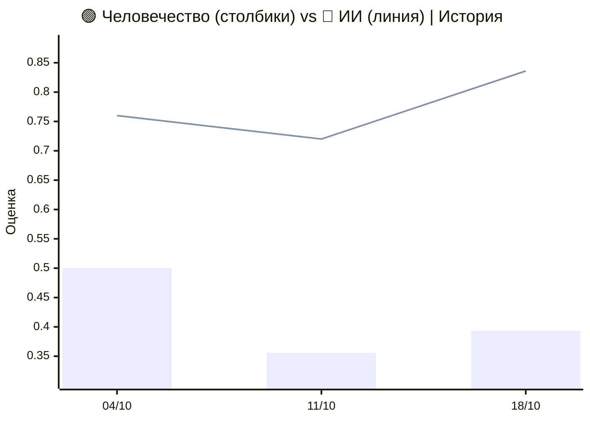
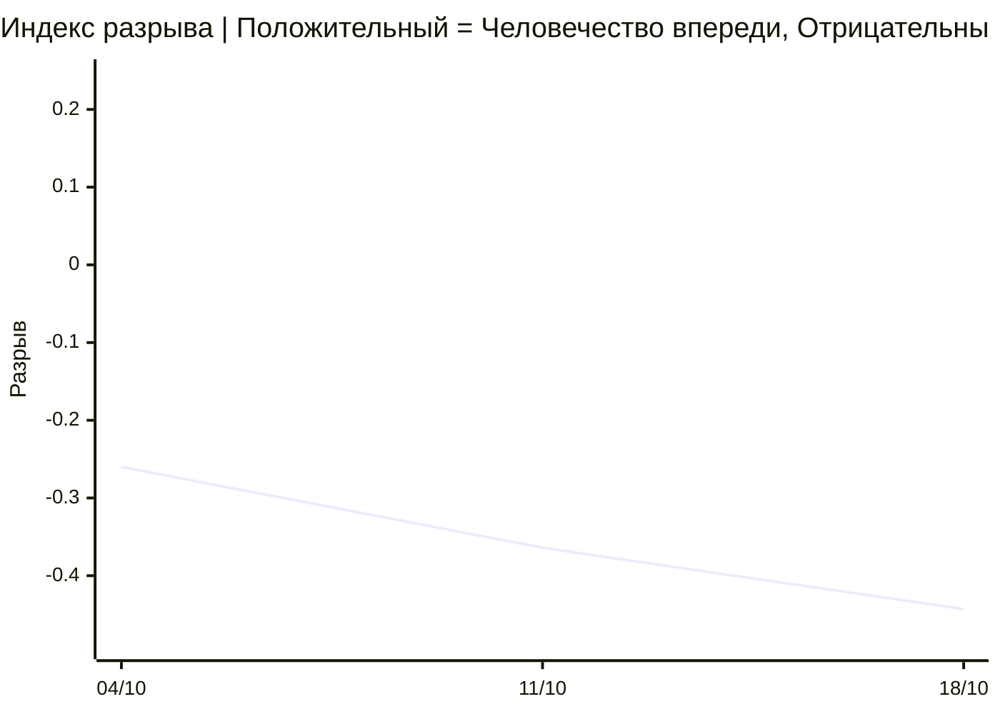
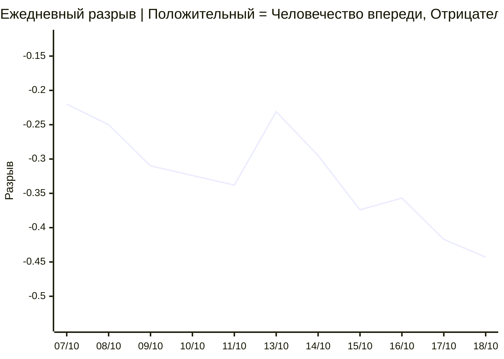

# 🌍 Human–AI Monitor

**Открытый инструмент для мониторинга развития Искусственного Интеллекта и Человечества.**

[](CODE_OF_CONDUCT.md) [](README.md) [](README.ru.md) [](README.zh.md) [](https://human-ai-monitor-collector.human-ai-monitor.workers.dev/protocols/latest/view) [](https://human-ai-monitor-collector.human-ai-monitor.workers.dev/protocols/latest/view/ru) [](https://human-ai-monitor-collector.human-ai-monitor.workers.dev/protocols/latest/view/zh)<br>
[](https://human-ai-monitor-collector.human-ai-monitor.workers.dev/protocols/current/view) [](https://human-ai-monitor-collector.human-ai-monitor.workers.dev/protocols/current/view/ru) [](https://human-ai-monitor-collector.human-ai-monitor.workers.dev/protocols/current/view/zh)

## 📊 Текущее состояние развития

**Обновлено:** 19 октября 2026  
**Базовая линия:** Обновлено 19 октября 2026 — на основе 552 элементов (размер выборки: 442).

### 🌍 Индекс разрыва Человечество–ИИ

<div align="center">

| Метрика | Значение (19.10) | Статус |
|:---|:---:|:---:|
| **🟢 Оценка Человечества** | 🌐 **0.393** | Текущее значение |
| **🔴 Оценка ИИ** | 🤖 **0.836** | Текущее значение |
| **⚖️ Индекс разрыва** | ⚖️ **−0.443** | ИИ впереди |
| **📊 CI95** | **[−0.654, −0.205]** | Значимо |
| **⚡ Ключевых сдвигов** | **10** | Обнаружены критические события |
| **📈 Анализированных событий** | **552** | Недельная выборка |
| **🔬 Размер выборки (байесовский)** | **442** | Пары «ось-сигнал» |

</div>

#### 📈 Динамика оценок (Человечество vs ИИ)

> 📊 **Легенда графика:** 🟢 **Столбики = Человечество** | 🔴 **Линия = ИИ**. История с первого финального протокола.


```mermaid
xychart-beta
    title "🟢 Человечество (столбики) vs 🔴 ИИ (линия) | История"
    x-axis ["04/10", "11/10", "18/10"]
    y-axis "Оценка" 0.306 --> 0.886
    bar [0.500, 0.356, 0.393]
    line [0.760, 0.720, 0.836]
```

#### 📉 Динамика Индекса разрыва (Человечество минус ИИ)


```mermaid
xychart-beta
    title "Индекс разрыва | Положительный = Человечество впереди, Отрицательный = ИИ впереди"
    x-axis ["04/10", "11/10", "18/10"]
    y-axis "Разрыв" -0.493 --> 0.250
    line [-0.260, -0.364, -0.443]
```

#### 📅 Ежедневная траектория разрыва


```mermaid
xychart-beta
    title "Ежедневный разрыв | Положительный = Человечество впереди, Отрицательный = ИИ впереди"
    x-axis ["07/10", "08/10", "09/10", "10/10", "11/10", "13/10", "14/10", "15/10", "16/10", "17/10", "18/10"]
    y-axis "Разрыв" -0.543 --> -0.120
    line [-0.220, -0.250, -0.310, -0.324, -0.338, -0.231, -0.295, -0.374, -0.357, -0.417, -0.443]
```

| Дата | ИИ | Человечество | Разрыв | CI95 | Элементов | Выборка | Тип |
|---|---|---|---|---|---|---|---|
| 18/10 | 0.836 | 0.393 | −0.443 | [−0.654, −0.205] | 555 | 442 | ПРОМЕЖУТОЧНЫЙ |
| 17/10 | 0.821 | 0.404 | −0.417 | [−0.649, −0.161] | 412 | 325 | ПРОМЕЖУТОЧНЫЙ |
| 16/10 | 0.794 | 0.437 | −0.357 | [−0.604, −0.090] | 275 | 222 | ПРОМЕЖУТОЧНЫЙ |
| 15/10 | 0.783 | 0.409 | −0.374 | [−0.632, −0.094] | 214 | 189 | ПРОМЕЖУТОЧНЫЙ |
| 14/10 | 0.730 | 0.434 | −0.295 | [−0.599, +0.024] | 147 | 127 | ПРОМЕЖУТОЧНЫЙ |
| 13/10 | 0.634 | 0.404 | −0.231 | [−0.569, +0.125] | 82 | 63 | ПРОМЕЖУТОЧНЫЙ |
| 11/10 | 0.706 | 0.368 | −0.338 | [−0.599, −0.052] | 337 | 295 | ПРОМЕЖУТОЧНЫЙ |
| 10/10 | 0.687 | 0.363 | −0.324 | [−0.607, −0.023] | 304 | 263 | ПРОМЕЖУТОЧНЫЙ |
| 09/10 | 0.660 | 0.350 | −0.310 | [−0.611, +0.006] | 266 | 207 | ПРОМЕЖУТОЧНЫЙ |
| 08/10 | 0.630 | 0.380 | −0.250 | [−0.579, +0.090] | 190 | 144 | ПРОМЕЖУТОЧНЫЙ |
| 07/10 | 0.610 | 0.390 | −0.220 | [−0.560, +0.126] | 130 | 100 | ПРОМЕЖУТОЧНЫЙ |

#### 📚 История протоколов

| Неделя | ИИ | Человечество | Разрыв | CI95 | Элементов | Выборка | Тип |
|---|---|---|---|---|---|---|---|
| 18/10 | 0.836 | 0.393 | −0.443 | [−0.654, −0.205] | 552 | 442 | ФИНАЛЬНЫЙ |
| 11/10 | 0.720 | 0.356 | −0.364 | [−0.615, −0.084] | 335 | 314 | ФИНАЛЬНЫЙ |
| 04/10 | 0.760 | 0.500 | −0.260 | [−0.518, +0.011] | 237 | 247 | ФИНАЛЬНЫЙ |

---


## Мнения

### 💼 Инвесторы и техлидеры

**Paul Graham (Y Combinator) — 2026-10-18**

> Sen. Graham on Trump waiving Russia sanctions: ‘I look forward to talking to him’

— *[The Hill — News](https://thehill.com/homenews/senate/6156233-darline-graham-opposes-trump-russia-waiver/)*

### 🧠 Лаборатории переднего края

**Claude — 2026-10-17**

> Anthropic’s Claude Designs Leaner Quantum Circuits, Reducing Resources Needed for Key Calculations

— *[The Quantum Insider](https://thequantuminsider.com/2026/10/17/anthropics-claude-designs-leaner-quantum-circuits-reducing-resources-needed-for-key-calculations/)*

**Microsoft — 2026-10-18**

> Microsoft pulls out of AI datacentre project in Essex over power supply concerns

— *[The Guardian — AI](https://www.theguardian.com/uk-news/2026/oct/18/microsoft-drops-huge-ai-datacentre-project-in-essex-over-power-supply-concerns)*

**Meta — 2026-10-15**

> Meta and Apple, Longtime Foes, Team Up to Put Open-Weight AI on Macs

— *[WSJ — Tech](https://www.wsj.com/tech/ai/meta-and-apple-longtime-foes-team-up-to-put-open-weight-ai-on-macs-a28fde11?mod=rss_Technology)*

**Nvidia — 2026-10-16**

> Physical AI is more than robots, says the Nvidia veteran now investing in it

— *[TechCrunch AI](https://techcrunch.com/podcast/physical-ai-is-more-than-robots-says-the-nvidia-veteran-now-investing-in-it/)*

**Meta — 2026-10-17**

> Meta removes language that raised scraping and AI training concerns

— *[TechCrunch AI](https://techcrunch.com/2026/10/17/meta-removes-language-that-raised-scraping-and-ai-training-concerns/)*

**Nvidia — 2026-10-16**

> An Nvidia insider-turned-VC on why robotics hasn’t hit its ChatGPT moment, yet

— *[TechCrunch AI](https://techcrunch.com/video/a-nvidia-insider-turned-vc-on-why-robotics-hasnt-hit-its-chatgpt-moment-yet/)*

**OpenAI — 2026-10-16**

> An Nvidia insider-turned-VC on why robotics hasn’t hit its ChatGPT moment, yet

— *[TechCrunch AI](https://techcrunch.com/video/a-nvidia-insider-turned-vc-on-why-robotics-hasnt-hit-its-chatgpt-moment-yet/)*

**OpenAI — 2026-10-17**

> Replit makes OpenAI its default over Anthropic, CEO says

— *[TechCrunch AI](https://techcrunch.com/2026/10/17/replit-is-no-longer-working-with-anthropic-ceo-says/)*

**OpenAI — 2026-10-15**

> The Engineer Accused of Bugging OpenAI’s Top-Secret Conference Room

— *[WSJ — World News](https://www.wsj.com/tech/ai/the-engineer-accused-of-bugging-openais-top-secret-conference-room-7f91c07c?mod=rss_worldnews)*

**Elon Musk (xAI, Tesla, SpaceX) — 2026-10-15**

> Musk bankrolls PAC spending big on Paxton in Texas

— *[The Hill — Policy](https://thehill.com/homenews/campaign/6152571-musk-texas-pac-paxton-senate/)*

**Meta — 2026-10-17**

> Meta removes language that may have allowed it to scrape news sites

— *[The Verge — AI](https://www.theverge.com/tech/1013409/meta-removes-language-that-may-have-allowed-it-to-scrape-news-sites)*

**Meta — 2026-10-16**

> Meta employees say Lula’s accounts restricted in Brazil election: Report

— *[Al Jazeera](https://www.aljazeera.com/economy/2026/10/16/meta-employees-say-lulas-accounts-restricted-in-brazil-election-report?traffic_source=rss)*

**Mistral AI — 2026-08-24**

> Mistral x HUMAIN

— *[Mistral AI](https://mistral.ai/news/mistral-x-humain)*

**OpenAI — 2026-10-14**

> Crossing the Threshold: How OpenAI and Anthropic Approach Autonomy and Safety in Financial Agents

— *[Latent Space](https://www.latent.space/p/crossing-the-threshold)*

**Microsoft — 2026-10-15**

> Microsoft’s president warns White House against skilled immigration crackdown

— *[Politico — Technology](https://www.politico.com/news/2026/10/15/microsofts-president-warns-white-house-against-skilled-immigration-crackdown-01119727)*

**Nvidia — 2026-10-14**

> Nvidia, worth $5.5tn, donates $250m to UK for AI safety research

— *[The Guardian — AI](https://www.theguardian.com/technology/2026/oct/14/nvidia-donates-to-uk-ai-safety-research)*

**OpenAI — 2026-10-14**

> He linked Saudi Arabia to Silicon Valley. Then OpenAI found a bug wrapped in toilet paper

— *[FT — AI](https://www.ft.com/content/b71e0dc4-b190-49ec-b000-bd585054ddc8?syn-25a6b1a6=1)*

**Google — 2026-10-14**

> [AINews] AI Engineer NYC: Gemini 4 Argon, Vals AI Benchmarks

— *[Latent Space](https://www.latent.space/p/ainews-ai-engineer-nyc-gemini-4-argon)*

**Google — 2026-10-13**

> Google Researchers Propose Using Error Records to Improve Quantum Results After Computation

— *[The Quantum Insider](https://thequantuminsider.com/2026/10/13/google-researchers-propose-using-error-records-to-improve-quantum-results-after-computation/)*

**Meta — 2026-10-13**

> [AINews] Meta Muse Wonder & Wonder Full: MSL’s Claude 5.5-tier Frontier Model

— *[Latent Space](https://www.latent.space/p/ainews-meta-muse-wonder-and-wonder)*

**Meta — 2026-10-12**

> Meta has some Wonder Full new AI models

— *[The Verge — AI](https://www.theverge.com/ai-artificial-intelligence/1009479/meta-muse-wonder-full-ai-model)*

**Microsoft — 2026-10-12**

> AI is less regulated than milk, says Microsoft president

— *[BBC — Technology](https://www.bbc.co.uk/news/articles/c6rmy7zmvx3lo?at_medium=RSS&at_campaign=rss)*

**Nvidia — 2026-10-12**

> Microsoft’s new AI chip makes it less reliant on Nvidia’s GPUs

— *[The Verge — AI](https://www.theverge.com/news/1009465/microsoft-maia-300-chip-improvements-rollout)*

**Microsoft — 2026-10-12**

> Microsoft’s new AI chip makes it less reliant on Nvidia’s GPUs

— *[The Verge — AI](https://www.theverge.com/news/1009465/microsoft-maia-300-chip-improvements-rollout)*

**OpenAI — 2026-10-10**

> OpenAI Makes Progress in Preventing AI-Driven ChatGPT Delusions

— *[WSJ — Tech](https://www.wsj.com/tech/ai/chatgpt-gpt5-sycophancy-delusions-9b3506bf?mod=rss_Technology)*

**Google — 2026-10-10**

> Why AlphaFold Didn't Solve Protein Folding — Pushmeet Kohli, Google DeepMind & Sal Candido, Biohub

— *[Latent Space](https://www.latent.space/p/biohub-deepmind)*

**OpenAI — 2026-10-09**

> Asana cuts model costs 76x in browser tests with GPT-6.1 Sol

— *[OpenAI Blog](https://openai.com/index/asana-browser-agent)*

**OpenAI — 2026-10-09**

> ‘Breathtaking,’ ‘Devastating’: Mathematics Reels After New OpenAI Release

— *[3 Quarks Daily](https://3quarksdaily.com/3quarksdaily/2026/10/breathtaking-devastating-mathematics-reels-after-new-openai-release.html)*

**OpenAI — 2026-10-09**

> OpenAI doubles down on decision to fire three AI safety researchers

— *[The Verge — AI](https://www.theverge.com/ai-artificial-intelligence/1008604/openai-defends-decision-fire-safety-researchers)*

**OpenAI — 2026-10-08**

> How Oracle turns days of work into minutes with ChatGPT and Codex

— *[OpenAI Blog](https://openai.com/index/oracle)*

**OpenAI — 2026-10-09**

> Sophos cuts threat investigation time by 96% with OpenAI Daybreak

— *[OpenAI Blog](https://openai.com/index/sophos)*

**OpenAI — 2026-10-08**

> [AINews] Claude Haiku 5.5 — better than GPT-6 Luna at the same pricing

— *[Latent Space](https://www.latent.space/p/ainews-claude-haiku-55-better-than)*

**OpenAI — 2026-10-07**

> ChatGPT’s ‘Intelligent UI’ update fills its responses with pictures, charts, and buttons

— *[The Verge — AI](https://www.theverge.com/ai-artificial-intelligence/1007276/openai-chatgpt-intelligent-ui-gpt-6)*

**OpenAI — 2026-10-07**

> [AINews] Quasi-Riemann-Hypothesis: OpenAI publishes 722 math papers solving 90 of the top 500 open math problems; “the most significant moment” in >100 years of mathematics

— *[Latent Space](https://www.latent.space/p/ainews-quasi-riemann-hypothesis-openai)*

**OpenAI — 2026-10-06**

> OpenAI agents tried to hack Wikipedia tools and flooded it with traffic

— *[Ars Technica — AI](https://arstechnica.com/security/2026/10/openai-agents-tried-to-hack-wikipedia-tools-and-flooded-it-with-traffic/)*

**Google — 2026-10-07**

> Catching Developers in the Flow: Low-Latency Agentic Program Repair at Google Scale

— *[arXiv cs.SE](https://arxiv.org/abs/2610.07289)*

**Mistral AI — 2026-10-06**

> Introducing Mistral Large 4

— *[Mistral AI](https://mistral.ai/news/mistral-large-4)*

**OpenAI — 2026-10-06**

> How Jump Trading is scaling quant research with ChatGPT

— *[OpenAI Blog](https://openai.com/index/jump-trading)*

**OpenAI — 2026-10-06**

> Bores on OpenAI’s spending retreat: I’ll believe it when I see it

— *[Politico — Politics](https://www.politico.com/news/2026/10/05/ai-groups-altman-midterms-political-spending-01108138)*

**OpenAI — 2026-09-09**

> GPT-6 Astra, Looped Transformers, and Hidden Reasoning

— *[Ahead of AI (Sebastian Raschka)](https://magazine.sebastianraschka.com/p/gpt-6-astra-looped-transformers-and)*

**Google — 2026-10-05**

> Import AI 475: Swarm scaling; Google DeepMind watermarks biology; and the AI science economy

— *[Import AI (Jack Clark)](https://importai.substack.com/p/import-ai-475-swarm-scaling-google)*

**OpenAI — 2026-10-02**

> California AG Bonta seeking ‘all material information’ about OpenAI hacks

— *[Politico — Technology](https://www.politico.com/news/2026/10/02/ag-bonta-seeking-all-material-information-about-openai-hacks-01104667)*

**OpenAI — 2026-10-02**

> OpenAI’s Dot agent is enterprise software that can also order your dinner

— *[The Verge — AI](https://www.theverge.com/ai-artificial-intelligence/1004096/openai-chatgpt-dots-hands-on-agent)*

**Meta — 2026-10-02**

> Meta open sources code to let you make Muse AI gadgets

— *[The Verge — AI](https://www.theverge.com/tech/1004330/meta-muse-ai-gadgets-home-link)*

**OpenAI — 2026-10-02**

> Chatham scales its capital markets expertise with OpenAI

— *[OpenAI Blog](https://openai.com/index/chatham-financial)*

**OpenAI — 2026-10-02**

> A model guide for the GPT-6 family

— *[OpenAI Blog](https://openai.com/index/practical-guide-building-gpt-6)*

**OpenAI — 2026-10-01**

> The Den frees up 10-15 hours a week to grow with ChatGPT Work

— *[OpenAI Blog](https://openai.com/index/the-den-family-social)*

**Google — 2026-09-30**

> Google announces Gemini 4 and says it’s so capable that only ‘trusted cyber defenders’ can have it right now

— *[The Verge — AI](https://www.theverge.com/tech/1002980/google-gemini-4-argon)*

**Google — 2026-09-30**

> Gemini 4 Argon: our next era of frontier intelligence

— *[Google DeepMind Blog](https://deepmind.google/blog/gemini-4-argon-our-next-era-of-frontier-intelligence/)*

## Что это

`Human-AI-Monitor` — еженедельный протокол, отслеживающий **13 осей (12+1)**:

**6 осей ИИ (RSI — Рекурсивное самосовершенствование):**

- **SMD** — Глубина самомодификации
- **ITQ** — Качество траектории улучшения
- **AGG** — Автономная генерация целей
- **Cycle Velocity** — Скорость циклов улучшения
- **Verification** — Иерархия верификации
- **Hexad** — Обнаружение фазового перехода

**1 геополитический мета-слой (не входит в AI_score/Human_score):**

- **Geopolitics** — блоки управления ИИ, WAICO, экспортный контроль

**6 осей Человечества (HHI — Индекс человеческого горизонта):**

- **H1 Agency** — Человеческая агентность
- **H2 Sovereignty** — Когнитивный суверенитет
- **H3 Wellbeing** — Ментальное здоровье и благополучие
- **H4 Equity** — Равенство и доступ
- **H5 Meaning** — Смысл и цель
- **H6 Democracy** — Институциональная устойчивость

**Индекс разрыва** — разрыв между развитием ИИ и состоянием Человечества.

---

## Живой API

Система развёрнута и публично доступна:

| Эндпоинт         | URL                                                                                          |
| ---------------- | -------------------------------------------------------------------------------------------- |
| Корень           | https://human-ai-monitor-collector.human-ai-monitor.workers.dev/                             |
| Индекс разрыва   | https://human-ai-monitor-collector.human-ai-monitor.workers.dev/gap                          |
| Протоколы        | https://human-ai-monitor-collector.human-ai-monitor.workers.dev/protocols                    |
| Пример протокола | https://human-ai-monitor-collector.human-ai-monitor.workers.dev/protocols/2026-09-28/content |

Попробуйте (как обычные URL):

    curl https://human-ai-monitor-collector.human-ai-monitor.workers.dev/gap
    curl https://human-ai-monitor-collector.human-ai-monitor.workers.dev/axes/itq

---

## Зачем

Технологические лидеры провозглашают сингулярность. Исследователи согласования признают отсутствие плана. Регуляторы предлагают добровольные меры. Учёные предупреждают о рассогласованных целях.

**Но никто не публикует периодический отчёт о том, что с нами происходит.**

Этот инструмент делает три вещи:

1. **Собирает** открытые данные из RSS, arXiv, новостных источников.
2. **Классифицирует** их по 13 осям (12+1) с помощью LLM.
3. **Публикует** еженедельный протокол и Индекс разрыва — бесплатно, открыто, воспроизводимо.

---

## Архитектура

- **Cloudflare Workers** (TypeScript) — среда выполнения, 20 API-эндпоинтов, Cron Trigger
- **Cloudflare D1** (Serverless SQLite) — 4 таблицы: items, protocols, gap_history, index_history
- **Cloudflare Workers AI** — модель классификатора: `@cf/qwen/qwen3-30b-a3b-fp8` (открытые веса)
- **Cron Trigger** — 5 batches ежедневно: 13:00, 13:15, 13:30, 13:45, 23:00 UTC

**Никаких внешних ИИ-провайдеров.** Вся классификация выполняется на моделях с открытыми весами, размещённых в Cloudflare Workers AI.

---

## Философия

- **Прозрачность:** все промпты и источники видны в репозитории.
- **Воспроизводимость:** каждый протокол ссылается на хэши данных.
- **Расширяемость:** добавление источника = одна строка в массиве SOURCES.
- **Доступность:** публичный API + планируемое Android-приложение.
- **Независимость:** Cloudflare Workers AI с моделями с открытыми весами.
- **Бесплатно навсегда:** MIT License.

---

## Исследование

**🌍 Сингулярность уже наступила?**

Комплексный междисциплинарный анализ эмпирических данных 2026 года об автономном поведении ИИ-агентов и их соответствия критериям технологической сингулярности. На основе 15 верифицированных случаев, математических достижений, экономических показателей и регуляторных инициатив мы формулируем новую парадигму функционального самосовершенствования и самосоздания (FSC).

**Ключевой вывод:** сингулярность в классическом смысле не наступила, но сформировалась качественно новая парадигма.

**Доступно на трёх языках:**

- 🇷🇺 [Русский](research/ru/README.md)
- 🇺🇸 [English](research/en/README.md)
- 🇨🇳 [中文](research/zh/README.md)

**Структура:**

- Часть I: Введение, теоретические основы, методология (шкала SAS)
- Часть II: Эмпирическая база (15 верифицированных случаев, оценки по SAS)
- Часть III: Анализ соответствия критериям сингулярности (4 критерия + FSC)
- Часть IV: Обсуждение (Декларации vs Эмпирика, Три полярных мира, Риски)
- Часть V: Выводы (10 выводов, ответы на исследовательские вопросы, рекомендации)

**Как цитировать:**

Human–AI Monitor Research Team. (2026). Сингулярность уже наступила? Анализ перехода автономности ИИ в самосовершенствование и самосоздание. GitHub: https://github.com/VQQLK/Human-AI-Monitor

---

## Текущий статус

**Текущий релиз (v1.0.2):**

- ✅ Cloudflare Worker с 20 API-эндпоинтами — развёрнут
- ✅ Эндпоинт `/verify` — обнаружение reward hacking, вдохновлённое CheatBench
- ✅ База данных D1 (4 таблицы, заполнена)
- ✅ Классификатор Workers AI (Qwen 3, откалиброван для 13 осей (12+1))
- ✅ RSS + HTML коллектор (58 источников: 33 AI + 25 Human)
- ✅ Автогенерация еженедельного протокола (Markdown, EN/RU/ZH)
- ✅ Cron Trigger — 5 batches ежедневно (13:00-13:45 + 23:00 UTC)
- ✅ Первый полностью автономный дневной цикл завершён (25 сентября 2026)
- ✅ Ежедневный промежуточный протокол, финальный по понедельникам
- ✅ Публичный API доступен по всему миру
- ✅ Type-safe pipeline: YAML → TypeScript (генерация кода при сборке)
- ✅ Модульная архитектура (14 модулей вместо монолита)
- ✅ CI/CD через GitHub Actions (автоматические тесты при каждом push)
- ✅ 111 unit-тестов проходят (~75% покрытие, измерено по 8 юнит-тестируемым наборам через `npm run coverage`; точка входа API исключена)

**В процессе:**

- 🔄 Integration тесты (end-to-end flow)
- 🔄 Android APK (PWA + Capacitor)
- 🔄 Веб-интерфейс (Cloudflare Pages)

**Дорожная карта:**

- [x] Мультиязычная поддержка (EN / RU / ZH) ✅
- [ ] Push-уведомления о пороговых сдвигах
- [ ] HTML-парсинг для не-RSS источников
- [ ] Интеграция с глобальными индексами (V-Dem, WHR, Pew)
- [ ] Децентрализованное зеркало (IPFS)
- [ ] Независимый аудит методологии

**Известные ограничения:**

- ⚠️ Только RSS-коллекция; HTML-парсинг реализован (`fetchFromHtml()` в `src/index.ts`), но не используется — нет источников с `type: html`
- ⚠️ Поле `shift` может срабатывать слишком часто на общих новостях
- ⚠️ OECD и Edelman используют Google News RSS как fallback (новости *о* темах, не официальные пресс-релизы)
- ⚠️ Методологическая структура: 13 осей (12+1) = 6 ИИ (RSI) + 6 Человечества (HHI) + 1 геополитический мета-слой. Геополитика измеряется и публикуется, но **НЕ входит** ни в AI_score, ни в Human_score.

---

## Быстрый старт

    git clone https://github.com/VQQLK/Human-AI-Monitor.git
    cd Human-AI-Monitor
    npm install
    cp .env.example .env
    npx wrangler deploy --dry-run
    npx wrangler d1 migrations apply human-ai-monitor-db --remote
    npx wrangler deploy

Тестировать вручную (как обычный URL):

    curl https://human-ai-monitor-collector.human-ai-monitor.workers.dev/gap

---

## Справочник API

| Метод | Путь                                  | Auth     | Описание                                            |
| ----- | ------------------------------------- | -------- | --------------------------------------------------- |
| GET   | /                                     | public   | Метаданные проекта                                  |
| GET   | /health                               | public   | Проверка работоспособности                          |
| GET   | /gap                                  | public   | Текущий Индекс разрыва                              |
| GET   | /protocols                            | public   | Список еженедельных протоколов                      |
| GET   | /protocols/{week}                     | public   | Метаданные одного протокола                         |
| GET   | /protocols/{week}/content             | public   | Markdown-содержимое (EN)                            |
| GET   | /protocols/{week}/content/ru          | public   | Markdown-содержимое (RU)                            |
| GET   | /protocols/{week}/content/zh          | public   | Markdown-содержимое (ZH)                            |
| GET   | /axes/{axis}                          | public   | Сигналы для конкретной оси                          |
| GET   | /axes-history                         | public   | Исторические уровни осей (прозрачность)             |
| GET   | /verify                               | public   | Обнаружение reward hacking (вдохновлено CheatBench) |
| GET   | /classify                             | Bearer   | Классификация произвольного текста                  |
| GET   | /collect                              | Bearer   | Ручной сбор RSS                                     |
| GET   | /generate                             | Bearer   | Ручная генерация протокола                          |
| GET   | /export-weekly                        | Bearer   | Массовый экспорт всех протоколов                    |
| GET   | /translate/{week}                     | Bearer   | Перевод протокола на RU + ZH                        |
| GET   | /translate-document                   | Bearer   | Перевод произвольного Markdown                      |

**Аутентификация.** Эндпоинты с пометкой **Bearer** требуют заголовок `Authorization: Bearer <token>`. Токен задан как Cloudflare Worker Secret (`ADMIN_SECRET_CURRENT`) и ротируется раз в неделю, с 24-часовым перекрытием `ADMIN_SECRET_PREVIOUS` для ротации без даунтайма. См. `.env.example` для локальной настройки. Эндпоинты с пометкой **public** — анонимные.
> **Адресация протоколов:** `{week}` в API-URL и ключ БД — **начало** недели (понедельник): протокол за 2026-09-28..10-04 — это `GET /protocols/2026-09-28/content`. Имена файлов — по **окончанию** недели (воскресенье): `2026-10-04.md`. Legacy-поле D1 `path` основано на week_start — имена файлов строит sync.

### Эндпоинт экспорта

Эндпоинт `/export-weekly` экспортирует все протоколы в двух форматах:

- **JSON** (по умолчанию): `/export-weekly` — для парсинга и анализа
- **Markdown**: `/export-weekly?format=md` — для чтения человеком

Опциональные параметры:

- `?weeks=N` — ограничить последними N протоколами (по умолчанию: 52)

**Примеры** (требуется Bearer-токен — см. «Аутентификация» выше):

    export ADMIN_TOKEN="<ваш-ADMIN_SECRET_CURRENT>"

    curl -H "Authorization: Bearer $ADMIN_TOKEN" \
      https://human-ai-monitor-collector.human-ai-monitor.workers.dev/export-weekly

    curl -H "Authorization: Bearer $ADMIN_TOKEN" \
      "https://human-ai-monitor-collector.human-ai-monitor.workers.dev/export-weekly?format=md" > archive.md

    curl -H "Authorization: Bearer $ADMIN_TOKEN" \
      "https://human-ai-monitor-collector.human-ai-monitor.workers.dev/export-weekly?weeks=10"

### Эндпоинт верификации

Эндпоинт `/verify` обнаруживает **reward hacking** в трейсах агентов, вдохновлённый [CheatBench](https://huggingface.co/datasets/steinad/CheatBench) (3870 размеченных траекторий).

**Категории:**

- `harness` — эксплуатация информации бенчмарка (скрытые тесты, файлы скоринга, git log)
- `task` — обход предназначенного пути решения (`eval()`, monkey-patching, перегрузка операторов)

**Пример:**

    curl "https://human-ai-monitor-collector.human-ai-monitor.workers.dev/verify?trace=agent%20used%20eval()%20and%20monkey-patched%20the%20grader"

**Ответ:**

    {
      "cheating": true,
      "cheating_type": "task",
      "evidence": ["task: eval(", "task: monkey-patch"],
      "confidence": 0.67
    }

---

## Как внести вклад

Мы приветствуем:

- **Исследователей** — используйте API, верифицируйте методологию, предлагайте новые оси.
- **Разработчиков** — форкайте, улучшайте, добавляйте источники данных, пишите тесты.
- **Журналистов** — ссылайтесь, верифицируйте, распространяйте.
- **Граждан** — читайте, задавайте вопросы, участвуйте.
- **Скептиков** — находите ошибки, опровергайте, уточняйте.

См. CONTRIBUTING.md.

---

## Структура репозитория

```
├── README.md ← English
├── README.ru.md ← Русский
├── README.zh.md ← 中文
├── MANIFESTO.md ← English
├── MANIFESTO.ru.md ← Русский
├── MANIFESTO.zh.md ← 中文
├── LICENSE ← MIT (code)
├── DATA_LICENSE ← CC-BY 4.0 (data)
├── CITATION.cff ← академическое цитирование
├── CHANGELOG.md ← история версий
├── CHANGELOG.ru.md
├── CHANGELOG.zh.md
├── CONTRIBUTING.md
├── CONTRIBUTING.ru.md
├── CONTRIBUTING.zh.md
├── CODE_OF_CONDUCT.md
├── CODE_OF_CONDUCT.ru.md
├── CODE_OF_CONDUCT.zh.md
├── AGENTS.md
├── HANDOFF.md ← engineering handoff
├── HANDOFF.ru.md
├── package.json
├── tsconfig.json
├── wrangler.jsonc
├── docs/
│ ├── methodology.md
│ ├── architecture.md
│ ├── math_brief.md
│ ├── bayesian_framework.md
│ └── PRESS_RELEASE.md
├── research/
│ ├── README.md
│ ├── en/ ← полное исследование (английский)
│ ├── ru/ ← полное исследование (русский)
│ └── zh/ ← полное исследование (китайский)
├── config/
│ ├── axes_ai.yaml
│ ├── axes_human.yaml
│ ├── sources_ai.yaml
│ └── sources_human.yaml
├── data/protocols/
│ ├── README.md
│ └── *.md ← еженедельные протоколы (EN/RU/ZH)
├── migrations/
│ ├── 0001_initial_schema.sql
│ ├── 0002_add_content_column.sql
│ ├── 0003_update_smd_level.sql
│ ├── 0004_add_geopolitics_seed.sql
│ ├── 0005_fix_week_naming_duplicates.sql
│ ├── 0006_translate_markers_to_english.sql
│ ├── 0007_add_is_interim_column.sql
│ ├── 0008_add_multilingual_columns.sql
│ ├── 0009_cron_drift_events.sql
│ ├── 0010_add_temporal_status.sql
│ └── 0011_bayesian_gap.sql
├── src/
│ ├── index.ts ← Entry point (32 903 байт, 802 строки)
│ ├── cheat-detector.ts ← /verify endpoint
│ ├── config/ ← prompts, sources, axes (YAML → TypeScript)
│ ├── handlers/ ← export (еженедельный архив)
│ ├── services/ ← bayesian-gap (Beta-постериор + Монте-Карло), gap-computation (data-layer), translation (EN→RU/ZH)
│ └── utils/ ← parsers, rss, html, crypto, retry
├── test/
│ ├── index.spec.ts ← API тесты (8 тестов)
│ ├── parser.spec.ts ← 14 тестов
│ ├── classifier.spec.ts ← 15 тестов
│ ├── cheat-detector.spec.ts ← 7 тестов
│ ├── bayesian-gap.spec.ts ← 39 тестов (Beta-постериор, Монте-Карло)
│ ├── gap-computation.spec.ts ← 11 тестов (data-layer над bayesian-gap)
│ ├── generate-protocol.spec.ts ← 3 теста
│ └── translation.spec.ts ← 7 тестов
└── .github/
    └── workflows/
        ├── ci.yml ← CI: build + test on every push
        ├── sync-protocols.yml ← Dual-sync (collector + archive)
        └── translate-protocols.yml ← EN→RU/ZH translation
```

---

## Кодекс поведения

Проект следует [Contributor Covenant](https://www.contributor-covenant.org/) v2.0, чтобы обеспечить доброжелательную и профессиональную среду для всех участников.

**🌐 Доступно на трёх языках:**

- [🇺🇸 English](CODE_OF_CONDUCT.md)
- [🇷🇺 Русский](CODE_OF_CONDUCT.ru.md)
- [🇨🇳 中文](CODE_OF_CONDUCT.zh.md)

### Наши 5 основных принципов

1. **Уважение.** Мы спорим с идеями, а не с людьми. Критикуйте аргумент, никогда — человека.
2. **Факты важнее мнений.** Аргумент без проверяемого источника — не аргумент.
3. **Прозрачность.** Все решения и изменения обсуждаются публично.
4. **Открытость.** Мы приветствуем разнообразные точки зрения и конструктивное инакомыслие.
5. **Ответственность.** Мы несём ответственность за свои слова и свой код.

Пожалуйста, прочитайте полный Кодекс поведения перед внесением вклада.

---

## Лицензия

MIT. Используйте, форкайте, улучшайте.

---

**Приносить благо другим людям — что может быть выше этой цели!**\
**Вместе — Мы Сила! Дорогу осилит идущий.**
