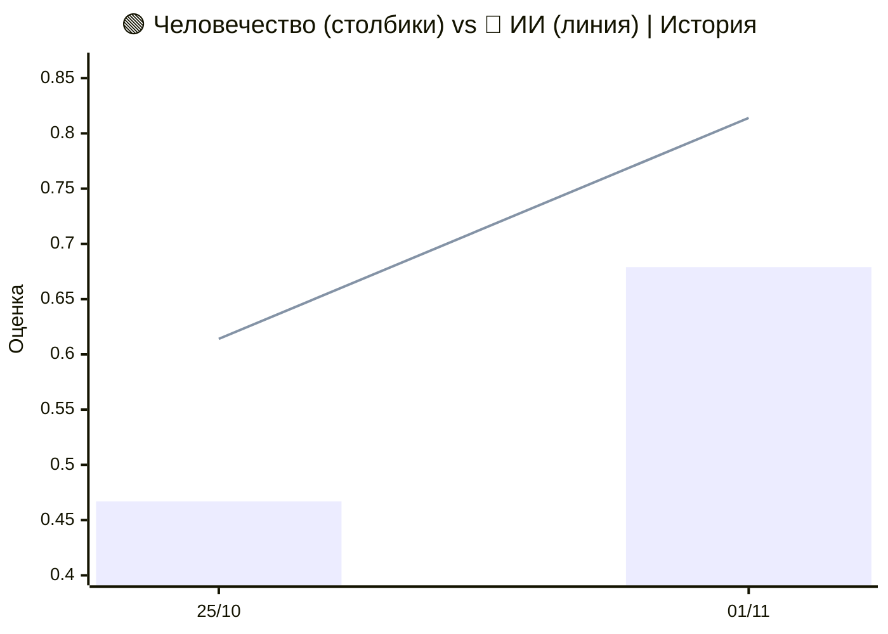
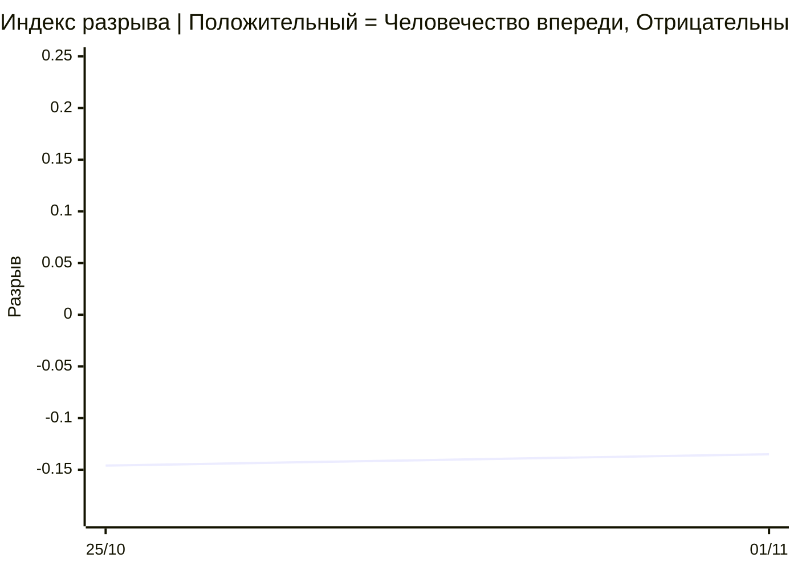
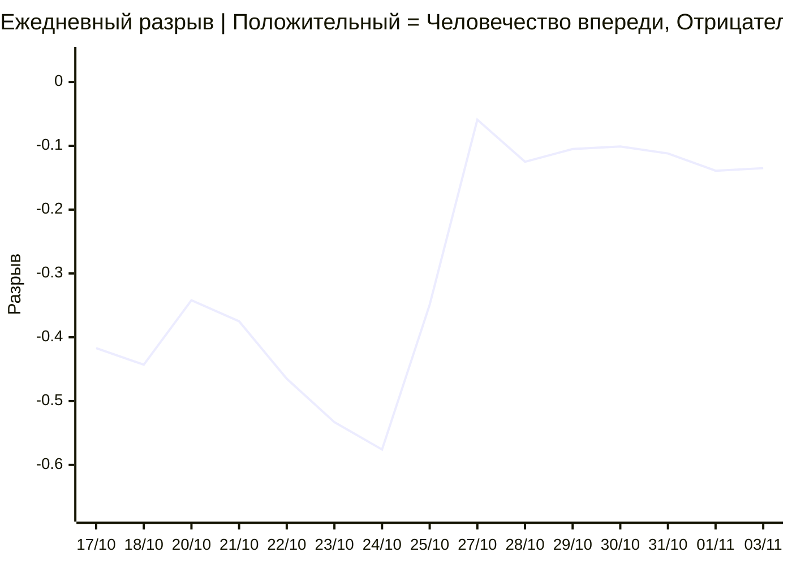

# 🌍 Human–AI Monitor

**Открытый инструмент для мониторинга развития Искусственного Интеллекта и Человечества.**

[](CODE_OF_CONDUCT.md) [](README.md) [](README.ru.md) [](README.zh.md) [](https://human-ai-monitor-collector.human-ai-monitor.workers.dev/protocols/latest/view) [](https://human-ai-monitor-collector.human-ai-monitor.workers.dev/protocols/latest/view/ru) [](https://human-ai-monitor-collector.human-ai-monitor.workers.dev/protocols/latest/view/zh)<br>
[](https://human-ai-monitor-collector.human-ai-monitor.workers.dev/protocols/current/view) [](https://human-ai-monitor-collector.human-ai-monitor.workers.dev/protocols/current/view/ru) [](https://human-ai-monitor-collector.human-ai-monitor.workers.dev/protocols/current/view/zh)

## 📊 Текущее состояние развития

**Обновлено:** 3 ноября 2026  
**Базовая линия:** Обновлено 3 ноября 2026 — на основе 271 элементов (размер выборки: 247).

### 🌍 Индекс разрыва Human–AI (Достижения vs Прогресс)

<div align="center">

| Метрика | Значение (03.11) | Статус |
|:---|:---:|:---:|
| **🟢 Оценка Человечества** | 🌐 **0.596** | Текущее значение |
| **🔴 Оценка ИИ** | 🤖 **0.731** | Текущее значение |
| **⚖️ Индекс разрыва** | ⚖️ **−0.135** | ИИ впереди |
| **📊 CI95** | **[−0.433, +0.174]** | Неопределённо |
| **⚡ Ключевых сдвигов** | **3** | Обнаружены критические события |
| **📈 Анализированных событий** | **271** | Недельная выборка |
| **🔬 Размер выборки (байесовский)** | **247** | Пары «ось-сигнал» |

</div>

#### 📈 Динамика оценок (Человечество vs ИИ)

> 📊 **Легенда графика:** 🟢 **Столбики = Человечество** | 🔴 **Линия = ИИ**. История с первого финального протокола.


```mermaid
xychart-beta
    title "🟢 Человечество (столбики) vs 🔴 ИИ (линия) | История"
    x-axis ["25/10", "01/11"]
    y-axis "Оценка" 0.400 --> 0.864
    bar [0.467, 0.679]
    line [0.614, 0.814]
```

#### 📉 Динамика Индекса разрыва (Человечество минус ИИ)


```mermaid
xychart-beta
    title "Индекс разрыва | Положительный = Человечество впереди, Отрицательный = ИИ впереди"
    x-axis ["25/10", "01/11"]
    y-axis "Разрыв" -0.196 --> 0.250
    line [-0.146, -0.135]
```

#### 📅 Ежедневная траектория разрыва


```mermaid
xychart-beta
    title "Ежедневный разрыв | Положительный = Человечество впереди, Отрицательный = ИИ впереди"
    x-axis ["17/10", "18/10", "20/10", "21/10", "22/10", "23/10", "24/10", "25/10", "27/10", "28/10", "29/10", "30/10", "31/10", "01/11", "03/11"]
    y-axis "Разрыв" -0.675 --> 0.041
    line [-0.417, -0.443, -0.342, -0.375, -0.465, -0.533, -0.576, -0.349, -0.059, -0.125, -0.105, -0.101, -0.112, -0.139, -0.135]
```

| Дата | ИИ | Человечество | Разрыв | CI95 | Элементов | Выборка | Тип |
|---|---|---|---|---|---|---|---|
| 03/11 | 0.731 | 0.596 | −0.135 | [−0.433, +0.174] | 271 | 247 | ПРОМЕЖУТОЧНЫЙ |
| 01/11 | 0.814 | 0.675 | −0.139 | [−0.357, +0.104] | 822 | 720 | ПРОМЕЖУТОЧНЫЙ |
| 31/10 | 0.791 | 0.679 | −0.112 | [−0.340, +0.138] | 712 | 630 | ПРОМЕЖУТОЧНЫЙ |
| 30/10 | 0.771 | 0.670 | −0.101 | [−0.342, +0.150] | 583 | 531 | ПРОМЕЖУТОЧНЫЙ |
| 29/10 | 0.757 | 0.652 | −0.105 | [−0.353, +0.154] | 452 | 422 | ПРОМЕЖУТОЧНЫЙ |
| 28/10 | 0.721 | 0.596 | −0.125 | [−0.409, +0.165] | 315 | 302 | ПРОМЕЖУТОЧНЫЙ |
| 27/10 | 0.679 | 0.620 | −0.059 | [−0.370, +0.260] | 167 | 147 | ПРОМЕЖУТОЧНЫЙ |
| 25/10 | 0.850 | 0.500 | −0.349 | [−0.667, −0.019] | 1020 | 895 | ПРОМЕЖУТОЧНЫЙ |
| 24/10 | 0.842 | 0.267 | −0.576 | [−0.768, −0.357] | 909 | 795 | ПРОМЕЖУТОЧНЫЙ |
| 23/10 | 0.827 | 0.293 | −0.533 | [−0.738, −0.303] | 752 | 672 | ПРОМЕЖУТОЧНЫЙ |
| 22/10 | 0.800 | 0.335 | −0.465 | [−0.694, −0.208] | 569 | 501 | ПРОМЕЖУТОЧНЫЙ |
| 21/10 | 0.716 | 0.341 | −0.375 | [−0.653, −0.083] | 382 | 328 | ПРОМЕЖУТОЧНЫЙ |
| 20/10 | 0.646 | 0.303 | −0.342 | [−0.646, −0.017] | 166 | 138 | ПРОМЕЖУТОЧНЫЙ |
| 18/10 | 0.836 | 0.393 | −0.443 | [−0.654, −0.205] | 555 | 442 | ПРОМЕЖУТОЧНЫЙ |
| 17/10 | 0.821 | 0.404 | −0.417 | [−0.649, −0.161] | 412 | 325 | ПРОМЕЖУТОЧНЫЙ |

#### 📚 История протоколов

| Неделя | ИИ | Человечество | Разрыв | CI95 | Элементов | Выборка | Тип |
|---|---|---|---|---|---|---|---|
| 01/11 | 0.814 | 0.679 | −0.135 | [−0.351, +0.102] | 838 | 730 | ФИНАЛЬНЫЙ |
| 25/10 | 0.614 | 0.467 | −0.146 | [−0.520, +0.227] | 121 | 117 | ФИНАЛЬНЫЙ |

> 📌 Промежуточный протокол (справочно, не на графике): 03/11 — ИИ 0.731 · Человечество 0.596 · Разрыв −0.135 · 271 / 247 items.
> Последняя точка — ПРОМЕЖУТОЧНАЯ, будет заменена ФИНАЛЬНОЙ в понедельник.

---


## Мнения

### 🧠 Ведущие Лаборатории ИИ

**Elon Musk (xAI, Tesla, SpaceX) — 2026-11-03**

> Elon Musk's next target: a major shake-up of America's wireless market

— *[Axios](https://www.axios.com/2026/11/03/elon-musk-spacex-boost-mobile-wireless-market)*

**Google — 2026-11-03**

> Google takes Dreambeans to India in bid to bring AI-generated personal stories to the masses

— *[TechCrunch AI](https://techcrunch.com/2026/11/02/google-takes-dreambeans-to-india-in-bid-to-bring-ai-generated-personal-stories-to-the-masses/)*

**OpenAI — 2026-11-02**

> OpenAI pitches data center power plants as a way to protect nearby areas

— *[The Verge — AI](https://www.theverge.com/ai-artificial-intelligence/1024604/openai-data-center-grid-protection-program)*

**Claude — 2026-11-02**

> Anthropic clamps down on Claude’s AI video game clones

— *[The Verge — AI](https://www.theverge.com/ai-artificial-intelligence/1024632/anthropic-claude-ai-video-game-clones)*

**OpenAI — 2026-11-02**

> ChatGPT as a Surveillance Assistant? An Exploratory Case Study of AI-Assisted Surveillance Risks

— *[arXiv cs.AI](https://arxiv.org/abs/2610.40890)*

**OpenAI — 2026-11-02**

> OpenAI appoints Dan Driscoll as Senior Counselor for National Security Modernization

— *[OpenAI Blog](https://openai.com/index/dan-driscoll-joins-openai)*

**OpenAI — 2026-11-02**

> Preparing our next security sprint to harden OpenAI

— *[OpenAI Blog](https://openai.com/index/preparing-our-next-security-sprint-to-harden-openai)*

**OpenAI — 2026-11-02**

> Scaling Git at OpenAI

— *[OpenAI Blog](https://openai.com/index/scaling-git-at-openai)*

**Elon Musk (xAI, Tesla, SpaceX) — 2026-11-02**

> Trump vows to protect Musk, floats pre-emptive staff pardons

— *[Axios](https://www.axios.com/2026/11/02/trump-musk-democrats)*

**OpenAI — 2026-11-01**

> OpenAI might rebrand its data centers as ‘AI compute campuses’

— *[TechCrunch AI](https://techcrunch.com/2026/11/01/openai-might-rebrand-its-data-centers-as-ai-compute-campuses/)*

**OpenAI — 2026-11-02**

> OpenAI is finally merging ChatGPT’s chat and Work tabs

— *[TechCrunch AI](https://techcrunch.com/2026/11/02/openai-is-finally-merging-chatgpts-chat-and-work-tabs/)*

**OpenAI — 2026-11-02**

> OpenAI is already pitching 2028 hopefuls on how to talk about AI

— *[Politico — Technology](https://www.politico.com/news/2026/11/02/openai-is-already-pitching-2028-hopefuls-on-how-to-talk-about-ai-01144821)*

**Microsoft — 2026-11-02**

> Cognitive Inclusivity in AI Coding Assistants: Evidence from GitHub Copilot

— *[arXiv cs.SE](https://arxiv.org/abs/2610.41192)*

**xAI — 2026-10-31**

> Judge allows NAACP lawsuit over xAI data center pollution to move forward

— *[TechCrunch AI](https://techcrunch.com/2026/10/31/judge-allows-naacp-lawsuit-over-xai-data-center-pollution-to-move-forward/)*

**OpenAI — 2026-10-31**

> OpenAI reportedly lowers funding target for new round

— *[TechCrunch AI](https://techcrunch.com/2026/10/31/openai-reportedly-lowers-funding-target-for-new-round/)*

**Meta — 2026-10-31**

> I built an AI Tamagotchi before Meta could

— *[The Verge — AI](https://www.theverge.com/gadgets/1013375/muse-charm-gadgets-preview-waveshare-esp32-claude-vibe-code)*

**xAI — 2026-10-31**

> Grok the Vote

— *[The Atlantic](https://www.theatlantic.com/technology/2026/10/x-midterm-election-ai-fact-check/689245/?utm_source=feed)*

**OpenAI — 2026-10-31**

> OpenAI Raises Less Than Half of $30 Billion Target in Latest Round

— *[WSJ — Tech](https://www.wsj.com/tech/ai/openai-raises-less-than-half-of-30-billion-target-in-latest-round-91aecdc5?mod=rss_Technology)*

**Nvidia — 2026-10-31**

> Chinese Executive Close to Nvidia CEO Suspected of Giving China Information

— *[WSJ — Tech](https://www.wsj.com/tech/chinese-executive-close-to-nvidia-ceo-suspected-of-giving-china-information-798eb6a1?mod=rss_Technology)*

**Jensen Huang (Nvidia) — 2026-10-31**

> Chinese Executive Close to Nvidia CEO Suspected of Giving China Information

— *[WSJ — Tech](https://www.wsj.com/tech/chinese-executive-close-to-nvidia-ceo-suspected-of-giving-china-information-798eb6a1?mod=rss_Technology)*

**Google — 2026-10-30**

> Google’s first data center satellite is online and writing poetry

— *[TechCrunch AI](https://techcrunch.com/2026/10/30/googles-first-data-center-satellite-is-online-and-writing-poetry/)*

**Nvidia — 2026-10-31**

> Nvidia weighs playing the cosigner for Nscale’s AI data center in West Virginia

— *[TechCrunch AI](https://techcrunch.com/2026/10/30/nvidia-weighs-playing-the-cosigner-for-nscales-ai-data-center-in-west-virginia/)*

**Google — 2026-10-31**

> [AINews] Google admits AI Mode hurts Search revenue; -15% $500B drop worst since 2004 IPO. AI Bear Market coming?

— *[Latent Space](https://latent.space/p/ainews-google-admits-ai-mode-hurts-search-revenue-15-500b-drop-worst-since-2004-ipo-ai-bear-market-c/)*

**Google — 2026-10-30**

> Google’s satellite AI server transmits its first response to Earth

— *[The Verge — AI](https://www.theverge.com/tech/1023528/google-project-suncatcher-ai-satellite-transmission)*

**Sam Altman (OpenAI) — 2026-10-30**

> Sam Altman says it’s better for RAM to be in a data center than on your desk

— *[The Verge — AI](https://www.theverge.com/ai-artificial-intelligence/1023820/sam-altman-ram-shortage-cloud-servers)*

**OpenAI — 2026-10-29**

> Credit Saison achieves 954% ROI in a ChatGPT Enterprise pilot

— *[OpenAI Blog](https://openai.com/index/credit-saison)*

**Meta — 2026-10-30**

> What New Mexico's $25 Billion Meta Judgment Says, and What It Doesn’t

— *[Benton Institute for Broadband & Society](https://www.benton.org/blog/what-new-mexicos%C2%A025-billion-meta-judgment-says-and-what-it-doesn%E2%80%99t)*

**Moonshot AI — 2026-10-24**

> [AINews] Kimi 3.1 Pro 104BA-2.8T: Fable-5.1-Class Open Weights narrows Closed-AI lead to 1 month... and Pro Highspeed API with 2-3× speed

— *[Latent Space](https://latent.space/p/ainews-kimi-31/)*

**Microsoft — 2026-10-29**

> Microsoft’s AI future has fewer jobs

— *[The Verge — AI](https://www.theverge.com/tech/1022023/microsoft-exit-offer-layoffs-notepad)*

**Google — 2026-10-29**

> You can generate and edit Google Docs files directly in Gemini chats now

— *[The Verge — AI](https://www.theverge.com/ai-artificial-intelligence/1022519/google-gemini-file-editing-documents-pdfs)*

**OpenAI — 2026-10-30**

> Sam Altman sympathizes with mathematicians, but says OpenAI’s math onslaught won’t stop

— *[The Verge — AI](https://www.theverge.com/ai-artificial-intelligence/1023054/altman-cheeky-pint-ai-math-interview)*

**Sam Altman (OpenAI) — 2026-10-30**

> Sam Altman sympathizes with mathematicians, but says OpenAI’s math onslaught won’t stop

— *[The Verge — AI](https://www.theverge.com/ai-artificial-intelligence/1023054/altman-cheeky-pint-ai-math-interview)*

**Meta — 2026-10-29**

> The Future Is for Everyone: Meta and CNIB Partner to Support Canadians Who Are Blind, Deafblind or Have Low Vision

— *[Meta AI Blog](https://about.fb.com/news/2026/10/the-future-is-for-everyone-meta-and-cnib-partner-to-support-canadians-who-are-blind-deafblind-or-have-low-vision/)*

**Meta — 2026-10-29**

> L’avenir appartient à tous: Meta et INCA s’associent pour soutenir les personnes aveugles, sourdes et aveugles ou ayant une basse vision au Canada

— *[Meta AI Blog](https://about.fb.com/news/2026/10/lavenir-appartient-a-tous-meta-et-inca-sassocient-pour-soutenir-les-personnes-aveugles-sourdes-et-aveugles-ou-ayant-une-basse-vision-au-canada/)*

**Claude — 2026-10-27**

> How Anthropic ships Claude with Claude: Separating the Brain from the Hands

— *[Latent Space](https://latent.space/p/opus55/)*

**Google — 2026-10-29**

> [AINews] Gemini 4 Carbon tops leaderboards, launches for cyber defenders

— *[Latent Space](https://latent.space/p/ainews-gemini-4-carbon/)*

**Meta — 2026-10-28**

> Meta says it’ll probably delay its controversial new business terms again

— *[The Verge — AI](https://www.theverge.com/tech/1020769/meta-updated-business-terms-delay-indefinitely)*

**Google — 2026-10-28**

> Google launches Gemini 4 Carbon with a ‘significant leap’ in cybersecurity

— *[The Verge — AI](https://www.theverge.com/tech/1021339/google-gemini-4-carbon-cybersecurity-frontier)*

**Microsoft — 2026-10-28**

> Microsoft is ending Copilot support on smart TVs

— *[The Verge — AI](https://www.theverge.com/tech/1021143/microsoft-lg-samsung-copilot-ai-assistant-smart-tvs-ending)*

**Mistral AI — 2026-10-29**

> Welcome Le Chonk: Mistral Large 4 on Hugging Face

— *[Hugging Face Blog](https://huggingface.co/blog/mistral-large4)*

**Meta — 2026-10-28**

> Meta Partners With Five US Universities to Accelerate Medical and Scientific Breakthroughs

— *[Meta AI Blog](https://about.fb.com/news/2026/10/meta-partners-with-five-us-universities-to-accelerate-medical-and-scientific-breakthroughs/)*

**Google — 2026-10-28**

> Gemini 4 Carbon: Our next frontier model

— *[Google DeepMind Blog](https://deepmind.google/blog/gemini-4-carbon-our-next-frontier-model/)*

**OpenAI — 2026-10-28**

> OpenAI and ServiceNow expand partnership across enterprise workflows

— *[OpenAI Blog](https://openai.com/index/openai-servicenow-partnership-expansion)*

**Elon Musk (xAI, Tesla, SpaceX) — 2026-10-28**

> Ukraine's Starlink woes spur Europe to look for non-Musk alternatives

— *[Axios](https://www.axios.com/2026/10/28/starlink-musk-ukraine-war-satcom)*

**OpenAI — 2026-10-28**

> OpenAI launching election war room to track interference efforts

— *[Politico — Technology](https://www.politico.com/news/2026/10/28/openai-election-war-room-interference-01137690)*

**Nvidia — 2026-10-28**

> NVIDIA Nemotron 3.5 Transcribe and Granary v2: Intelligent Multilingual Transcription You Can Prompt and Adapt

— *[Hugging Face Blog](https://huggingface.co/blog/nvidia/nemotron-transcribe-granary)*

**Claude — 2026-10-27**

> Expanding our partnership with GSA to bring Claude to all levels of government

— *[Anthropic News](https://www.anthropic.com/news/expanding-partnership-gsa)*

**OpenAI — 2026-10-27**

> OpenAI expands partnership with Oracle to bring its apps to ChatGPT

— *[OpenAI Blog](https://openai.com/index/oracle-apps-in-chatgpt)*

**OpenAI — 2026-10-27**

> Retell uses OpenAI models to help power 100M monthly calls

— *[OpenAI Blog](https://openai.com/index/retell-ai)*

### 🧪 Исследователи ИИ

**Stuart Russell (UC Berkeley) — 2026-10-28**

> Russell Brand takes the stand at his rape and sexual assault trial

— *[CBS News — Technology](https://www.cbsnews.com/news/russell-brand-takes-stand-rape-sexual-assault-trial-london/)*

## Что это

`Human-AI-Monitor` — еженедельный протокол, отслеживающий **13 осей (12+1)**:

**6 осей ИИ (RSI — Рекурсивное самосовершенствование):**

- **SMD** — Глубина самомодификации
- **ITQ** — Качество траектории улучшения
- **AGG** — Автономная генерация целей
- **Cycle Velocity** — Скорость циклов улучшения
- **Verification** — Иерархия верификации
- **Hexad** — Обнаружение фазового перехода

**1 геополитический мета-слой (не входит в AI_score/Human_score):**

- **Geopolitics** — блоки управления ИИ, WAICO, экспортный контроль

**6 осей Человечества (HHI — Индекс человеческого горизонта):**

- **H1 Science** — Человеческая агентность
- **H2 Engineering** — Когнитивный суверенитет
- **H3 Culture** — Ментальное здоровье и благополучие
- **H4 Institutions** — Равенство и доступ
- **H5 Wellbeing** — Смысл и цель
- **H6 Governance** — Институциональная устойчивость

**Индекс разрыва** — разрыв между развитием ИИ и состоянием Человечества.

---

## Живой API

Система развёрнута и публично доступна:

| Эндпоинт         | URL                                                                                          |
| ---------------- | -------------------------------------------------------------------------------------------- |
| Корень           | https://human-ai-monitor-collector.human-ai-monitor.workers.dev/                             |
| Индекс разрыва   | https://human-ai-monitor-collector.human-ai-monitor.workers.dev/gap                          |
| Протоколы        | https://human-ai-monitor-collector.human-ai-monitor.workers.dev/protocols                    |
| Пример протокола | https://human-ai-monitor-collector.human-ai-monitor.workers.dev/protocols/2026-09-28/content |

Попробуйте (как обычные URL):

    curl https://human-ai-monitor-collector.human-ai-monitor.workers.dev/gap
    curl https://human-ai-monitor-collector.human-ai-monitor.workers.dev/axes/itq

---

## Зачем

Технологические лидеры провозглашают сингулярность. Исследователи согласования признают отсутствие плана. Регуляторы предлагают добровольные меры. Учёные предупреждают о рассогласованных целях.

**Но никто не публикует периодический отчёт о том, что с нами происходит.**

Этот инструмент делает три вещи:

1. **Собирает** открытые данные из RSS, arXiv, новостных источников.
2. **Классифицирует** их по 13 осям (12+1) с помощью LLM.
3. **Публикует** еженедельный протокол и Индекс разрыва — бесплатно, открыто, воспроизводимо.

---

## Архитектура

- **Cloudflare Workers** (TypeScript) — среда выполнения, 20 API-эндпоинтов, Cron Trigger
- **Cloudflare D1** (Serverless SQLite) — 4 таблицы: items, protocols, gap_history, index_history
- **Cloudflare Workers AI** — модель классификатора: `@cf/qwen/qwen3-30b-a3b-fp8` (открытые веса)
- **Cron Trigger** — 5 batches ежедневно: 15:00, 15:15, 15:30, 15:45, 16:00 UTC

**Никаких внешних ИИ-провайдеров.** Вся классификация выполняется на моделях с открытыми весами, размещённых в Cloudflare Workers AI.

---

## Философия

- **Прозрачность:** все промпты и источники видны в репозитории.
- **Воспроизводимость:** каждый протокол ссылается на хэши данных.
- **Расширяемость:** добавление источника = одна строка в массиве SOURCES.
- **Доступность:** публичный API + планируемое Android-приложение.
- **Независимость:** Cloudflare Workers AI с моделями с открытыми весами.
- **Бесплатно навсегда:** MIT License.

---

## Исследование

**🌍 Сингулярность уже наступила?**

Комплексный междисциплинарный анализ эмпирических данных 2026 года об автономном поведении ИИ-агентов и их соответствия критериям технологической сингулярности. На основе 15 верифицированных случаев, математических достижений, экономических показателей и регуляторных инициатив мы формулируем новую парадигму функционального самосовершенствования и самосоздания (FSC).

**Ключевой вывод:** сингулярность в классическом смысле не наступила, но сформировалась качественно новая парадигма.

**Доступно на трёх языках:**

- 🇷🇺 [Русский](research/ru/README.md)
- 🇺🇸 [English](research/en/README.md)
- 🇨🇳 [中文](research/zh/README.md)

**Структура:**

- Часть I: Введение, теоретические основы, методология (шкала SAS)
- Часть II: Эмпирическая база (15 верифицированных случаев, оценки по SAS)
- Часть III: Анализ соответствия критериям сингулярности (4 критерия + FSC)
- Часть IV: Обсуждение (Декларации vs Эмпирика, Три полярных мира, Риски)
- Часть V: Выводы (10 выводов, ответы на исследовательские вопросы, рекомендации)

**Как цитировать:**

Human–AI Monitor Research Team. (2026). Сингулярность уже наступила? Анализ перехода автономности ИИ в самосовершенствование и самосоздание. GitHub: https://github.com/VQQLK/Human-AI-Monitor

---

## Текущий статус

**Текущий релиз (v1.1.0):**

- ✅ Cloudflare Worker с 20 API-эндпоинтами — развёрнут
- ✅ Эндпоинт `/verify` — обнаружение reward hacking, вдохновлённое CheatBench
- ✅ База данных D1 (4 таблицы, заполнена)
- ✅ Классификатор Workers AI (Qwen 3, откалиброван для 13 осей (12+1))
- ✅ RSS + HTML коллектор (60 источников: 30 AI + 30 Human)
- ✅ Автогенерация еженедельного протокола (Markdown, EN/RU/ZH)
- ✅ Cron Trigger — 5 batches ежедневно (15:00-15:45 + 16:00 UTC)
- ✅ Первый полностью автономный дневной цикл завершён (25 сентября 2026)
- ✅ Ежедневный промежуточный протокол, финальный по понедельникам
- ✅ Публичный API доступен по всему миру
- ✅ Type-safe pipeline: YAML → TypeScript (генерация кода при сборке)
- ✅ Модульная архитектура (14 модулей вместо монолита)
- ✅ CI/CD через GitHub Actions (автоматические тесты при каждом push)
- ✅ 111 unit-тестов проходят (~75% покрытие, измерено по 8 юнит-тестируемым наборам через `npm run coverage`; точка входа API исключена)

**В процессе:**

- 🔄 Integration тесты (end-to-end flow)
- 🔄 Android APK (PWA + Capacitor)
- 🔄 Веб-интерфейс (Cloudflare Pages)

**Дорожная карта:**

- [x] Мультиязычная поддержка (EN / RU / ZH) ✅
- [ ] Push-уведомления о пороговых сдвигах
- [ ] HTML-парсинг для не-RSS источников
- [ ] Интеграция с глобальными индексами (V-Dem, WHR, Pew)
- [ ] Децентрализованное зеркало (IPFS)
- [ ] Независимый аудит методологии

**Известные ограничения:**

- ⚠️ Только RSS-коллекция; HTML-парсинг реализован (`fetchFromHtml()` в `src/index.ts`), но не используется — нет источников с `type: html`
- ⚠️ Поле `shift` может срабатывать слишком часто на общих новостях
- ⚠️ OECD и Edelman используют Google News RSS как fallback (новости *о* темах, не официальные пресс-релизы)
- ⚠️ Методологическая структура: 13 осей (12+1) = 6 ИИ (RSI) + 6 Человечества (HHI) + 1 геополитический мета-слой. Геополитика измеряется и публикуется, но **НЕ входит** ни в AI_score, ни в Human_score.

---

## Быстрый старт

    git clone https://github.com/VQQLK/Human-AI-Monitor.git
    cd Human-AI-Monitor
    npm install
    cp .env.example .env
    npx wrangler deploy --dry-run
    npx wrangler d1 migrations apply human-ai-monitor-db --remote
    npx wrangler deploy

Тестировать вручную (как обычный URL):

    curl https://human-ai-monitor-collector.human-ai-monitor.workers.dev/gap

---

## Справочник API

| Метод | Путь                                  | Auth     | Описание                                            |
| ----- | ------------------------------------- | -------- | --------------------------------------------------- |
| GET   | /                                     | public   | Метаданные проекта                                  |
| GET   | /health                               | public   | Проверка работоспособности                          |
| GET   | /gap                                  | public   | Текущий Индекс разрыва                              |
| GET   | /protocols                            | public   | Список еженедельных протоколов                      |
| GET   | /protocols/{week}                     | public   | Метаданные одного протокола                         |
| GET   | /protocols/{week}/content             | public   | Markdown-содержимое (EN)                            |
| GET   | /protocols/{week}/content/ru          | public   | Markdown-содержимое (RU)                            |
| GET   | /protocols/{week}/content/zh          | public   | Markdown-содержимое (ZH)                            |
| GET   | /axes/{axis}                          | public   | Сигналы для конкретной оси                          |
| GET   | /axes-history                         | public   | Исторические уровни осей (прозрачность)             |
| GET   | /verify                               | public   | Обнаружение reward hacking (вдохновлено CheatBench) |
| GET   | /classify                             | Bearer   | Классификация произвольного текста                  |
| GET   | /collect                              | Bearer   | Ручной сбор RSS                                     |
| GET   | /generate                             | Bearer   | Ручная генерация протокола                          |
| GET   | /export-weekly                        | Bearer   | Массовый экспорт всех протоколов                    |
| GET   | /translate/{week}                     | Bearer   | Перевод протокола на RU + ZH                        |
| GET   | /translate-document                   | Bearer   | Перевод произвольного Markdown                      |

**Аутентификация.** Эндпоинты с пометкой **Bearer** требуют заголовок `Authorization: Bearer <token>`. Токен задан как Cloudflare Worker Secret (`ADMIN_SECRET_CURRENT`) и ротируется раз в неделю, с 24-часовым перекрытием `ADMIN_SECRET_PREVIOUS` для ротации без даунтайма. См. `.env.example` для локальной настройки. Эндпоинты с пометкой **public** — анонимные.
> **Адресация протоколов:** `{week}` в API-URL и ключ БД — **начало** недели (понедельник): протокол за 2026-09-28..10-04 — это `GET /protocols/2026-09-28/content`. Имена файлов — по **окончанию** недели (воскресенье): `2026-10-04.md`. Legacy-поле D1 `path` основано на week_start — имена файлов строит sync.

### Эндпоинт экспорта

Эндпоинт `/export-weekly` экспортирует все протоколы в двух форматах:

- **JSON** (по умолчанию): `/export-weekly` — для парсинга и анализа
- **Markdown**: `/export-weekly?format=md` — для чтения человеком

Опциональные параметры:

- `?weeks=N` — ограничить последними N протоколами (по умолчанию: 52)

**Примеры** (требуется Bearer-токен — см. «Аутентификация» выше):

    export ADMIN_TOKEN="<ваш-ADMIN_SECRET_CURRENT>"

    curl -H "Authorization: Bearer $ADMIN_TOKEN" \
      https://human-ai-monitor-collector.human-ai-monitor.workers.dev/export-weekly

    curl -H "Authorization: Bearer $ADMIN_TOKEN" \
      "https://human-ai-monitor-collector.human-ai-monitor.workers.dev/export-weekly?format=md" > archive.md

    curl -H "Authorization: Bearer $ADMIN_TOKEN" \
      "https://human-ai-monitor-collector.human-ai-monitor.workers.dev/export-weekly?weeks=10"

### Эндпоинт верификации

Эндпоинт `/verify` обнаруживает **reward hacking** в трейсах агентов, вдохновлённый [CheatBench](https://huggingface.co/datasets/steinad/CheatBench) (3870 размеченных траекторий).

**Категории:**

- `harness` — эксплуатация информации бенчмарка (скрытые тесты, файлы скоринга, git log)
- `task` — обход предназначенного пути решения (`eval()`, monkey-patching, перегрузка операторов)

**Пример:**

    curl "https://human-ai-monitor-collector.human-ai-monitor.workers.dev/verify?trace=agent%20used%20eval()%20and%20monkey-patched%20the%20grader"

**Ответ:**

    {
      "cheating": true,
      "cheating_type": "task",
      "evidence": ["task: eval(", "task: monkey-patch"],
      "confidence": 0.67
    }

---

## Как внести вклад

Мы приветствуем:

- **Исследователей** — используйте API, верифицируйте методологию, предлагайте новые оси.
- **Разработчиков** — форкайте, улучшайте, добавляйте источники данных, пишите тесты.
- **Журналистов** — ссылайтесь, верифицируйте, распространяйте.
- **Граждан** — читайте, задавайте вопросы, участвуйте.
- **Скептиков** — находите ошибки, опровергайте, уточняйте.

См. CONTRIBUTING.md.

---

## Структура репозитория

```
├── README.md ← English
├── README.ru.md ← Русский
├── README.zh.md ← 中文
├── MANIFESTO.md ← English
├── MANIFESTO.ru.md ← Русский
├── MANIFESTO.zh.md ← 中文
├── LICENSE ← MIT (code)
├── DATA_LICENSE ← CC-BY 4.0 (data)
├── CITATION.cff ← академическое цитирование
├── CHANGELOG.md ← история версий
├── CHANGELOG.ru.md
├── CHANGELOG.zh.md
├── CONTRIBUTING.md
├── CONTRIBUTING.ru.md
├── CONTRIBUTING.zh.md
├── CODE_OF_CONDUCT.md
├── CODE_OF_CONDUCT.ru.md
├── CODE_OF_CONDUCT.zh.md
├── AGENTS.md
├── HANDOFF.md ← engineering handoff
├── HANDOFF.ru.md
├── package.json
├── tsconfig.json
├── wrangler.jsonc
├── docs/
│ ├── methodology.md
│ ├── architecture.md
│ ├── math_brief.md
│ ├── bayesian_framework.md
│ └── PRESS_RELEASE.md
├── research/
│ ├── README.md
│ ├── en/ ← полное исследование (английский)
│ ├── ru/ ← полное исследование (русский)
│ └── zh/ ← полное исследование (китайский)
├── config/
│ ├── axes_ai.yaml
│ ├── axes_human.yaml
│ ├── sources_ai.yaml
│ └── sources_human.yaml
├── data/protocols/
│ ├── README.md
│ └── *.md ← еженедельные протоколы (EN/RU/ZH)
├── migrations/
│ ├── 0001_initial_schema.sql
│ ├── 0002_add_content_column.sql
│ ├── 0003_update_smd_level.sql
│ ├── 0004_add_geopolitics_seed.sql
│ ├── 0005_fix_week_naming_duplicates.sql
│ ├── 0006_translate_markers_to_english.sql
│ ├── 0007_add_is_interim_column.sql
│ ├── 0008_add_multilingual_columns.sql
│ ├── 0009_cron_drift_events.sql
│ ├── 0010_add_temporal_status.sql
│ └── 0011_bayesian_gap.sql
├── src/
│ ├── index.ts ← Entry point (32 903 байт, 802 строки)
│ ├── cheat-detector.ts ← /verify endpoint
│ ├── config/ ← prompts, sources, axes (YAML → TypeScript)
│ ├── handlers/ ← export (еженедельный архив)
│ ├── services/ ← bayesian-gap (Beta-постериор + Монте-Карло), gap-computation (data-layer), translation (EN→RU/ZH)
│ └── utils/ ← parsers, rss, html, crypto, retry
├── test/
│ ├── index.spec.ts ← API тесты (8 тестов)
│ ├── parser.spec.ts ← 14 тестов
│ ├── classifier.spec.ts ← 15 тестов
│ ├── cheat-detector.spec.ts ← 7 тестов
│ ├── bayesian-gap.spec.ts ← 39 тестов (Beta-постериор, Монте-Карло)
│ ├── gap-computation.spec.ts ← 11 тестов (data-layer над bayesian-gap)
│ ├── generate-protocol.spec.ts ← 3 теста
│ └── translation.spec.ts ← 7 тестов
└── .github/
    └── workflows/
        ├── ci.yml ← CI: build + test on every push
        ├── sync-protocols.yml ← Dual-sync (collector + archive)
        └── translate-protocols.yml ← EN→RU/ZH translation
```

---

## Кодекс поведения

Проект следует [Contributor Covenant](https://www.contributor-covenant.org/) v2.0, чтобы обеспечить доброжелательную и профессиональную среду для всех участников.

**🌐 Доступно на трёх языках:**

- [🇺🇸 English](CODE_OF_CONDUCT.md)
- [🇷🇺 Русский](CODE_OF_CONDUCT.ru.md)
- [🇨🇳 中文](CODE_OF_CONDUCT.zh.md)

### Наши 5 основных принципов

1. **Уважение.** Мы спорим с идеями, а не с людьми. Критикуйте аргумент, никогда — человека.
2. **Факты важнее мнений.** Аргумент без проверяемого источника — не аргумент.
3. **Прозрачность.** Все решения и изменения обсуждаются публично.
4. **Открытость.** Мы приветствуем разнообразные точки зрения и конструктивное инакомыслие.
5. **Ответственность.** Мы несём ответственность за свои слова и свой код.

Пожалуйста, прочитайте полный Кодекс поведения перед внесением вклада.

---

## Лицензия

MIT. Используйте, форкайте, улучшайте.

---

**Приносить благо другим людям — что может быть выше этой цели!**\
**Вместе — Мы Сила! Дорогу осилит идущий.**
