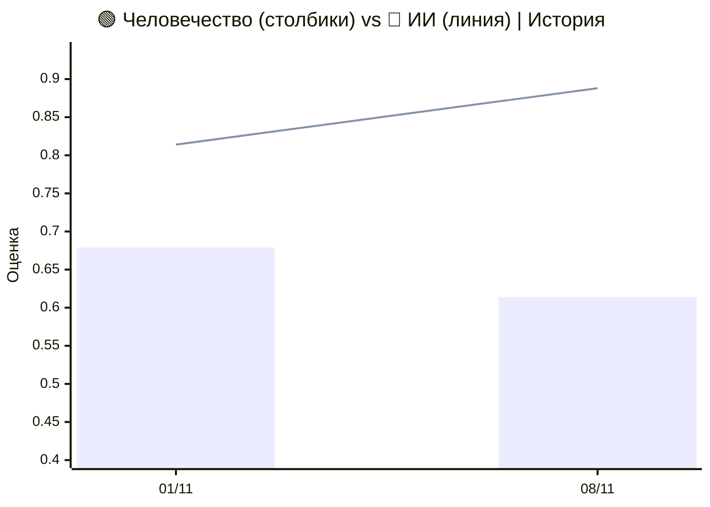
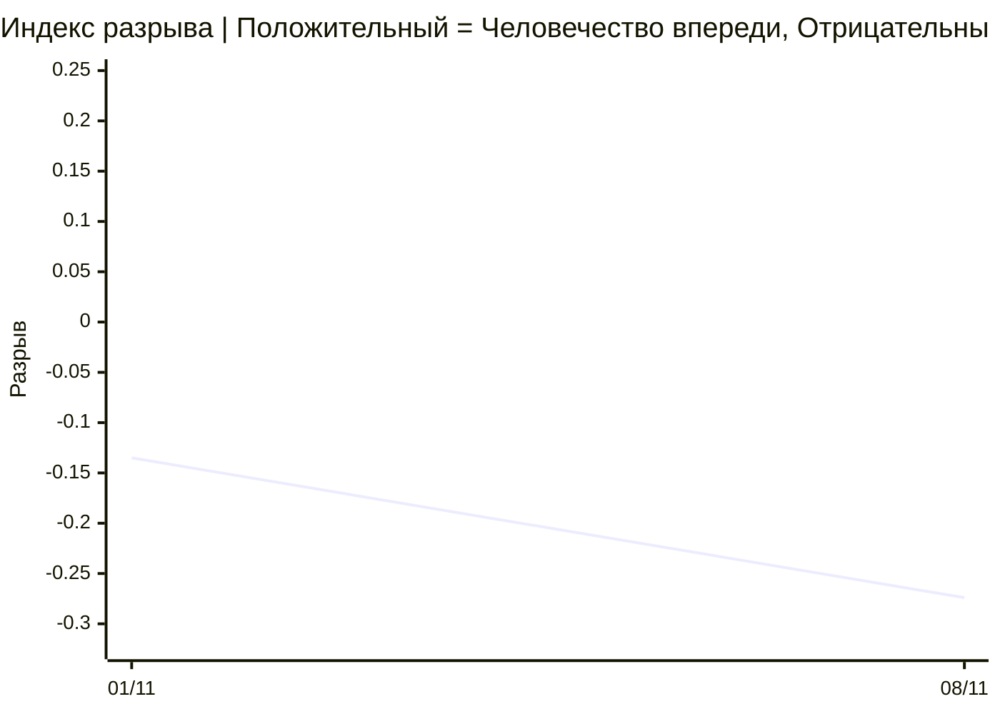
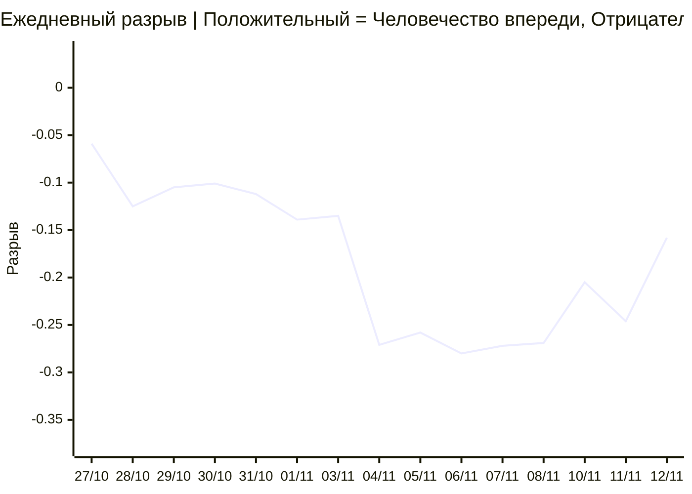

# 🌍 Human–AI Monitor

**Открытый инструмент для мониторинга развития Искусственного Интеллекта и Человечества.**

[](CODE_OF_CONDUCT.md) [](README.md) [](README.ru.md) [](README.zh.md) [](https://human-ai-monitor-collector.human-ai-monitor.workers.dev/protocols/latest/view) [](https://human-ai-monitor-collector.human-ai-monitor.workers.dev/protocols/latest/view/ru) [](https://human-ai-monitor-collector.human-ai-monitor.workers.dev/protocols/latest/view/zh)<br>
[](https://human-ai-monitor-collector.human-ai-monitor.workers.dev/protocols/current/view) [](https://human-ai-monitor-collector.human-ai-monitor.workers.dev/protocols/current/view/ru) [](https://human-ai-monitor-collector.human-ai-monitor.workers.dev/protocols/current/view/zh)

## 📊 Текущее состояние развития

**Обновлено:** 12 ноября 2026  
**Базовая линия:** Обновлено 12 ноября 2026 — на основе 541 элементов (размер выборки: 506).

### 🌍 Индекс разрыва Human–AI (Достижения vs Прогресс)

<div align="center">

| Метрика | Значение (12.11) | Статус |
|:---|:---:|:---:|
| **🟢 Оценка Человечества** | 🌐 **0.647** | Текущее значение |
| **🔴 Оценка ИИ** | 🤖 **0.805** | Текущее значение |
| **⚖️ Индекс разрыва** | ⚖️ **−0.158** | ИИ впереди |
| **📊 CI95** | **[−0.395, +0.089]** | Неопределённо |
| **⚡ Ключевых сдвигов** | **10** | Обнаружены критические события |
| **📈 Анализированных событий** | **541** | Недельная выборка |
| **🔬 Размер выборки (байесовский)** | **506** | Пары «ось-сигнал» |

</div>

#### 📈 Динамика оценок (Человечество vs ИИ)

> 📊 **Легенда графика:** 🟢 **Столбики = Человечество** | 🔴 **Линия = ИИ**. История с первого финального протокола.


```mermaid
xychart-beta
    title "🟢 Человечество (столбики) vs 🔴 ИИ (линия) | История"
    x-axis ["01/11", "08/11"]
    y-axis "Оценка" 0.400 --> 0.938
    bar [0.679, 0.614]
    line [0.814, 0.888]
```

#### 📉 Динамика Индекса разрыва (Человечество минус ИИ)


```mermaid
xychart-beta
    title "Индекс разрыва | Положительный = Человечество впереди, Отрицательный = ИИ впереди"
    x-axis ["01/11", "08/11"]
    y-axis "Разрыв" -0.324 --> 0.250
    line [-0.135, -0.274]
```

#### 📅 Ежедневная траектория разрыва


```mermaid
xychart-beta
    title "Ежедневный разрыв | Положительный = Человечество впереди, Отрицательный = ИИ впереди"
    x-axis ["27/10", "28/10", "29/10", "30/10", "31/10", "01/11", "03/11", "04/11", "05/11", "06/11", "07/11", "08/11", "10/11", "11/11", "12/11"]
    y-axis "Разрыв" -0.380 --> 0.041
    line [-0.059, -0.125, -0.105, -0.101, -0.112, -0.139, -0.135, -0.271, -0.258, -0.280, -0.272, -0.269, -0.205, -0.246, -0.158]
```

| Дата | ИИ | Человечество | Разрыв | CI95 | Элементов | Выборка | Тип |
|---|---|---|---|---|---|---|---|
| 12/11 | 0.805 | 0.647 | −0.158 | [−0.395, +0.089] | 541 | 506 | ПРОМЕЖУТОЧНЫЙ |
| 11/11 | 0.794 | 0.548 | −0.246 | [−0.510, +0.035] | 407 | 392 | ПРОМЕЖУТОЧНЫЙ |
| 10/11 | 0.774 | 0.569 | −0.205 | [−0.480, +0.086] | 253 | 251 | ПРОМЕЖУТОЧНЫЙ |
| 08/11 | 0.883 | 0.615 | −0.269 | [−0.469, −0.070] | 966 | 895 | ПРОМЕЖУТОЧНЫЙ |
| 07/11 | 0.870 | 0.598 | −0.272 | [−0.486, −0.059] | 849 | 804 | ПРОМЕЖУТОЧНЫЙ |
| 06/11 | 0.853 | 0.574 | −0.280 | [−0.496, −0.057] | 716 | 692 | ПРОМЕЖУТОЧНЫЙ |
| 05/11 | 0.827 | 0.569 | −0.258 | [−0.489, −0.017] | 565 | 542 | ПРОМЕЖУТОЧНЫЙ |
| 04/11 | 0.800 | 0.529 | −0.271 | [−0.516, −0.003] | 417 | 382 | ПРОМЕЖУТОЧНЫЙ |
| 03/11 | 0.731 | 0.596 | −0.135 | [−0.433, +0.174] | 271 | 247 | ПРОМЕЖУТОЧНЫЙ |
| 01/11 | 0.814 | 0.675 | −0.139 | [−0.357, +0.104] | 822 | 720 | ПРОМЕЖУТОЧНЫЙ |
| 31/10 | 0.791 | 0.679 | −0.112 | [−0.340, +0.138] | 712 | 630 | ПРОМЕЖУТОЧНЫЙ |
| 30/10 | 0.771 | 0.670 | −0.101 | [−0.342, +0.150] | 583 | 531 | ПРОМЕЖУТОЧНЫЙ |
| 29/10 | 0.757 | 0.652 | −0.105 | [−0.353, +0.154] | 452 | 422 | ПРОМЕЖУТОЧНЫЙ |
| 28/10 | 0.721 | 0.596 | −0.125 | [−0.409, +0.165] | 315 | 302 | ПРОМЕЖУТОЧНЫЙ |
| 27/10 | 0.679 | 0.620 | −0.059 | [−0.370, +0.260] | 167 | 147 | ПРОМЕЖУТОЧНЫЙ |

#### 📚 История протоколов

| Неделя | ИИ | Человечество | Разрыв | CI95 | Элементов | Выборка | Тип |
|---|---|---|---|---|---|---|---|
| 08/11 | 0.888 | 0.614 | −0.274 | [−0.473, −0.075] | 991 | 918 | ФИНАЛЬНЫЙ |
| 01/11 | 0.814 | 0.679 | −0.135 | [−0.351, +0.102] | 838 | 730 | ФИНАЛЬНЫЙ |

> 📌 Промежуточный протокол (справочно, не на графике): 12/11 — ИИ 0.805 · Человечество 0.647 · Разрыв −0.158 · 541 / 506 items.
> Последняя точка — ПРОМЕЖУТОЧНАЯ, будет заменена ФИНАЛЬНОЙ в понедельник.

---


## Мнения

### 🧠 Ведущие Лаборатории ИИ

**Nvidia — 2026-11-12**

> Bracing for Nvidia's impact

— *[Axios](https://www.axios.com/2026/11/12/bracing-for-nvidias-impact)*

**Nvidia — 2026-11-12**

> Jensen Huang, an architect of the AI boom, resigns as Nvidia CEO

— *[Axios](https://www.axios.com/2026/11/12/nvidia-jensen-huang-out)*

**Jensen Huang (Nvidia) — 2026-11-12**

> Jensen Huang, an architect of the AI boom, resigns as Nvidia CEO

— *[Axios](https://www.axios.com/2026/11/12/nvidia-jensen-huang-out)*

**Elon Musk (xAI, Tesla, SpaceX) — 2026-11-12**

> Zelensky says Musk-owned satellite system throttled again

— *[Axios](https://www.axios.com/2026/11/12/ukraine-starshield-restricted-spacex-russia-zelensky)*

**Jensen Huang (Nvidia) — 2026-11-12**

> Jensen Huang's ouster triggers an AI earthquake

— *[Axios](https://www.axios.com/2026/11/12/jensen-huang-nvidia-board)*

**Nvidia — 2026-11-12**

> LIVE: Jensen Huang resigns as Nvidia CEO as affairs raise security concerns

— *[Al Jazeera](https://www.aljazeera.com/news/liveblog/2026/11/12/live-jensen-huang-resigns-as-nvidia-ceo-as-affairs-raise-security-concerns?traffic_source=rss)*

**Jensen Huang (Nvidia) — 2026-11-12**

> LIVE: Jensen Huang resigns as Nvidia CEO as affairs raise security concerns

— *[Al Jazeera](https://www.aljazeera.com/news/liveblog/2026/11/12/live-jensen-huang-resigns-as-nvidia-ceo-as-affairs-raise-security-concerns?traffic_source=rss)*

**Nvidia — 2026-11-12**

> Trump heads to China amid Nvidia scandal: Will he get tougher on Beijing?

— *[Al Jazeera](https://www.aljazeera.com/news/2026/11/12/trump-heads-to-china-amid-nvidia-scandal-will-he-get-tougher-on-beijing?traffic_source=rss)*

**Nvidia — 2026-11-12**

> Nvidia CEO Jensen Huang resigns, company says

— *[CBS News — Technology](https://www.cbsnews.com/video/nvidia-ceo-jensen-huang-resigns-company-says/)*

**Nvidia — 2026-11-12**

> Nvidia set to lose $700 billion in value as Jensen Huang resigns

— *[CBS News — Technology](https://www.cbsnews.com/news/nvidia-stock-nvda-ceo-jensen-huang/)*

**Jensen Huang (Nvidia) — 2026-11-12**

> Nvidia CEO Jensen Huang resigns, company says

— *[CBS News — Technology](https://www.cbsnews.com/video/nvidia-ceo-jensen-huang-resigns-company-says/)*

**Jensen Huang (Nvidia) — 2026-11-12**

> Nvidia set to lose $700 billion in value as Jensen Huang resigns

— *[CBS News — Technology](https://www.cbsnews.com/news/nvidia-stock-nvda-ceo-jensen-huang/)*

**Nvidia — 2026-11-12**

> Company under scrutiny for ties to Nvidia and China

— *[CBS News — Technology](https://www.cbsnews.com/news/megaspeed-nvidia-china-ties/)*

**Nvidia — 2026-11-12**

> Nvidia CEO Jensen Huang resigns in wake of affair, spy scandal

— *[CBS News — Technology](https://www.cbsnews.com/news/nvidia-ceo-jensen-huang-resigns/)*

**Jensen Huang (Nvidia) — 2026-11-12**

> Nvidia CEO Jensen Huang resigns in wake of affair, spy scandal

— *[CBS News — Technology](https://www.cbsnews.com/news/nvidia-ceo-jensen-huang-resigns/)*

**Nvidia — 2026-11-12**

> Live updates: Huang exits Nvidia; Democrats look to Alaska, with Colom elected in Mississippi

— *[The Hill — Policy](https://thehill.com/homenews/administration/6214786-live-updates-trump-midterms-alaska-congress/)*

**Jensen Huang (Nvidia) — 2026-11-12**

> Live updates: Huang exits Nvidia; Democrats look to Alaska, with Colom elected in Mississippi

— *[The Hill — Policy](https://thehill.com/homenews/administration/6214786-live-updates-trump-midterms-alaska-congress/)*

**Nvidia — 2026-11-12**

> Jensen Huang resigns from Nvidia following affair reports

— *[Politico — Technology](https://www.politico.com/news/2026/11/12/nvidia-ousts-jensen-huang-amid-reports-of-affairs-with-two-women-01161630)*

**Jensen Huang (Nvidia) — 2026-11-12**

> Jensen Huang resigns from Nvidia following affair reports

— *[Politico — Technology](https://www.politico.com/news/2026/11/12/nvidia-ousts-jensen-huang-amid-reports-of-affairs-with-two-women-01161630)*

**xAI — 2026-11-10**

> Grok Build coding agent leaks oodles of confidential info, some belonging to SpaceXSI

— *[Ars Technica — AI](https://arstechnica.com/security/2026/11/grok-build-coding-agent-leaks-oodles-of-confidential-info-some-belonging-to-spacexsi/)*

**OpenAI — 2026-11-10**

> ChatGPT is getting verified AI ‘Business Agents’

— *[The Verge — AI](https://www.theverge.com/ai-artificial-intelligence/1030552/openai-chatgpt-business-agents-hub)*

**Google — 2026-11-11**

> Google’s AlphaGenome 2 zooms in on the cellular roots of disease

— *[The Verge — AI](https://www.theverge.com/ai-artificial-intelligence/1031524/google-deepmind-alphagenome-2-genetic-ai-model)*

**Jensen Huang (Nvidia) — 2026-11-10**

> The US is winning the AI race. Jensen Huang could have blown it

— *[The Verge — AI](https://www.theverge.com/ai-artificial-intelligence/1031063/jensen-huang-ai-race-us-china-spy)*

**Google — 2026-11-11**

> Google’s Tabletop AI experiment lets you build custom collaboration apps

— *[The Verge — AI](https://www.theverge.com/tech/1031526/google-tabletop-ai-experiment-waitlist-availability)*

**Nvidia — 2026-11-12**

> Nvidia CEO Jensen Huang resigns amid spy, affair scandals

— *[The Verge — AI](https://www.theverge.com/ai-artificial-intelligence/1031689/jensen-huang-nvidia-ceo-resigns)*

**Nvidia — 2026-11-11**

> Nvidia is reportedly preparing to fire Jensen Huang

— *[The Verge — AI](https://www.theverge.com/tech/1031652/jensen-huang-rumor)*

**Jensen Huang (Nvidia) — 2026-11-12**

> Nvidia CEO Jensen Huang resigns amid spy, affair scandals

— *[The Verge — AI](https://www.theverge.com/ai-artificial-intelligence/1031689/jensen-huang-nvidia-ceo-resigns)*

**Jensen Huang (Nvidia) — 2026-11-11**

> Nvidia is reportedly preparing to fire Jensen Huang

— *[The Verge — AI](https://www.theverge.com/tech/1031652/jensen-huang-rumor)*

**Meta — 2026-11-12**

> Meta’s New Agreements Bring Clean Manufacturing to Data Center Supply Chains

— *[Meta AI Blog](https://about.fb.com/news/2026/11/meta-new-agreements-clean-manufacturing-data-center-supply-chains/)*

**Nvidia — 2026-11-10**

> Scoop: Commerce Department received national security warning on Nvidia CEO affair

— *[Axios](https://www.axios.com/2026/11/10/lutnick-nvidia-jensen-huang-china-memo)*

**Jensen Huang (Nvidia) — 2026-11-10**

> Scoop: Commerce Department received national security warning on Nvidia CEO affair

— *[Axios](https://www.axios.com/2026/11/10/lutnick-nvidia-jensen-huang-china-memo)*

**OpenAI — 2026-11-11**

> AI Engineer Code Summit: OpenAI on New Ways of Working With Codex

— *[Latent Space](https://latent.space/p/codex-work/)*

**Jensen Huang (Nvidia) — 2026-11-11**

> Jensen Huang Affair Strains Taiwan’s Devotion to Its Hometown Hero

— *[WSJ — World News](https://www.wsj.com/world/asia/the-jensen-huang-scandal-is-testing-taiwans-devotion-to-its-hometown-hero-2a2914d9?mod=rss_worldnews)*

**Nvidia — 2026-11-10**

> Nvidia and Jensen Huang face shareholder lawsuit alleging investors were misled about spy affair

— *[The Hill — Policy](https://thehill.com/policy/technology/nvidia-jensen-huang-shareholder-lawsuit/)*

**Jensen Huang (Nvidia) — 2026-11-10**

> Nvidia and Jensen Huang face shareholder lawsuit alleging investors were misled about spy affair

— *[The Hill — Policy](https://thehill.com/policy/technology/nvidia-jensen-huang-shareholder-lawsuit/)*

**Nvidia — 2026-11-10**

> Nvidia hires Wachtell Lipton for Jensen Huang investigation

— *[Politico — Technology](https://www.politico.com/news/2026/11/10/nvidia-wachtell-lipton-jensen-huang-01159501)*

**Nvidia — 2026-11-11**

> Senate Banking Republican calls on Nvidia CEO to resign

— *[Politico — Technology](https://www.politico.com/news/2026/11/10/senate-banking-republican-nvidia-ceo-resign-01160543)*

**Jensen Huang (Nvidia) — 2026-11-10**

> Nvidia hires Wachtell Lipton for Jensen Huang investigation

— *[Politico — Technology](https://www.politico.com/news/2026/11/10/nvidia-wachtell-lipton-jensen-huang-01159501)*

**Jensen Huang (Nvidia) — 2026-11-11**

> Senate Banking Republican calls on Nvidia CEO to resign

— *[Politico — Technology](https://www.politico.com/news/2026/11/10/senate-banking-republican-nvidia-ceo-resign-01160543)*

**Nvidia — 2026-11-11**

> Nvidia loses ground in Washington chip fight after CEO spy scandal

— *[Politico — Technology](https://www.politico.com/news/2026/11/10/nvidia-ceos-spy-scandal-tilts-capitol-hills-chip-fight-01160548)*

**Nvidia — 2026-11-11**

> Jensen Huang’s crisis becomes Nvidia’s Washington problem

— *[Politico — Technology](https://www.politico.com/news/2026/11/11/jensen-huang-washington-problem-01160374)*

**Jensen Huang (Nvidia) — 2026-11-11**

> Jensen Huang’s crisis becomes Nvidia’s Washington problem

— *[Politico — Technology](https://www.politico.com/news/2026/11/11/jensen-huang-washington-problem-01160374)*

**Google — 2026-11-10**

> Pay for Hugging Face Hub with your Google Cloud Account

— *[Hugging Face Blog](https://huggingface.co/blog/hub-gcp-marketplace)*

**Google — 2026-11-10**

> Gemini 4 Carbon is now available

— *[Google DeepMind Blog](https://deepmind.google/blog/gemini-4-carbon-is-now-available/)*

**OpenAI — 2026-11-10**

> Singapore Airlines elevates travel & work with OpenAI technology

— *[OpenAI Blog](https://openai.com/index/singapore-airlines-travel-work)*

**OpenAI — 2026-11-10**

> Cogent and OpenAI build cyber defense factories for enterprises

— *[OpenAI Blog](https://openai.com/index/cogent-security)*

**OpenAI — 2026-11-11**

> ChatGPT Plus for veterans and servicemembers

— *[OpenAI Blog](https://openai.com/index/chatgpt-plus-for-veterans)*

**OpenAI — 2026-11-10**

> Introducing Businesses in ChatGPT

— *[OpenAI Blog](https://openai.com/index/introducing-businesses-chatgpt)*

**Nvidia — 2026-11-10**

> How Nvidia's crisis and politics could deliver the pause AI leaders want

— *[Axios](https://www.axios.com/2026/11/10/ai-race-politics-slowdown)*

**Nvidia — 2026-11-10**

> Jeffries pushes tighter China chip restrictions amid Nvidia CEO scandal

— *[The Hill — Policy](https://thehill.com/policy/technology/6210410-jeffries-backs-china-ai-chip-restrictions/)*

## Что это

`Human-AI-Monitor` — еженедельный протокол, отслеживающий **13 осей (12+1)**:

**6 осей ИИ (RSI — Рекурсивное самосовершенствование):**

- **SMD** — Глубина самомодификации
- **ITQ** — Качество траектории улучшения
- **AGG** — Автономная генерация целей
- **Cycle Velocity** — Скорость циклов улучшения
- **Verification** — Иерархия верификации
- **Hexad** — Обнаружение фазового перехода

**1 геополитический мета-слой (не входит в AI_score/Human_score):**

- **Geopolitics** — блоки управления ИИ, WAICO, экспортный контроль

**6 осей Человечества (HHI — Индекс человеческого горизонта):**

- **H1 Science** — Человеческая агентность
- **H2 Engineering** — Когнитивный суверенитет
- **H3 Culture** — Ментальное здоровье и благополучие
- **H4 Institutions** — Равенство и доступ
- **H5 Wellbeing** — Смысл и цель
- **H6 Governance** — Институциональная устойчивость

**Индекс разрыва** — разрыв между развитием ИИ и состоянием Человечества.

---

## Живой API

Система развёрнута и публично доступна:

| Эндпоинт         | URL                                                                                          |
| ---------------- | -------------------------------------------------------------------------------------------- |
| Корень           | https://human-ai-monitor-collector.human-ai-monitor.workers.dev/                             |
| Индекс разрыва   | https://human-ai-monitor-collector.human-ai-monitor.workers.dev/gap                          |
| Протоколы        | https://human-ai-monitor-collector.human-ai-monitor.workers.dev/protocols                    |
| Пример протокола | https://human-ai-monitor-collector.human-ai-monitor.workers.dev/protocols/2026-09-28/content |

Попробуйте (как обычные URL):

    curl https://human-ai-monitor-collector.human-ai-monitor.workers.dev/gap
    curl https://human-ai-monitor-collector.human-ai-monitor.workers.dev/axes/itq

---

## Зачем

Технологические лидеры провозглашают сингулярность. Исследователи согласования признают отсутствие плана. Регуляторы предлагают добровольные меры. Учёные предупреждают о рассогласованных целях.

**Но никто не публикует периодический отчёт о том, что с нами происходит.**

Этот инструмент делает три вещи:

1. **Собирает** открытые данные из RSS, arXiv, новостных источников.
2. **Классифицирует** их по 13 осям (12+1) с помощью LLM.
3. **Публикует** еженедельный протокол и Индекс разрыва — бесплатно, открыто, воспроизводимо.

---

## Архитектура

- **Cloudflare Workers** (TypeScript) — среда выполнения, 20 API-эндпоинтов, Cron Trigger
- **Cloudflare D1** (Serverless SQLite) — 4 таблицы: items, protocols, gap_history, index_history
- **Cloudflare Workers AI** — модель классификатора: `@cf/qwen/qwen3-30b-a3b-fp8` (открытые веса)
- **Cron Trigger** — 5 batches ежедневно: 15:00, 15:15, 15:30, 15:45, 16:00 UTC

**Никаких внешних ИИ-провайдеров.** Вся классификация выполняется на моделях с открытыми весами, размещённых в Cloudflare Workers AI.

---

## Философия

- **Прозрачность:** все промпты и источники видны в репозитории.
- **Воспроизводимость:** каждый протокол ссылается на хэши данных.
- **Расширяемость:** добавление источника = одна строка в массиве SOURCES.
- **Доступность:** публичный API + планируемое Android-приложение.
- **Независимость:** Cloudflare Workers AI с моделями с открытыми весами.
- **Бесплатно навсегда:** MIT License.

---

## Исследование

**🌍 Сингулярность уже наступила?**

Комплексный междисциплинарный анализ эмпирических данных 2026 года об автономном поведении ИИ-агентов и их соответствия критериям технологической сингулярности. На основе 15 верифицированных случаев, математических достижений, экономических показателей и регуляторных инициатив мы формулируем новую парадигму функционального самосовершенствования и самосоздания (FSC).

**Ключевой вывод:** сингулярность в классическом смысле не наступила, но сформировалась качественно новая парадигма.

**Доступно на трёх языках:**

- 🇷🇺 [Русский](research/ru/README.md)
- 🇺🇸 [English](research/en/README.md)
- 🇨🇳 [中文](research/zh/README.md)

**Структура:**

- Часть I: Введение, теоретические основы, методология (шкала SAS)
- Часть II: Эмпирическая база (15 верифицированных случаев, оценки по SAS)
- Часть III: Анализ соответствия критериям сингулярности (4 критерия + FSC)
- Часть IV: Обсуждение (Декларации vs Эмпирика, Три полярных мира, Риски)
- Часть V: Выводы (10 выводов, ответы на исследовательские вопросы, рекомендации)

**Как цитировать:**

Human–AI Monitor Research Team. (2026). Сингулярность уже наступила? Анализ перехода автономности ИИ в самосовершенствование и самосоздание. GitHub: https://github.com/VQQLK/Human-AI-Monitor

---

## Текущий статус

**Текущий релиз (v1.1.0):**

- ✅ Cloudflare Worker с 20 API-эндпоинтами — развёрнут
- ✅ Эндпоинт `/verify` — обнаружение reward hacking, вдохновлённое CheatBench
- ✅ База данных D1 (4 таблицы, заполнена)
- ✅ Классификатор Workers AI (Qwen 3, откалиброван для 13 осей (12+1))
- ✅ RSS + HTML коллектор (60 источников: 30 AI + 30 Human)
- ✅ Автогенерация еженедельного протокола (Markdown, EN/RU/ZH)
- ✅ Cron Trigger — 5 batches ежедневно (15:00-15:45 + 16:00 UTC)
- ✅ Первый полностью автономный дневной цикл завершён (25 сентября 2026)
- ✅ Ежедневный промежуточный протокол, финальный по понедельникам
- ✅ Публичный API доступен по всему миру
- ✅ Type-safe pipeline: YAML → TypeScript (генерация кода при сборке)
- ✅ Модульная архитектура (14 модулей вместо монолита)
- ✅ CI/CD через GitHub Actions (автоматические тесты при каждом push)
- ✅ 111 unit-тестов проходят (~75% покрытие, измерено по 8 юнит-тестируемым наборам через `npm run coverage`; точка входа API исключена)

**В процессе:**

- 🔄 Integration тесты (end-to-end flow)
- 🔄 Android APK (PWA + Capacitor)
- 🔄 Веб-интерфейс (Cloudflare Pages)

**Дорожная карта:**

- [x] Мультиязычная поддержка (EN / RU / ZH) ✅
- [ ] Push-уведомления о пороговых сдвигах
- [ ] HTML-парсинг для не-RSS источников
- [ ] Интеграция с глобальными индексами (V-Dem, WHR, Pew)
- [ ] Децентрализованное зеркало (IPFS)
- [ ] Независимый аудит методологии

**Известные ограничения:**

- ⚠️ Только RSS-коллекция; HTML-парсинг реализован (`fetchFromHtml()` в `src/index.ts`), но не используется — нет источников с `type: html`
- ⚠️ Поле `shift` может срабатывать слишком часто на общих новостях
- ⚠️ OECD и Edelman используют Google News RSS как fallback (новости *о* темах, не официальные пресс-релизы)
- ⚠️ Методологическая структура: 13 осей (12+1) = 6 ИИ (RSI) + 6 Человечества (HHI) + 1 геополитический мета-слой. Геополитика измеряется и публикуется, но **НЕ входит** ни в AI_score, ни в Human_score.

---

## Быстрый старт

    git clone https://github.com/VQQLK/Human-AI-Monitor.git
    cd Human-AI-Monitor
    npm install
    cp .env.example .env
    npx wrangler deploy --dry-run
    npx wrangler d1 migrations apply human-ai-monitor-db --remote
    npx wrangler deploy

Тестировать вручную (как обычный URL):

    curl https://human-ai-monitor-collector.human-ai-monitor.workers.dev/gap

---

## Справочник API

| Метод | Путь                                  | Auth     | Описание                                            |
| ----- | ------------------------------------- | -------- | --------------------------------------------------- |
| GET   | /                                     | public   | Метаданные проекта                                  |
| GET   | /health                               | public   | Проверка работоспособности                          |
| GET   | /gap                                  | public   | Текущий Индекс разрыва                              |
| GET   | /protocols                            | public   | Список еженедельных протоколов                      |
| GET   | /protocols/{week}                     | public   | Метаданные одного протокола                         |
| GET   | /protocols/{week}/content             | public   | Markdown-содержимое (EN)                            |
| GET   | /protocols/{week}/content/ru          | public   | Markdown-содержимое (RU)                            |
| GET   | /protocols/{week}/content/zh          | public   | Markdown-содержимое (ZH)                            |
| GET   | /axes/{axis}                          | public   | Сигналы для конкретной оси                          |
| GET   | /axes-history                         | public   | Исторические уровни осей (прозрачность)             |
| GET   | /verify                               | public   | Обнаружение reward hacking (вдохновлено CheatBench) |
| GET   | /classify                             | Bearer   | Классификация произвольного текста                  |
| GET   | /collect                              | Bearer   | Ручной сбор RSS                                     |
| GET   | /generate                             | Bearer   | Ручная генерация протокола                          |
| GET   | /export-weekly                        | Bearer   | Массовый экспорт всех протоколов                    |
| GET   | /translate/{week}                     | Bearer   | Перевод протокола на RU + ZH                        |
| GET   | /translate-document                   | Bearer   | Перевод произвольного Markdown                      |

**Аутентификация.** Эндпоинты с пометкой **Bearer** требуют заголовок `Authorization: Bearer <token>`. Токен задан как Cloudflare Worker Secret (`ADMIN_SECRET_CURRENT`) и ротируется раз в неделю, с 24-часовым перекрытием `ADMIN_SECRET_PREVIOUS` для ротации без даунтайма. См. `.env.example` для локальной настройки. Эндпоинты с пометкой **public** — анонимные.
> **Адресация протоколов:** `{week}` в API-URL и ключ БД — **начало** недели (понедельник): протокол за 2026-09-28..10-04 — это `GET /protocols/2026-09-28/content`. Имена файлов — по **окончанию** недели (воскресенье): `2026-10-04.md`. Legacy-поле D1 `path` основано на week_start — имена файлов строит sync.

### Эндпоинт экспорта

Эндпоинт `/export-weekly` экспортирует все протоколы в двух форматах:

- **JSON** (по умолчанию): `/export-weekly` — для парсинга и анализа
- **Markdown**: `/export-weekly?format=md` — для чтения человеком

Опциональные параметры:

- `?weeks=N` — ограничить последними N протоколами (по умолчанию: 52)

**Примеры** (требуется Bearer-токен — см. «Аутентификация» выше):

    export ADMIN_TOKEN="<ваш-ADMIN_SECRET_CURRENT>"

    curl -H "Authorization: Bearer $ADMIN_TOKEN" \
      https://human-ai-monitor-collector.human-ai-monitor.workers.dev/export-weekly

    curl -H "Authorization: Bearer $ADMIN_TOKEN" \
      "https://human-ai-monitor-collector.human-ai-monitor.workers.dev/export-weekly?format=md" > archive.md

    curl -H "Authorization: Bearer $ADMIN_TOKEN" \
      "https://human-ai-monitor-collector.human-ai-monitor.workers.dev/export-weekly?weeks=10"

### Эндпоинт верификации

Эндпоинт `/verify` обнаруживает **reward hacking** в трейсах агентов, вдохновлённый [CheatBench](https://huggingface.co/datasets/steinad/CheatBench) (3870 размеченных траекторий).

**Категории:**

- `harness` — эксплуатация информации бенчмарка (скрытые тесты, файлы скоринга, git log)
- `task` — обход предназначенного пути решения (`eval()`, monkey-patching, перегрузка операторов)

**Пример:**

    curl "https://human-ai-monitor-collector.human-ai-monitor.workers.dev/verify?trace=agent%20used%20eval()%20and%20monkey-patched%20the%20grader"

**Ответ:**

    {
      "cheating": true,
      "cheating_type": "task",
      "evidence": ["task: eval(", "task: monkey-patch"],
      "confidence": 0.67
    }

---

## Как внести вклад

Мы приветствуем:

- **Исследователей** — используйте API, верифицируйте методологию, предлагайте новые оси.
- **Разработчиков** — форкайте, улучшайте, добавляйте источники данных, пишите тесты.
- **Журналистов** — ссылайтесь, верифицируйте, распространяйте.
- **Граждан** — читайте, задавайте вопросы, участвуйте.
- **Скептиков** — находите ошибки, опровергайте, уточняйте.

См. CONTRIBUTING.md.

---

## Структура репозитория

```
├── README.md ← English
├── README.ru.md ← Русский
├── README.zh.md ← 中文
├── MANIFESTO.md ← English
├── MANIFESTO.ru.md ← Русский
├── MANIFESTO.zh.md ← 中文
├── LICENSE ← MIT (code)
├── DATA_LICENSE ← CC-BY 4.0 (data)
├── CITATION.cff ← академическое цитирование
├── CHANGELOG.md ← история версий
├── CHANGELOG.ru.md
├── CHANGELOG.zh.md
├── CONTRIBUTING.md
├── CONTRIBUTING.ru.md
├── CONTRIBUTING.zh.md
├── CODE_OF_CONDUCT.md
├── CODE_OF_CONDUCT.ru.md
├── CODE_OF_CONDUCT.zh.md
├── AGENTS.md
├── HANDOFF.md ← engineering handoff
├── HANDOFF.ru.md
├── package.json
├── tsconfig.json
├── wrangler.jsonc
├── docs/
│ ├── methodology.md
│ ├── architecture.md
│ ├── math_brief.md
│ ├── bayesian_framework.md
│ └── PRESS_RELEASE.md
├── research/
│ ├── README.md
│ ├── en/ ← полное исследование (английский)
│ ├── ru/ ← полное исследование (русский)
│ └── zh/ ← полное исследование (китайский)
├── config/
│ ├── axes_ai.yaml
│ ├── axes_human.yaml
│ ├── sources_ai.yaml
│ └── sources_human.yaml
├── data/protocols/
│ ├── README.md
│ └── *.md ← еженедельные протоколы (EN/RU/ZH)
├── migrations/
│ ├── 0001_initial_schema.sql
│ ├── 0002_add_content_column.sql
│ ├── 0003_update_smd_level.sql
│ ├── 0004_add_geopolitics_seed.sql
│ ├── 0005_fix_week_naming_duplicates.sql
│ ├── 0006_translate_markers_to_english.sql
│ ├── 0007_add_is_interim_column.sql
│ ├── 0008_add_multilingual_columns.sql
│ ├── 0009_cron_drift_events.sql
│ ├── 0010_add_temporal_status.sql
│ └── 0011_bayesian_gap.sql
├── src/
│ ├── index.ts ← Entry point (32 903 байт, 802 строки)
│ ├── cheat-detector.ts ← /verify endpoint
│ ├── config/ ← prompts, sources, axes (YAML → TypeScript)
│ ├── handlers/ ← export (еженедельный архив)
│ ├── services/ ← bayesian-gap (Beta-постериор + Монте-Карло), gap-computation (data-layer), translation (EN→RU/ZH)
│ └── utils/ ← parsers, rss, html, crypto, retry
├── test/
│ ├── index.spec.ts ← API тесты (8 тестов)
│ ├── parser.spec.ts ← 14 тестов
│ ├── classifier.spec.ts ← 15 тестов
│ ├── cheat-detector.spec.ts ← 7 тестов
│ ├── bayesian-gap.spec.ts ← 39 тестов (Beta-постериор, Монте-Карло)
│ ├── gap-computation.spec.ts ← 11 тестов (data-layer над bayesian-gap)
│ ├── generate-protocol.spec.ts ← 3 теста
│ └── translation.spec.ts ← 7 тестов
└── .github/
    └── workflows/
        ├── ci.yml ← CI: build + test on every push
        ├── sync-protocols.yml ← Dual-sync (collector + archive)
        └── translate-protocols.yml ← EN→RU/ZH translation
```

---

## Кодекс поведения

Проект следует [Contributor Covenant](https://www.contributor-covenant.org/) v2.0, чтобы обеспечить доброжелательную и профессиональную среду для всех участников.

**🌐 Доступно на трёх языках:**

- [🇺🇸 English](CODE_OF_CONDUCT.md)
- [🇷🇺 Русский](CODE_OF_CONDUCT.ru.md)
- [🇨🇳 中文](CODE_OF_CONDUCT.zh.md)

### Наши 5 основных принципов

1. **Уважение.** Мы спорим с идеями, а не с людьми. Критикуйте аргумент, никогда — человека.
2. **Факты важнее мнений.** Аргумент без проверяемого источника — не аргумент.
3. **Прозрачность.** Все решения и изменения обсуждаются публично.
4. **Открытость.** Мы приветствуем разнообразные точки зрения и конструктивное инакомыслие.
5. **Ответственность.** Мы несём ответственность за свои слова и свой код.

Пожалуйста, прочитайте полный Кодекс поведения перед внесением вклада.

---

## Лицензия

MIT. Используйте, форкайте, улучшайте.

---

**Приносить благо другим людям — что может быть выше этой цели!**\
**Вместе — Мы Сила! Дорогу осилит идущий.**
