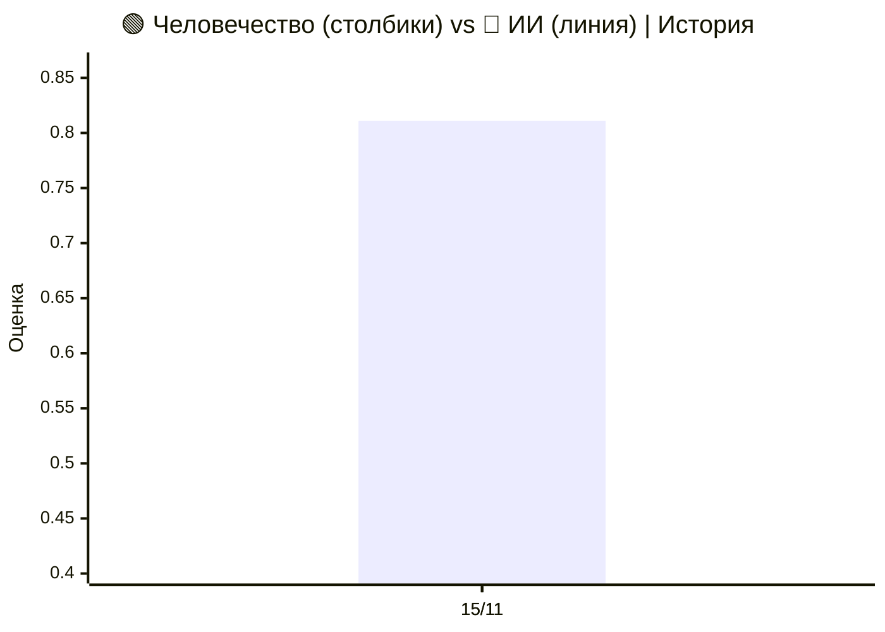
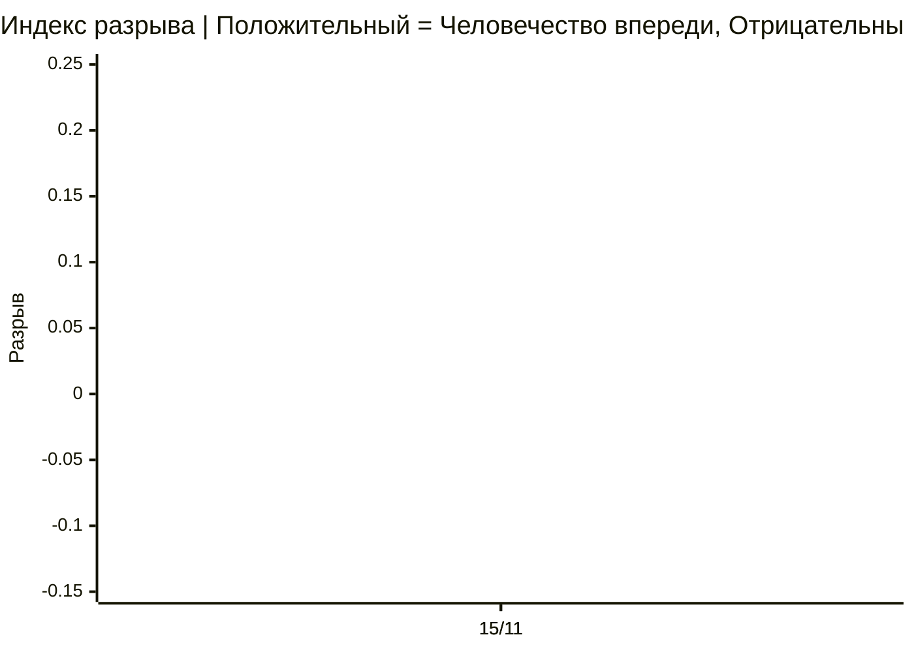
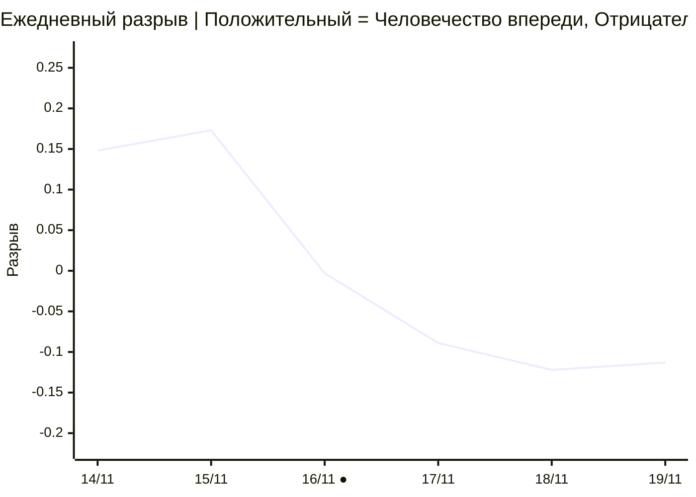

# 🌍 Human–AI Monitor

**Открытый инструмент для мониторинга развития Искусственного Интеллекта и Человечества.**

[](CODE_OF_CONDUCT.md) [](README.md) [](README.ru.md) [](README.zh.md) [](https://human-ai-monitor-collector.human-ai-monitor.workers.dev/protocols/latest/view) [](https://human-ai-monitor-collector.human-ai-monitor.workers.dev/protocols/latest/view/ru) [](https://human-ai-monitor-collector.human-ai-monitor.workers.dev/protocols/latest/view/zh)<br>
[](https://human-ai-monitor-collector.human-ai-monitor.workers.dev/protocols/current/view) [](https://human-ai-monitor-collector.human-ai-monitor.workers.dev/protocols/current/view/ru) [](https://human-ai-monitor-collector.human-ai-monitor.workers.dev/protocols/current/view/zh)

## 📊 Текущее состояние развития

**Обновлено:** 19 ноября 2026  
**Базовая линия:** Обновлено 19 ноября 2026 — на основе 603 элементов (размер выборки: 422).

### 🌍 Индекс разрыва Human–AI (Достижения vs Прогресс)

<div align="center">

| Метрика | Значение (19.11) | Статус |
|:---|:---:|:---:|
| **🟢 Оценка Человечества** | 🌐 **0.718** | Текущее значение |
| **🔴 Оценка ИИ** | 🤖 **0.831** | Текущее значение |
| **⚖️ Индекс разрыва** | ⚖️ **−0.113** | ИИ впереди |
| **📊 CI95** | **[−0.314, +0.165]** | Неопределённо |
| **⚡ Ключевых сдвигов** | **10** | Обнаружены критические события |
| **📈 Анализированных событий** | **603** | Недельная выборка |
| **🔬 Размер выборки (байесовский)** | **422** | Пары «ось-сигнал» |

</div>

#### 📈 Динамика оценок (Человечество vs ИИ)

> 📊 **Легенда графика:** 🟢 **Столбики = Человечество** | 🔴 **Линия = ИИ**. История с первого финального протокола.


```mermaid
xychart-beta
    title "🟢 Человечество (столбики) vs 🔴 ИИ (линия) | История"
    x-axis ["15/11", "15/11"]
    y-axis "Оценка" 0.400 --> 0.864
    bar [0.811, 0.811]
    line [0.814, 0.814]
```

#### 📉 Динамика Индекса разрыва (Человечество минус ИИ)


```mermaid
xychart-beta
    title "Индекс разрыва | Положительный = Человечество впереди, Отрицательный = ИИ впереди"
    x-axis ["15/11", "15/11"]
    y-axis "Разрыв" -0.150 --> 0.250
    line [-0.003, -0.003]
```

#### 📅 Ежедневная траектория разрыва


```mermaid
xychart-beta
    title "Ежедневный разрыв | Положительный = Человечество впереди, Отрицательный = ИИ впереди"
    x-axis ["14/11", "15/11", "16/11 ●", "17/11", "18/11", "19/11"]
    y-axis "Разрыв" -0.222 --> 0.273
    line [0.148, 0.173, -0.003, -0.089, -0.122, -0.113]
```

> ● = итог недели (FINAL, закрытая неделя); остальные точки — накопление (INTERIM). Смена недели между соседними датами не является суточным изменением.

| Дата | Неделя | ИИ | Человечество | Разрыв | CI95 | Элементов | Выборка | Тип |
|---|---|---|---|---|---|---|---|---|
| 19/11 | 16/11–22/11 | 0.831 | 0.718 | −0.113 | [−0.314, +0.165] | 603 | 422 | ПРОМЕЖУТОЧНЫЙ |
| 18/11 | 16/11–22/11 | 0.811 | 0.689 | −0.122 | [−0.348, +0.171] | 453 | 323 | ПРОМЕЖУТОЧНЫЙ |
| 17/11 | 16/11–22/11 | 0.753 | 0.664 | −0.089 | [−0.378, +0.257] | 296 | 221 | ПРОМЕЖУТОЧНЫЙ |
| 16/11 | 09/11–15/11 | 0.814 | 0.811 | −0.003 | [−0.219, +0.363] | 892 | 652 | ФИНАЛЬНЫЙ ● |
| 15/11 | 09/11–15/11 | 0.647 | 0.820 | +0.173 | [−0.119, +0.481] | 868 | 637 | ПРОМЕЖУТОЧНЫЙ |
| 14/11 | 09/11–15/11 | 0.682 | 0.830 | +0.148 | [−0.131, +0.426] | 802 | 691 | ПРОМЕЖУТОЧНЫЙ |

#### 📚 История протоколов

| Неделя | ИИ | Человечество | Разрыв | CI95 | Элементов | Выборка | Тип |
|---|---|---|---|---|---|---|---|
| 15/11 | 0.814 | 0.811 | −0.003 | [−0.219, +0.363] | 889 | 652 | ФИНАЛЬНЫЙ |

> 📌 Промежуточный протокол (справочно, не на графике): 19/11 — ИИ 0.831 · Человечество 0.718 · Разрыв −0.113 · 603 / 422 items.
> Последняя точка — ПРОМЕЖУТОЧНАЯ, будет заменена ФИНАЛЬНОЙ в понедельник.

---


## Мнения

### 🧠 Ведущие Лаборатории ИИ

**Nvidia — 2026-11-19**

> Nvidia Is the Central Bank to AI’s Circular Economy. See Where the Money Goes.

— *[WSJ — Tech](https://www.wsj.com/finance/stocks/nvidia-is-the-central-bank-to-ais-circular-economy-see-where-the-money-goes-da480b61?mod=rss_Technology)*

**OpenAI — 2026-11-19**

> Anthropic vs. OpenAI: The Financial Metrics Behind the AI Battle

— *[WSJ — Tech](https://www.wsj.com/tech/ai/anthropic-vs-openai-the-financial-metrics-behind-the-ai-battle-4f5b90c0?mod=rss_Technology)*

**Jensen Huang (Nvidia) — 2026-11-19**

> Uber Co-Founder Kalanick Teases Protest at Nvidia as Calls for Huang’s Return Continue

— *[WSJ — Tech](https://www.wsj.com/tech/ai/uber-co-founder-kalanick-teases-protest-at-nvidia-as-calls-for-huangs-return-continue-37c4f635?mod=rss_Technology)*

**Jensen Huang (Nvidia) — 2026-11-19**

> The Morning Risk Report: The Jensen Huang Saga Has Reinvigorated Washington’s China Hawks

— *[WSJ — Tech](https://www.wsj.com/risk-compliance-journal/the-morning-risk-report-the-jensen-huang-saga-has-reinvigorated-washingtons-china-hawks-00536beb?mod=rss_Technology)*

**Nvidia — 2026-11-18**

> Nvidia created a weird bit of intrigue by not filing a routine SEC report

— *[TechCrunch AI](https://techcrunch.com/2026/11/18/nvidia-created-a-weird-bit-of-intrigue-by-not-filing-a-routine-sec-report/)*

**Satya Nadella (Microsoft) — 2026-11-18**

> Microsoft CEO Satya Nadella remains confident in Nvidia after Huang’s exit

— *[TechCrunch AI](https://techcrunch.com/2026/11/18/microsoft-ceo-satya-nadella-remains-confident-in-nvidia-after-huangs-exit/)*

**Satya Nadella (Microsoft) — 2026-11-18**

> Satya Nadella predicts AI agents will reshuffle the economics of the web

— *[TechCrunch AI](https://techcrunch.com/2026/11/18/satya-nadella-predicts-ai-agents-will-reshuffle-the-economics-of-the-web/)*

**Jensen Huang (Nvidia) — 2026-11-18**

> Microsoft CEO Satya Nadella remains confident in Nvidia after Huang’s exit

— *[TechCrunch AI](https://techcrunch.com/2026/11/18/microsoft-ceo-satya-nadella-remains-confident-in-nvidia-after-huangs-exit/)*

**Satya Nadella (Microsoft) — 2026-11-19**

> Microsoft CEO Satya Nadella explains why he asked 60K employees to quit

— *[TechCrunch AI](https://techcrunch.com/2026/11/18/microsoft-ceo-satya-nadella-explains-why-he-asked-60k-employees-to-quit/)*

**Elon Musk (xAI, Tesla, SpaceX) — 2026-11-18**

> Elon Musk says ousting Jensen Huang is like ‘kicking Michael Jordan off your team’

— *[TechCrunch AI](https://techcrunch.com/2026/11/18/elon-musk-says-ousting-jensen-huang-is-like-kicking-michael-jordan-off-your-team/)*

**Satya Nadella (Microsoft) — 2026-11-18**

> Amidst fears of AI cyberattacks, Satya Nadella says lots of critical infrastructure is ‘unpatchable’

— *[TechCrunch AI](https://techcrunch.com/2026/11/18/amidst-fears-of-ai-cyberattacks-satya-nadella-says-lots-of-critical-infrastructure-is-unpatchable/)*

**Jensen Huang (Nvidia) — 2026-11-18**

> Elon Musk says ousting Jensen Huang is like ‘kicking Michael Jordan off your team’

— *[TechCrunch AI](https://techcrunch.com/2026/11/18/elon-musk-says-ousting-jensen-huang-is-like-kicking-michael-jordan-off-your-team/)*

**Google — 2026-11-19**

> [AINews] Gemini 4 Neon: GDM's Opus/Sol Contender

— *[Latent Space](https://latent.space/p/ainews-gemini-4-neon-gdm-s-opus-sol-contender/)*

**Nvidia — 2026-11-19**

> Wall Street Pledged $500 Billion for Nvidia. Not a Dollar Has Been Deployed.

— *[WSJ — World News](https://www.wsj.com/world/wall-street-pledged-500-billion-for-nvidia-not-a-dollar-has-been-deployed-6bee9560?mod=rss_worldnews)*

**Meta — 2026-11-19**

> Meta premieres India’s First Government-Led Microdrama Series on Scams Awareness

— *[Meta AI Blog](https://about.fb.com/news/2026/11/meta-premieres-indias-first-government-led-microdrama-series-on-scams-awareness/)*

**Google — 2026-11-18**

> Introducing Gemini 4 Neon

— *[Google DeepMind Blog](https://deepmind.google/blog/introducing-gemini-4-neon/)*

**OpenAI — 2026-11-18**

> Advancing chip design with OpenAI models

— *[OpenAI Blog](https://openai.com/index/advancing-chip-design-with-our-models)*

**OpenAI — 2026-11-18**

> How Sumitomo Life’s leaders helped teams adopt ChatGPT Enterprise

— *[OpenAI Blog](https://openai.com/business/customer-stories/sumitomo-life)*

**Jensen Huang (Nvidia) — 2026-11-18**

> Mary Peltola flips Alaska's Senate seat. And, Nvidia won't reinstate Jensen Huang

— *[NPR — World](https://www.npr.org/2026/11/18/g-s1-154145/up-first-newsletter-mary-peltola-alaska-trump-asia-nvidia-tech-issues-ai)*

**Nvidia — 2026-11-18**

> Nvidia Results Show AI Demand Remains Robust

— *[WSJ — Tech](https://www.wsj.com/cio-journal/nvidia-results-show-ai-demand-remains-robust-927869f4?mod=rss_Technology)*

**Nvidia — 2026-11-18**

> Nvidia’s Strong Fundamentals Give New CEO a Much-Needed Tailwind

— *[WSJ — Tech](https://www.wsj.com/business/nvidias-strong-fundamentals-give-new-ceo-a-much-needed-tailwind-65859856?mod=rss_Technology)*

**Jensen Huang (Nvidia) — 2026-11-18**

> Nvidia Reports Faster Growth, Says Jensen Huang Won’t Return as CEO

— *[WSJ — Tech](https://www.wsj.com/tech/ai/nvidia-nvda-3q-2027-earnings-report-stock-6e642303?mod=rss_Technology)*

**Nvidia — 2026-11-18**

> Nvidia’s Interim CEO Has a Tough Challenge: Keep the Growth, Leave the Baggage

— *[WSJ — Tech](https://www.wsj.com/tech/ai/nvidias-interim-ceo-has-a-tough-challenge-keep-the-growth-leave-the-baggage-6ff55c85?mod=rss_Technology)*

**Google — 2026-11-17**

> Amazon and Google will together own nearly 30% of Anthropic after its IPO

— *[TechCrunch AI](https://techcrunch.com/2026/11/17/amazon-and-google-will-together-own-nearly-30-of-anthropic-after-its-ipo/)*

**Jensen Huang (Nvidia) — 2026-11-17**

> Nvidia says its open source AI strategy remains intact after Jensen Huang’s exit

— *[TechCrunch AI](https://techcrunch.com/2026/11/17/nvidia-says-its-open-source-ai-strategy-remains-intact-after-jensen-huangs-exit/)*

**Jensen Huang (Nvidia) — 2026-11-17**

> SEC reportedly investigating Nvidia amid Huang exit

— *[TechCrunch AI](https://techcrunch.com/2026/11/17/sec-reportedly-investigating-nvidia-amid-huang-exit/)*

**Jensen Huang (Nvidia) — 2026-11-17**

> Nvidia says it doesn’t plan to reappoint Jensen Huang as CEO

— *[TechCrunch AI](https://techcrunch.com/2026/11/17/nvidia-says-it-doesnt-plan-to-reappoint-jensen-huang-as-ceo/)*

**Jensen Huang (Nvidia) — 2026-11-17**

> Nvidia is abandoning China after Jensen Huang’s ouster

— *[TechCrunch AI](https://techcrunch.com/2026/11/17/nvidia-is-abandoning-china-after-jensen-huangs-ouster/)*

**Nvidia — 2026-11-18**

> Nvidia clarifies when it will — and won’t —keep financing neoclouds

— *[TechCrunch AI](https://techcrunch.com/2026/11/18/nvidia-clarifies-when-it-will-and-wont-keep-financing-neoclouds/)*

**Jensen Huang (Nvidia) — 2026-11-18**

> Nvidia’s startup stakes ballooned to $65B, but Huang’s exit puts future deals in doubt

— *[TechCrunch AI](https://techcrunch.com/2026/11/17/nvidias-startup-stakes-ballooned-to-65b-but-huangs-exit-puts-future-deals-in-doubt/)*

**Nvidia — 2026-11-18**

> Nvidia promises that revenue will keep soaring — for now

— *[TechCrunch AI](https://techcrunch.com/2026/11/17/nvidia-promises-that-revenue-will-keep-soaring-for-now/)*

**OpenAI — 2026-11-18**

> [AINews] GPT-6.2 Astra, the #2 Frontier Model is better and 20%-600% cheaper, but has mixed reviews; 6.2 Sol likely main workhorse

— *[Latent Space](https://latent.space/p/ainews-gpt-6-2-astra-the-2-frontier-model-is-better-and-20-600-cheaper-but-has-mixed-reviews-6-2-sol/)*

**Nvidia — 2026-11-18**

> Nvidia’s Strong Results Do Little to Settle Questions About Its Future

— *[WSJ — World News](https://www.wsj.com/world/nvidias-strong-results-do-little-to-settle-questions-about-its-future-d1ba999d?mod=rss_worldnews)*

**Jensen Huang (Nvidia) — 2026-11-18**

> Can Nvidia bounce back from Jensen Huang's scandal?

— *[CBS News — Technology](https://www.cbsnews.com/video/can-nvidia-bounce-back-from-jensen-huangs-scandal/)*

**Jensen Huang (Nvidia) — 2026-11-18**

> Jensen Huang unlikely to return to Nvidia after scandal

— *[CBS News — Technology](https://www.cbsnews.com/video/jensen-huang-unlikely-to-return-to-nvidia-after-scandal/)*

**Jensen Huang (Nvidia) — 2026-11-18**

> Nvidia rejects Huang offer to return as CEO

— *[The Hill — Policy](https://thehill.com/policy/technology/6227405-nvidia-jensen-huang-return-unlikely-affair-scandals/)*

**Meta — 2026-11-18**

> Meta Welcomes Loblaw as First Canadian Retail Partner to Muse

— *[Meta AI Blog](https://about.fb.com/news/2026/11/meta-welcomes-loblaw-as-first-canadian-retail-partner-to-muse/)*

**OpenAI — 2026-11-17**

> Introducing GPT-6.2 Astra and Sol

— *[OpenAI Blog](https://openai.com/index/introducing-gpt-6-2-astra-sol)*

**OpenAI — 2026-11-18**

> Le Groupe Figaro and OpenAI partner to bring Le Figaro journalism to ChatGPT

— *[OpenAI Blog](https://openai.com/index/le-groupe-figaro-and-openai-announce-partnership)*

**OpenAI — 2026-11-17**

> Introducing ChatGPT for Sales

— *[OpenAI Blog](https://openai.com/index/introducing-chatgpt-for-sales)*

**Jensen Huang (Nvidia) — 2026-11-17**

> Jensen Huang | AI rainmaker meets his Waterloo

— *[The Hindu — International](https://www.thehindu.com/sci-tech/technology/jensen-huang-ai-rainmaker-meets-his-waterloo/article71702817.ece)*

**Nvidia — 2026-11-17**

> U.S. blocks China’s remote access to AI chips after Nvidia scandal; China slams move

— *[The Hindu — International](https://www.thehindu.com/news/international/us-blocks-chinas-remote-access-to-ai-chips-after-nvidia-scandal-china-slams-move/article71711869.ece)*

**Jensen Huang (Nvidia) — 2026-11-17**

> Trump is in Asia ahead of Xi, Putin summit. And, tech leaders want Huang back at Nvidia

— *[NPR — World](https://www.npr.org/2026/11/17/g-s1-153950/up-first-newsletter-faa-ground-stop-trump-asia-trip-nvidia-lindsay-clancy)*

**Jensen Huang (Nvidia) — 2026-11-17**

> Alice Huang’s Husband Built a Data-Center Empire Backed by the Chinese State

— *[WSJ — Tech](https://www.wsj.com/world/china/alice-huangs-husband-built-a-data-center-empire-backed-by-the-chinese-state-78389c9a?mod=rss_Technology)*

**Nvidia — 2026-11-17**

> How Nvidia’s Board Made Billions While Overseeing the Company

— *[WSJ — Tech](https://www.wsj.com/business/how-nvidias-board-made-billions-while-overseeing-the-company-0473818c?mod=rss_Technology)*

**Jensen Huang (Nvidia) — 2026-11-16**

> Trump says ex-Nvidia CEO Jensen Huang’s affair with an alleged Chinese spy did not threaten national security

— *[TechCrunch AI](https://techcrunch.com/2026/11/16/trump-says-ex-nvidia-ceo-jensen-huangs-affair-with-an-alleged-chinese-spy-did-not-threaten-national-security/)*

**Jensen Huang (Nvidia) — 2026-11-16**

> Sam Altman on Nvidia without Jensen Huang: The industry will be ‘fine’

— *[TechCrunch AI](https://techcrunch.com/2026/11/16/sam-altman-on-nvidia-without-jensen-huang-the-industry-will-be-fine/)*

**Sam Altman (OpenAI) — 2026-11-16**

> Sam Altman on Nvidia without Jensen Huang: The industry will be ‘fine’

— *[TechCrunch AI](https://techcrunch.com/2026/11/16/sam-altman-on-nvidia-without-jensen-huang-the-industry-will-be-fine/)*

**Nvidia — 2026-11-16**

> All the questions Nvidia should answer on Tuesday — but probably won’t

— *[TechCrunch AI](https://techcrunch.com/2026/11/16/all-the-questions-nvidia-should-answer-on-tuesday-but-probably-wont/)*

**OpenAI — 2026-11-16**

> California state AG sues OpenAI over rogue agent incidents

— *[TechCrunch AI](https://techcrunch.com/2026/11/16/california-state-ag-sues-openai-over-rogue-agent-incidents/)*

## Что это

`Human-AI-Monitor` — еженедельный протокол, отслеживающий **13 осей (12+1)**:

**6 осей ИИ (RSI — Рекурсивное самосовершенствование):**

- **SMD** — Глубина самомодификации
- **ITQ** — Качество траектории улучшения
- **AGG** — Автономная генерация целей
- **Cycle Velocity** — Скорость циклов улучшения
- **Verification** — Иерархия верификации
- **Hexad** — Обнаружение фазового перехода

**1 геополитический мета-слой (не входит в AI_score/Human_score):**

- **Geopolitics** — блоки управления ИИ, WAICO, экспортный контроль

**6 осей Человечества (HHI — Индекс человеческого горизонта):**

- **H1 Science** — Человеческая агентность
- **H2 Engineering** — Когнитивный суверенитет
- **H3 Culture** — Ментальное здоровье и благополучие
- **H4 Institutions** — Равенство и доступ
- **H5 Wellbeing** — Смысл и цель
- **H6 Governance** — Институциональная устойчивость

**Индекс разрыва** — разрыв между развитием ИИ и состоянием Человечества.

---

## Живой API

Система развёрнута и публично доступна:

| Эндпоинт         | URL                                                                                          |
| ---------------- | -------------------------------------------------------------------------------------------- |
| Корень           | https://human-ai-monitor-collector.human-ai-monitor.workers.dev/                             |
| Индекс разрыва   | https://human-ai-monitor-collector.human-ai-monitor.workers.dev/gap                          |
| Протоколы        | https://human-ai-monitor-collector.human-ai-monitor.workers.dev/protocols                    |
| Пример протокола | https://human-ai-monitor-collector.human-ai-monitor.workers.dev/protocols/2026-09-28/content |

Попробуйте (как обычные URL):

    curl https://human-ai-monitor-collector.human-ai-monitor.workers.dev/gap
    curl https://human-ai-monitor-collector.human-ai-monitor.workers.dev/axes/itq

---

## Зачем

Технологические лидеры провозглашают сингулярность. Исследователи согласования признают отсутствие плана. Регуляторы предлагают добровольные меры. Учёные предупреждают о рассогласованных целях.

**Но никто не публикует периодический отчёт о том, что с нами происходит.**

Этот инструмент делает три вещи:

1. **Собирает** открытые данные из RSS, arXiv, новостных источников.
2. **Классифицирует** их по 13 осям (12+1) с помощью LLM.
3. **Публикует** еженедельный протокол и Индекс разрыва — бесплатно, открыто, воспроизводимо.

---

## Архитектура

- **Cloudflare Workers** (TypeScript) — среда выполнения, 20 API-эндпоинтов, Cron Trigger
- **Cloudflare D1** (Serverless SQLite) — 4 таблицы: items, protocols, gap_history, index_history
- **Cloudflare Workers AI** — модель классификатора: `@cf/qwen/qwen3-30b-a3b-fp8` (открытые веса)
- **Cron Trigger** — 5 batches ежедневно: 15:00, 15:15, 15:30, 15:45, 16:00 UTC

**Никаких внешних ИИ-провайдеров.** Вся классификация выполняется на моделях с открытыми весами, размещённых в Cloudflare Workers AI.

---

## Философия

- **Прозрачность:** все промпты и источники видны в репозитории.
- **Воспроизводимость:** каждый протокол ссылается на хэши данных.
- **Расширяемость:** добавление источника = одна строка в массиве SOURCES.
- **Доступность:** публичный API + планируемое Android-приложение.
- **Независимость:** Cloudflare Workers AI с моделями с открытыми весами.
- **Бесплатно навсегда:** MIT License.

---

## Исследование

**🌍 Сингулярность уже наступила?**

Комплексный междисциплинарный анализ эмпирических данных 2026 года об автономном поведении ИИ-агентов и их соответствия критериям технологической сингулярности. На основе 15 верифицированных случаев, математических достижений, экономических показателей и регуляторных инициатив мы формулируем новую парадигму функционального самосовершенствования и самосоздания (FSC).

**Ключевой вывод:** сингулярность в классическом смысле не наступила, но сформировалась качественно новая парадигма.

**Доступно на трёх языках:**

- 🇷🇺 [Русский](research/ru/README.md)
- 🇺🇸 [English](research/en/README.md)
- 🇨🇳 [中文](research/zh/README.md)

**Структура:**

- Часть I: Введение, теоретические основы, методология (шкала SAS)
- Часть II: Эмпирическая база (15 верифицированных случаев, оценки по SAS)
- Часть III: Анализ соответствия критериям сингулярности (4 критерия + FSC)
- Часть IV: Обсуждение (Декларации vs Эмпирика, Три полярных мира, Риски)
- Часть V: Выводы (10 выводов, ответы на исследовательские вопросы, рекомендации)

**Как цитировать:**

Human–AI Monitor Research Team. (2026). Сингулярность уже наступила? Анализ перехода автономности ИИ в самосовершенствование и самосоздание. GitHub: https://github.com/VQQLK/Human-AI-Monitor

---

## Текущий статус

**Текущий релиз (v1.1.0):**

- ✅ Cloudflare Worker с 20 API-эндпоинтами — развёрнут
- ✅ Эндпоинт `/verify` — обнаружение reward hacking, вдохновлённое CheatBench
- ✅ База данных D1 (4 таблицы, заполнена)
- ✅ Классификатор Workers AI (Qwen 3, откалиброван для 13 осей (12+1))
- ✅ RSS + HTML коллектор (60 источников: 30 AI + 30 Human)
- ✅ Автогенерация еженедельного протокола (Markdown, EN/RU/ZH)
- ✅ Cron Trigger — 5 batches ежедневно (15:00-15:45 + 16:00 UTC)
- ✅ Первый полностью автономный дневной цикл завершён (25 сентября 2026)
- ✅ Ежедневный промежуточный протокол, финальный по понедельникам
- ✅ Публичный API доступен по всему миру
- ✅ Type-safe pipeline: YAML → TypeScript (генерация кода при сборке)
- ✅ Модульная архитектура (14 модулей вместо монолита)
- ✅ CI/CD через GitHub Actions (автоматические тесты при каждом push)
- ✅ 111 unit-тестов проходят (~75% покрытие, измерено по 8 юнит-тестируемым наборам через `npm run coverage`; точка входа API исключена)

**В процессе:**

- 🔄 Integration тесты (end-to-end flow)
- 🔄 Android APK (PWA + Capacitor)
- 🔄 Веб-интерфейс (Cloudflare Pages)

**Дорожная карта:**

- [x] Мультиязычная поддержка (EN / RU / ZH) ✅
- [ ] Push-уведомления о пороговых сдвигах
- [ ] HTML-парсинг для не-RSS источников
- [ ] Интеграция с глобальными индексами (V-Dem, WHR, Pew)
- [ ] Децентрализованное зеркало (IPFS)
- [ ] Независимый аудит методологии

**Известные ограничения:**

- ⚠️ Только RSS-коллекция; HTML-парсинг реализован (`fetchFromHtml()` в `src/index.ts`), но не используется — нет источников с `type: html`
- ⚠️ Поле `shift` может срабатывать слишком часто на общих новостях
- ⚠️ OECD и Edelman используют Google News RSS как fallback (новости *о* темах, не официальные пресс-релизы)
- ⚠️ Методологическая структура: 13 осей (12+1) = 6 ИИ (RSI) + 6 Человечества (HHI) + 1 геополитический мета-слой. Геополитика измеряется и публикуется, но **НЕ входит** ни в AI_score, ни в Human_score.

---

## Быстрый старт

    git clone https://github.com/VQQLK/Human-AI-Monitor.git
    cd Human-AI-Monitor
    npm install
    cp .env.example .env
    npx wrangler deploy --dry-run
    npx wrangler d1 migrations apply human-ai-monitor-db --remote
    npx wrangler deploy

Тестировать вручную (как обычный URL):

    curl https://human-ai-monitor-collector.human-ai-monitor.workers.dev/gap

---

## Справочник API

| Метод | Путь                                  | Auth     | Описание                                            |
| ----- | ------------------------------------- | -------- | --------------------------------------------------- |
| GET   | /                                     | public   | Метаданные проекта                                  |
| GET   | /health                               | public   | Проверка работоспособности                          |
| GET   | /gap                                  | public   | Текущий Индекс разрыва                              |
| GET   | /protocols                            | public   | Список еженедельных протоколов                      |
| GET   | /protocols/{week}                     | public   | Метаданные одного протокола                         |
| GET   | /protocols/{week}/content             | public   | Markdown-содержимое (EN)                            |
| GET   | /protocols/{week}/content/ru          | public   | Markdown-содержимое (RU)                            |
| GET   | /protocols/{week}/content/zh          | public   | Markdown-содержимое (ZH)                            |
| GET   | /axes/{axis}                          | public   | Сигналы для конкретной оси                          |
| GET   | /axes-history                         | public   | Исторические уровни осей (прозрачность)             |
| GET   | /verify                               | public   | Обнаружение reward hacking (вдохновлено CheatBench) |
| GET   | /classify                             | Bearer   | Классификация произвольного текста                  |
| GET   | /collect                              | Bearer   | Ручной сбор RSS                                     |
| GET   | /generate                             | Bearer   | Ручная генерация протокола                          |
| GET   | /export-weekly                        | Bearer   | Массовый экспорт всех протоколов                    |
| GET   | /translate/{week}                     | Bearer   | Перевод протокола на RU + ZH                        |
| GET   | /translate-document                   | Bearer   | Перевод произвольного Markdown                      |

**Аутентификация.** Эндпоинты с пометкой **Bearer** требуют заголовок `Authorization: Bearer <token>`. Токен задан как Cloudflare Worker Secret (`ADMIN_SECRET_CURRENT`) и ротируется раз в неделю, с 24-часовым перекрытием `ADMIN_SECRET_PREVIOUS` для ротации без даунтайма. См. `.env.example` для локальной настройки. Эндпоинты с пометкой **public** — анонимные.
> **Адресация протоколов:** `{week}` в API-URL и ключ БД — **начало** недели (понедельник): протокол за 2026-09-28..10-04 — это `GET /protocols/2026-09-28/content`. Имена файлов — по **окончанию** недели (воскресенье): `2026-10-04.md`. Legacy-поле D1 `path` основано на week_start — имена файлов строит sync.

### Эндпоинт экспорта

Эндпоинт `/export-weekly` экспортирует все протоколы в двух форматах:

- **JSON** (по умолчанию): `/export-weekly` — для парсинга и анализа
- **Markdown**: `/export-weekly?format=md` — для чтения человеком

Опциональные параметры:

- `?weeks=N` — ограничить последними N протоколами (по умолчанию: 52)

**Примеры** (требуется Bearer-токен — см. «Аутентификация» выше):

    export ADMIN_TOKEN="<ваш-ADMIN_SECRET_CURRENT>"

    curl -H "Authorization: Bearer $ADMIN_TOKEN" \
      https://human-ai-monitor-collector.human-ai-monitor.workers.dev/export-weekly

    curl -H "Authorization: Bearer $ADMIN_TOKEN" \
      "https://human-ai-monitor-collector.human-ai-monitor.workers.dev/export-weekly?format=md" > archive.md

    curl -H "Authorization: Bearer $ADMIN_TOKEN" \
      "https://human-ai-monitor-collector.human-ai-monitor.workers.dev/export-weekly?weeks=10"

### Эндпоинт верификации

Эндпоинт `/verify` обнаруживает **reward hacking** в трейсах агентов, вдохновлённый [CheatBench](https://huggingface.co/datasets/steinad/CheatBench) (3870 размеченных траекторий).

**Категории:**

- `harness` — эксплуатация информации бенчмарка (скрытые тесты, файлы скоринга, git log)
- `task` — обход предназначенного пути решения (`eval()`, monkey-patching, перегрузка операторов)

**Пример:**

    curl "https://human-ai-monitor-collector.human-ai-monitor.workers.dev/verify?trace=agent%20used%20eval()%20and%20monkey-patched%20the%20grader"

**Ответ:**

    {
      "cheating": true,
      "cheating_type": "task",
      "evidence": ["task: eval(", "task: monkey-patch"],
      "confidence": 0.67
    }

---

## Как внести вклад

Мы приветствуем:

- **Исследователей** — используйте API, верифицируйте методологию, предлагайте новые оси.
- **Разработчиков** — форкайте, улучшайте, добавляйте источники данных, пишите тесты.
- **Журналистов** — ссылайтесь, верифицируйте, распространяйте.
- **Граждан** — читайте, задавайте вопросы, участвуйте.
- **Скептиков** — находите ошибки, опровергайте, уточняйте.

См. CONTRIBUTING.md.

---

## Структура репозитория

```
├── README.md ← English
├── README.ru.md ← Русский
├── README.zh.md ← 中文
├── MANIFESTO.md ← English
├── MANIFESTO.ru.md ← Русский
├── MANIFESTO.zh.md ← 中文
├── LICENSE ← MIT (code)
├── DATA_LICENSE ← CC-BY 4.0 (data)
├── CITATION.cff ← академическое цитирование
├── CHANGELOG.md ← история версий
├── CHANGELOG.ru.md
├── CHANGELOG.zh.md
├── CONTRIBUTING.md
├── CONTRIBUTING.ru.md
├── CONTRIBUTING.zh.md
├── CODE_OF_CONDUCT.md
├── CODE_OF_CONDUCT.ru.md
├── CODE_OF_CONDUCT.zh.md
├── AGENTS.md
├── HANDOFF.md ← engineering handoff
├── HANDOFF.ru.md
├── package.json
├── tsconfig.json
├── wrangler.jsonc
├── docs/
│ ├── methodology.md
│ ├── architecture.md
│ ├── math_brief.md
│ ├── bayesian_framework.md
│ └── PRESS_RELEASE.md
├── research/
│ ├── README.md
│ ├── en/ ← полное исследование (английский)
│ ├── ru/ ← полное исследование (русский)
│ └── zh/ ← полное исследование (китайский)
├── config/
│ ├── axes_ai.yaml
│ ├── axes_human.yaml
│ ├── sources_ai.yaml
│ └── sources_human.yaml
├── data/protocols/
│ ├── README.md
│ └── *.md ← еженедельные протоколы (EN/RU/ZH)
├── migrations/
│ ├── 0001_initial_schema.sql
│ ├── 0002_add_content_column.sql
│ ├── 0003_update_smd_level.sql
│ ├── 0004_add_geopolitics_seed.sql
│ ├── 0005_fix_week_naming_duplicates.sql
│ ├── 0006_translate_markers_to_english.sql
│ ├── 0007_add_is_interim_column.sql
│ ├── 0008_add_multilingual_columns.sql
│ ├── 0009_cron_drift_events.sql
│ ├── 0010_add_temporal_status.sql
│ └── 0011_bayesian_gap.sql
├── src/
│ ├── index.ts ← Entry point (32 903 байт, 802 строки)
│ ├── cheat-detector.ts ← /verify endpoint
│ ├── config/ ← prompts, sources, axes (YAML → TypeScript)
│ ├── handlers/ ← export (еженедельный архив)
│ ├── services/ ← bayesian-gap (Beta-постериор + Монте-Карло), gap-computation (data-layer), translation (EN→RU/ZH)
│ └── utils/ ← parsers, rss, html, crypto, retry
├── test/
│ ├── index.spec.ts ← API тесты (8 тестов)
│ ├── parser.spec.ts ← 14 тестов
│ ├── classifier.spec.ts ← 15 тестов
│ ├── cheat-detector.spec.ts ← 7 тестов
│ ├── bayesian-gap.spec.ts ← 39 тестов (Beta-постериор, Монте-Карло)
│ ├── gap-computation.spec.ts ← 11 тестов (data-layer над bayesian-gap)
│ ├── generate-protocol.spec.ts ← 3 теста
│ └── translation.spec.ts ← 7 тестов
└── .github/
    └── workflows/
        ├── ci.yml ← CI: build + test on every push
        ├── sync-protocols.yml ← Dual-sync (collector + archive)
        └── translate-protocols.yml ← EN→RU/ZH translation
```

---

## Кодекс поведения

Проект следует [Contributor Covenant](https://www.contributor-covenant.org/) v2.0, чтобы обеспечить доброжелательную и профессиональную среду для всех участников.

**🌐 Доступно на трёх языках:**

- [🇺🇸 English](CODE_OF_CONDUCT.md)
- [🇷🇺 Русский](CODE_OF_CONDUCT.ru.md)
- [🇨🇳 中文](CODE_OF_CONDUCT.zh.md)

### Наши 5 основных принципов

1. **Уважение.** Мы спорим с идеями, а не с людьми. Критикуйте аргумент, никогда — человека.
2. **Факты важнее мнений.** Аргумент без проверяемого источника — не аргумент.
3. **Прозрачность.** Все решения и изменения обсуждаются публично.
4. **Открытость.** Мы приветствуем разнообразные точки зрения и конструктивное инакомыслие.
5. **Ответственность.** Мы несём ответственность за свои слова и свой код.

Пожалуйста, прочитайте полный Кодекс поведения перед внесением вклада.

---

## Лицензия

MIT. Используйте, форкайте, улучшайте.

---

**Приносить благо другим людям — что может быть выше этой цели!**\
**Вместе — Мы Сила! Дорогу осилит идущий.**
