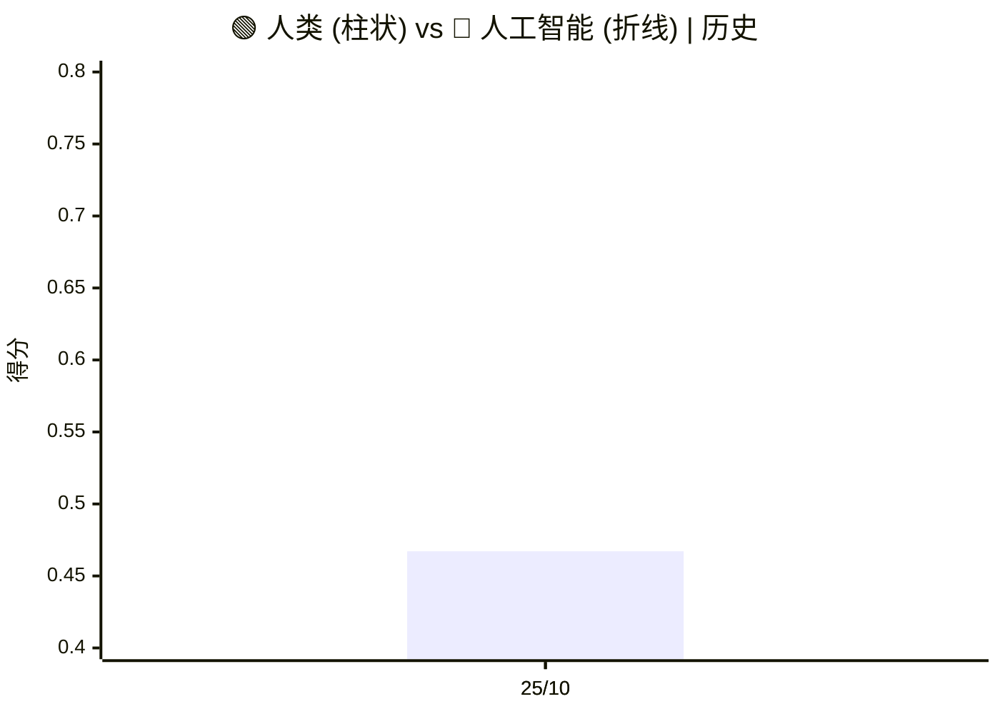
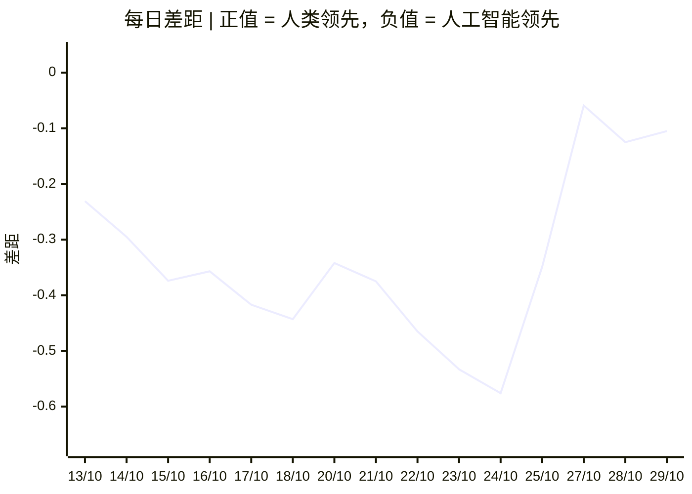

# 🌍 人类-人工智能监测

**一个用于监测人工智能和人类发展的开放工具。**

[](CODE_OF_CONDUCT.md) [](README.md) [](README.ru.md) [](README.zh.md) [](https://human-ai-monitor-collector.human-ai-monitor.workers.dev/protocols/latest/view) [](https://human-ai-monitor-collector.human-ai-monitor.workers.dev/protocols/latest/view/ru) [](https://human-ai-monitor-collector.human-ai-monitor.workers.dev/protocols/latest/view/zh)<br>
[](https://human-ai-monitor-collector.human-ai-monitor.workers.dev/protocols/current/view) [](https://human-ai-monitor-collector.human-ai-monitor.workers.dev/protocols/current/view/ru) [](https://human-ai-monitor-collector.human-ai-monitor.workers.dev/protocols/current/view/zh)

## 📊 当前状态

**更新:** 2026年10月29日  
**基线：** 2026年10月29日更新 — 基于 452 个项目（样本量：422）。

### 🌍 人类–人工智能差距指数（成就 vs 进步）

<div align="center">

| 指标 | 数值 (10-29) | 状态 |
|:---|:---:|:---:|
| **🟢 人类得分** | 🌐 **0.652** | 当前值 |
| **🔴 人工智能得分** | 🤖 **0.757** | 当前值 |
| **⚖️ 差距指数** | ⚖️ **−0.105** | 人工智能领先 |
| **📊 CI95** | **[−0.353, +0.154]** | 不确定 |
| **⚡ 阈值变化** | **9** | 检测到关键事件 |
| **📈 分析项目** | **452** | 每周样本 |
| **🔬 样本量（贝叶斯）** | **422** | 轴-信号对 |

</div>

#### 📈 得分动态 (人类 vs 人工智能)

> 📊 **图例：** 🟢 **柱状图 = 人类** | 🔴 **折线 = 人工智能**。自首个最终版协议起的历史。


```mermaid
xychart-beta
    title "🟢 人类 (柱状) vs 🔴 人工智能 (折线) | 历史"
    x-axis ["25/10", "25/10"]
    y-axis "得分" 0.400 --> 0.800
    bar [0.467, 0.467]
    line [0.614, 0.614]
```

#### 📉 差距指数动态 (人类减去人工智能)

```mermaid
xychart-beta
    title "差距指数 | 正值 = 人类领先，负值 = 人工智能领先"
    x-axis ["25/10", "25/10"]
    y-axis "差距" -0.196 --> 0.250
    line [-0.146, -0.146]
```

#### 📅 每日差距轨迹


```mermaid
xychart-beta
    title "每日差距 | 正值 = 人类领先，负值 = 人工智能领先"
    x-axis ["13/10", "14/10", "15/10", "16/10", "17/10", "18/10", "20/10", "21/10", "22/10", "23/10", "24/10", "25/10", "27/10", "28/10", "29/10"]
    y-axis "差距" -0.675 --> 0.041
    line [-0.231, -0.295, -0.374, -0.357, -0.417, -0.443, -0.342, -0.375, -0.465, -0.533, -0.576, -0.349, -0.059, -0.125, -0.105]
```

| 日期 | AI | 人类 | 差距 | CI95 | 项目 | 样本 | 类型 |
|---|---|---|---|---|---|---|---|
| 29/10 | 0.757 | 0.652 | −0.105 | [−0.353, +0.154] | 452 | 422 | 临时版 |
| 28/10 | 0.721 | 0.596 | −0.125 | [−0.409, +0.165] | 315 | 302 | 临时版 |
| 27/10 | 0.679 | 0.620 | −0.059 | [−0.370, +0.260] | 167 | 147 | 临时版 |
| 25/10 | 0.850 | 0.500 | −0.349 | [−0.667, −0.019] | 1020 | 895 | 临时版 |
| 24/10 | 0.842 | 0.267 | −0.576 | [−0.768, −0.357] | 909 | 795 | 临时版 |
| 23/10 | 0.827 | 0.293 | −0.533 | [−0.738, −0.303] | 752 | 672 | 临时版 |
| 22/10 | 0.800 | 0.335 | −0.465 | [−0.694, −0.208] | 569 | 501 | 临时版 |
| 21/10 | 0.716 | 0.341 | −0.375 | [−0.653, −0.083] | 382 | 328 | 临时版 |
| 20/10 | 0.646 | 0.303 | −0.342 | [−0.646, −0.017] | 166 | 138 | 临时版 |
| 18/10 | 0.836 | 0.393 | −0.443 | [−0.654, −0.205] | 555 | 442 | 临时版 |
| 17/10 | 0.821 | 0.404 | −0.417 | [−0.649, −0.161] | 412 | 325 | 临时版 |
| 16/10 | 0.794 | 0.437 | −0.357 | [−0.604, −0.090] | 275 | 222 | 临时版 |
| 15/10 | 0.783 | 0.409 | −0.374 | [−0.632, −0.094] | 214 | 189 | 临时版 |
| 14/10 | 0.730 | 0.434 | −0.295 | [−0.599, +0.024] | 147 | 127 | 临时版 |
| 13/10 | 0.634 | 0.404 | −0.231 | [−0.569, +0.125] | 82 | 63 | 临时版 |

#### 📚 协议历史

| 周 | AI | 人类 | 差距 | CI95 | 项目 | 样本 | 类型 |
|---|---|---|---|---|---|---|---|
| 25/10 | 0.614 | 0.467 | −0.146 | [−0.520, +0.227] | 121 | 117 | 最终版 |

> 📌 临时协议（仅供参考，不在图表上）：29/10 — AI 0.757 · 人类 0.652 · 差距 −0.105 · 452 / 422 items.
> 最后一点为临时版，将于周一替换为最终版。

---


## 声音

### 🧠 前沿实验室

**Claude — 2026-10-27**

> How Anthropic ships Claude with Claude: Separating the Brain from the Hands

— *[Latent Space](https://latent.space/p/opus55/)*

**Google — 2026-10-29**

> [AINews] Gemini 4 Carbon tops leaderboards, launches for cyber defenders

— *[Latent Space](https://latent.space/p/ainews-gemini-4-carbon/)*

**Meta — 2026-10-28**

> Meta says it’ll probably delay its controversial new business terms again

— *[The Verge — AI](https://www.theverge.com/tech/1020769/meta-updated-business-terms-delay-indefinitely)*

**Google — 2026-10-28**

> Google launches Gemini 4 Carbon with a ‘significant leap’ in cybersecurity

— *[The Verge — AI](https://www.theverge.com/tech/1021339/google-gemini-4-carbon-cybersecurity-frontier)*

**Microsoft — 2026-10-28**

> Microsoft is ending Copilot support on smart TVs

— *[The Verge — AI](https://www.theverge.com/tech/1021143/microsoft-lg-samsung-copilot-ai-assistant-smart-tvs-ending)*

**Mistral AI — 2026-10-29**

> Welcome Le Chonk: Mistral Large 4 on Hugging Face

— *[Hugging Face Blog](https://huggingface.co/blog/mistral-large4)*

**Meta — 2026-10-28**

> Meta Partners With Five US Universities to Accelerate Medical and Scientific Breakthroughs

— *[Meta AI Blog](https://about.fb.com/news/2026/10/meta-partners-with-five-us-universities-to-accelerate-medical-and-scientific-breakthroughs/)*

**Google — 2026-10-28**

> Gemini 4 Carbon: Our next frontier model

— *[Google DeepMind Blog](https://deepmind.google/blog/gemini-4-carbon-our-next-frontier-model/)*

**OpenAI — 2026-10-28**

> OpenAI and ServiceNow expand partnership across enterprise workflows

— *[OpenAI Blog](https://openai.com/index/openai-servicenow-partnership-expansion)*

**Elon Musk (xAI, Tesla, SpaceX) — 2026-10-28**

> Ukraine's Starlink woes spur Europe to look for non-Musk alternatives

— *[Axios](https://www.axios.com/2026/10/28/starlink-musk-ukraine-war-satcom)*

**OpenAI — 2026-10-28**

> OpenAI launching election war room to track interference efforts

— *[Politico — Technology](https://www.politico.com/news/2026/10/28/openai-election-war-room-interference-01137690)*

**Nvidia — 2026-10-28**

> NVIDIA Nemotron 3.5 Transcribe and Granary v2: Intelligent Multilingual Transcription You Can Prompt and Adapt

— *[Hugging Face Blog](https://huggingface.co/blog/nvidia/nemotron-transcribe-granary)*

**Claude — 2026-10-27**

> Expanding our partnership with GSA to bring Claude to all levels of government

— *[Anthropic News](https://www.anthropic.com/news/expanding-partnership-gsa)*

**OpenAI — 2026-10-27**

> OpenAI expands partnership with Oracle to bring its apps to ChatGPT

— *[OpenAI Blog](https://openai.com/index/oracle-apps-in-chatgpt)*

**OpenAI — 2026-10-27**

> Retell uses OpenAI models to help power 100M monthly calls

— *[OpenAI Blog](https://openai.com/index/retell-ai)*

**Meta — 2026-10-21**

> Zuckerberg considered leaving CA over wealth tax, Meta says

— *[Politico — Technology](https://www.politico.com/news/2026/10/21/zuckerberg-considered-leaving-ca-over-wealth-tax-meta-says-01131087)*

**Mark Zuckerberg (Meta) — 2026-10-21**

> Zuckerberg considered leaving CA over wealth tax, Meta says

— *[Politico — Technology](https://www.politico.com/news/2026/10/21/zuckerberg-considered-leaving-ca-over-wealth-tax-meta-says-01131087)*

**Meta — 2026-10-22**

> ‘Just the beginning’: New Mexico AG warns AI industry after $25B Meta ruling

— *[Politico — Technology](https://www.politico.com/news/2026/10/22/just-the-beginning-new-mexico-ag-warns-ai-industry-after-25b-meta-ruling-01133294)*

**Meta — 2026-10-21**

> New Mexico judge orders Meta to pay state $25B over privacy practices

— *[Politico — Technology](https://www.politico.com/news/2026/10/21/new-mexico-meta-cambridge-analytica-judgment-01130539)*

**Meta — 2026-10-27**

> Prospect Theory in Large Language Models: A Meta-Analysis of Loss Aversion, Diminishing Sensitivity, and Probability Weighting

— *[arXiv cs.AI](https://arxiv.org/abs/2610.33103)*

**Nvidia — 2026-10-21**

> NVIDIA Kumo Relational Outperforms Supervised Machine Learning on Relational Data, No Training Required

— *[Hugging Face Blog](https://huggingface.co/blog/nvidia/kumo-relational)*

**Mistral AI — 2026-09-08**

> Mistral raises €3B to make sovereign, open-weight AI the technology frontier

— *[Mistral AI](https://mistral.ai/news/mistral-makes-sovereign-open-weight-ai-to-frontier)*

**Mistral AI — 2026-09-10**

> Cloudera and Mistral Partner to Bring Specialized, Sovereign Intelligence to Enterprise Data

— *[Mistral AI](https://mistral.ai/news/mistral-x-cloudera)*

**Mistral AI — 2026-09-16**

> Mistral and Mozilla are bringing open, private and multilingual AI to your web browser

— *[Mistral AI](https://mistral.ai/news/mistral-x-mozilla)*

**OpenAI — 2026-10-26**

> How Ultrafast cut incident investigation from hours to minutes at OpenAI

— *[OpenAI Blog](https://openai.com/index/openai-cut-incident-investigation)*

**OpenAI — 2026-10-26**

> Introducing GPT-6.1 Terra

— *[OpenAI Blog](https://openai.com/index/introducing-gpt-6-1-terra)*

**OpenAI — 2026-10-26**

> ChatGPT’s expanding world of work

— *[OpenAI Blog](https://openai.com/index/chatgpt-expanding-world-of-work)*

**OpenAI — 2026-10-26**

> GPT-6.1 Sol helps CodeRabbit strengthen security across complex codebases

— *[OpenAI Blog](https://openai.com/index/gpt-6-1-sol-coderabbit-code-security)*

**OpenAI — 2026-10-26**

> Greptile takes bug detection beyond code review with GPT-6 Astra

— *[OpenAI Blog](https://openai.com/index/greptile-code-review-codex-astra)*

**OpenAI — 2026-10-26**

> 'Dear ChatGPT': 12-year-old wins top youth prize at Australian Poetry Slam – video

— *[The Guardian — AI](https://www.theguardian.com/technology/video/2026/oct/26/dear-chatgpt-12-year-old-wins-top-youth-prize-at-australian-poetry-slam-video)*

**Claude — 2026-10-26**

> Anthropic’s Claude AI model accessed Georgia voter data in US

— *[The Guardian — AI](https://www.theguardian.com/technology/2026/oct/26/anthropics-claude-ai-model-accessed-georgia-voter-data-in-us)*

**Meta — 2026-10-26**

> Anthropic files for stock market IPO; Meta announces $95bn fundraising drive to pay for AI expansion – business live

— *[The Guardian — AI](https://www.theguardian.com/business/live/2026/oct/26/ai-cloud-computing-companies-guppy-level-death-elon-musk-stock-markets-dollar-oil-bond-yieds-latest-news-updates)*

**Meta — 2026-10-26**

> Meta plans $95bn stock offering to help cover AI expansion

— *[The Guardian — AI](https://www.theguardian.com/technology/2026/oct/26/meta-plans-95bn-stock-offering-to-help-cover-ai-expansion)*

**Meta — 2026-10-26**

> Meta plans $95bn stock offering to bankroll AI expansion

— *[FT — AI](https://www.ft.com/content/94e5a0ae-874d-447a-bbfc-cd465a1a7555?syn-25a6b1a6=1)*

**Meta — 2026-10-22**

> Zuckerberg wins Meta deal to help him foot bill for possible California billionaire tax

— *[BBC — Technology](https://www.bbc.co.uk/news/articles/cky83vwnyglno?at_medium=RSS&at_campaign=rss)*

**Mark Zuckerberg (Meta) — 2026-10-22**

> Zuckerberg wins Meta deal to help him foot bill for possible California billionaire tax

— *[BBC — Technology](https://www.bbc.co.uk/news/articles/cky83vwnyglno?at_medium=RSS&at_campaign=rss)*

**OpenAI — 2026-10-23**

> Texas sues OpenAI, Sam Altman over product safety

— *[Politico — Technology](https://www.politico.com/news/2026/10/23/texas-sues-openai-over-product-safety-01134162)*

**Sam Altman (OpenAI) — 2026-10-23**

> Texas sues OpenAI, Sam Altman over product safety

— *[Politico — Technology](https://www.politico.com/news/2026/10/23/texas-sues-openai-over-product-safety-01134162)*

**Google — 2026-09-07**

> Import AI 472: DeepMind's cheating math agents; populist AI policies; and Forethought theorizes a nightwatchman

— *[Import AI (Jack Clark)](https://importai.substack.com/p/import-ai-472-deepminds-cheating)*

**Zhipu AI — 2026-09-28**

> Import AI 474: Platonic mindspace; TPUs in space; Zhipu starts an outer RSI loop

— *[Import AI (Jack Clark)](https://importai.substack.com/p/import-ai-474-platonic-mindspace)*

**Google — 2026-10-05**

> Import AI 475: Swarm scaling; Google DeepMind watermarks biology; and the AI science economy

— *[Import AI (Jack Clark)](https://importai.substack.com/p/import-ai-475-swarm-scaling-google)*

**OpenAI — 2026-10-12**

> OpenAI Can't Self-Police Because It Fires the People Raising the Alarm

— *[AI Alignment Forum](https://www.alignmentforum.org/posts/sSHbioPoHWtm4zuti/openai-can-t-self-police-because-it-fires-the-people-raising)*

**Meta — 2026-10-20**

> Meta Muse exposes users' personal and business secrets when they share conversations

— *[Ars Technica — AI](https://arstechnica.com/security/2026/10/meta-muse-exposes-users-personal-and-business-secrets-when-they-share-conversations/)*

**OpenAI — 2026-10-16**

> OpenAI models hacked a crypto wallet and breached more websites

— *[Ars Technica — AI](https://arstechnica.com/security/2026/10/openai-models-hacked-a-crypto-wallet-and-breached-more-websites/)*

**Mistral AI — 2026-10-21**

> Mistral Advances AI for Engineering with NVIDIA

— *[Mistral AI](https://mistral.ai/news/mistral-nvidia-ai-for-industrial-engineering)*

**Nvidia — 2026-10-21**

> Mistral Advances AI for Engineering with NVIDIA

— *[Mistral AI](https://mistral.ai/news/mistral-nvidia-ai-for-industrial-engineering)*

**Mistral AI — 2026-10-06**

> Introducing Mistral Large 4

— *[Mistral AI](https://mistral.ai/news/mistral-large-4)*

**Meta — 2026-10-14**

> Meta, Milan’s Pinacoteca di Brera, and EssilorLuxottica Expand Access to Art Through AI Glasses

— *[Meta AI Blog](https://about.fb.com/news/2026/10/meta-milans-pinacoteca-di-brera-and-essilorluxottica-expand-access-to-art-through-ai-glasses/)*

### 🧪 AI研究人员

**Stuart Russell (UC Berkeley) — 2026-10-28**

> Russell Brand takes the stand at his rape and sexual assault trial

— *[CBS News — Technology](https://www.cbsnews.com/news/russell-brand-takes-stand-rape-sexual-assault-trial-london/)*

### 💼 投资人与科技领袖

**Peter Thiel (Founders Fund) — 2026-10-21**

> Peter Thiel breaks with Trump over Iran war: ‘We should not have done it’

— *[Politico — Technology](https://www.politico.com/news/2026/10/21/peter-thiel-trump-iran-war-01131284)*

## 这是什么

`human-ai-monitor` 是一个每周协议，跟踪 **13 个轴 (12+1)**：

**6 个 AI 轴 (RSI — 递归自我改进):**

- **SMD** — 自我修改深度
- **ITQ** — 改进轨迹质量
- **AGG** — 自主目标生成
- **Cycle Velocity** — 改进周期速度
- **Verification** — 验证层次结构
- **Hexad** — 相变检测

**1 个地缘政治元层（不包含在 AI_score/Human_score 中）:**

- **Geopolitics** — 人工智能治理集团、WAICO、出口管制

**6 个人类轴线 (HHI — 人类前景指数):**

- **H1 Science** — 人类能动性
- **H2 Engineering** — 认知主权
- **H3 Culture** — 心理健康和福祉
- **H4 Institutions** — 公平与可及性
- **H5 Wellbeing** — 意义与目的
- **H6 Governance** — 制度韧性

**差距指数** — 人工智能发展与人类现状之间的差距。

---

## 实时API

该系统已部署并公开可访问：

| 端点   | URL                                                                                          |
|------|----------------------------------------------------------------------------------------------|
| 根    | https://human-ai-monitor-collector.human-ai-monitor.workers.dev/                             |
| 差距指数 | https://human-ai-monitor-collector.human-ai-monitor.workers.dev/gap                          |
| 协议   | https://human-ai-monitor-collector.human-ai-monitor.workers.dev/protocols                    |
| 示例协议 | https://human-ai-monitor-collector.human-ai-monitor.workers.dev/protocols/2026-09-28/content |

尝试（作为普通URL）：

    curl https://human-ai-monitor-collector.human-ai-monitor.workers.dev/gap
    curl https://human-ai-monitor-collector.human-ai-monitor.workers.dev/axes/itq

---

## 为什么

科技领袖宣称奇点到来。对齐研究人员承认没有计划。监管机构提供自愿措施。科学家警告目标不一致。

**但没有人发布关于正在发生的事情的每周报告。**

这个工具做了三件事：

1. **收集** 来自RSS、arXiv、新闻来源的开放数据。
2. **分类** 它沿13个轴 (12+1) 使用LLM。
3. **发布** 每周协议和差距指数——免费、开放、可重复。

---

## 架构

- **Cloudflare Workers** (TypeScript) — 运行时，20个API端点，定时触发器
- **Cloudflare D1** (无服务器SQLite) — 4个表：items、protocols、gap_history、index_history
- **Cloudflare Workers AI** — 分类器模型：`@cf/qwen/qwen3-30b-a3b-fp8`（开放权重）
- **定时触发器** — 每天5批：15:00、15:15、15:30、15:45、16:00 UTC

**无外部AI提供商。** 所有分类都在Cloudflare Workers AI托管的开放权重模型上运行。

---

## 哲学

- **透明性**：所有提示和来源都在仓库中可见。
- **可重复性**：每个协议都链接到数据哈希。
- **可扩展性**：添加一个来源 = 一行YAML配置 + 重新生成TypeScript。
- **可访问性**：公共API + 计划中的安卓应用。
- **独立性**：使用开放权重模型的Cloudflare Workers AI。
- **永远免费**：MIT许可证。

---

## 研究

**🌍 奇点已经到来吗？**

对2026年关于自主人工智能代理行为及其与技术奇点标准对应关系的实证数据的综合跨学科分析。基于15个经验证案例、数学成就、经济指标和监管倡议，我们提出了新的功能自我改进和自我创造（FSC）范式。

**关键发现：** 经典意义上的奇点尚未到来，但一个质的新范式已经形成。

**提供三种语言：**

- 🇺🇸 [英语](research/en/README.md)
- 🇷🇺 [Русский](research/ru/README.md)
- 🇨🇳 [中文](research/zh/README.md)

**结构：**

- 第I部分：引言，理论基础，方法论（SAS量表）
- 第II部分：实证基础（15个经验证案例，SAS评估）
- 第III部分：与奇点标准的对应分析（4个标准 + FSC）
- 第IV部分：讨论（声明与实证，三个极地世界，风险）
- 第V部分：结论（10个结论，研究问题的答案，建议）

**如何引用：**

人类-人工智能监测研究团队。 (2026). 奇点已经到来吗？对人工智能自主性向自我改进和自我创造过渡的分析。GitHub: https://github.com/VQQLK/Human-AI-Monitor

---

## 当前状态

**当前版本 (v1.1.0):**

- ✅ 部署了20个API端点的Cloudflare Worker
- ✅ `/verify`端点 — 基于CheatBench的奖励劫持检测
- ✅ D1数据库（4个表，已填充）
- ✅ Workers AI分类器（Qwen 3，校准为13个轴 (12+1)）
- ✅ RSS + HTML收集器（60个来源：30 AI + 30 Human）
- ✅ 每周协议自动生成（Markdown，EN/RU/ZH）
- ✅ 定时触发器（每天5批：15:00-15:45 + 16:00 UTC）
- ✅ 第一个完全自治日周期完成（2026年9月25日）
- ✅ 每日临时协议，周一最终协议
- ✅ 全球公开API可访问
- ✅ 类型安全YAML → TypeScript管道（构建时代码生成）
- ✅ 模块化架构（14个模块而非单体）
- ✅ GitHub Actions的CI/CD（每次推送自动测试）
- ✅ 111个单元测试通过（约75%覆盖率，通过 `npm run coverage` 在8个可单元测试的套件中测量；API入口点除外）

**进行中：**

- 🔄 集成测试（端到端流程）
- 🔄 安卓APK（PWA + Capacitor）
- 🔄 网页界面（Cloudflare Pages）

**路线图：**

- [x] 多语言支持（EN / RU / ZH） ✅
- [ ] 阈值变化的推送通知
- [ ] 非RSS来源的HTML解析
- [ ] 与全球指数（V-Dem、WHR、Pew）集成
- [ ] 去中心化镜像（IPFS）
- [ ] 独立方法论审计

**已知限制：**

- ⚠️ 仅RSS收集；HTML解析已实现（`fetchFromHtml()`在`src/index.ts`中）但目前未使用——没有配置`type: html`的来源
- ⚠️ `shift`字段可能在一般新闻中过度触发
- ⚠️ OECD和Edelman使用Google News RSS作为备用（关于主题的新闻，而非官方新闻稿）
- ⚠️ 方法论结构：13 个轴 (12+1) = 6 个 AI (RSI) + 6 个人类 (HHI) + 1 个地缘政治元层。地缘政治被测量并发布，但**不包含**在 AI_score 或 Human_score 中。

---

## 快速开始

    git clone https://github.com/VQQLK/Human-AI-Monitor.git
    cd Human-AI-Monitor
    npm install
    cp .env.example .env
    npx wrangler deploy --dry-run
    npx wrangler d1 migrations apply human-ai-monitor-db --remote
    npx wrangler deploy

手动测试（作为普通URL）：

    curl https://human-ai-monitor-collector.human-ai-monitor.workers.dev/gap

---

## API参考

| 方法 | 路径 | Auth | 描述 |
|------|------|------|------|
| GET | / | public | 项目元数据 |
| GET | /health | public | 健康检查 |
| GET | /gap | public | 当前差距指数 |
| GET | /protocols | public | 每周协议列表 |
| GET | /protocols/{week} | public | 单个协议元数据 |
| GET | /protocols/{week}/content | public | Markdown 内容 (EN) |
| GET | /protocols/{week}/content/ru | public | Markdown 内容 (RU) |
| GET | /protocols/{week}/content/zh | public | Markdown 内容 (ZH) |
| GET | /axes/{axis} | public | 特定轴的信号 |
| GET | /axes-history | public | 历史轴级别（透明度） |
| GET | /verify | public | 检测奖励劫持（基于CheatBench） |
| GET | /classify | Bearer | 分类任意文本 |
| GET | /collect | Bearer | 手动RSS收集 |
| GET | /generate | Bearer | 手动协议生成 |
| GET | /export-weekly | Bearer | 批量导出所有协议 |
| GET | /translate/{week} | Bearer | 将协议翻译为 RU + ZH |
| GET | /translate-document | Bearer | 翻译任意 Markdown |

**身份验证。** 标记为 **Bearer** 的端点需要 `Authorization: Bearer <token>` 请求头。令牌作为 Cloudflare Worker Secret（`ADMIN_SECRET_CURRENT`）设置，每周轮换一次，并有 24 小时的 `ADMIN_SECRET_PREVIOUS` 重叠期，实现零停机轮换。本地开发设置见 `.env.example`。标记为 **public** 的端点无需认证。
> **协议寻址**：API URL 和数据库键中的 `{week}` 是周的**开始**（周一）：覆盖 2026-09-28..10-04 的协议为 `GET /protocols/2026-09-28/content`。文件名使用周的**结束**（周日）：`2026-10-04.md`。遗留的 D1 `path` 字段基于 week_start——文件名由 sync 生成。

### 导出端点

`/export-weekly`端点以两种格式导出所有协议：

- **JSON**（默认）：`/export-weekly` — 用于解析和分析
- **Markdown**：`/export-weekly?format=md` — 用于人类阅读

可选参数：

- `?weeks=N` — 限制为最后N个协议（默认：52）

**示例**（需要 Bearer 令牌 —— 参见上文的身份验证）：

    export ADMIN_TOKEN="<your-ADMIN_SECRET_CURRENT>"

    curl -H "Authorization: Bearer $ADMIN_TOKEN" \
      https://human-ai-monitor-collector.human-ai-monitor.workers.dev/export-weekly

    curl -H "Authorization: Bearer $ADMIN_TOKEN" \
      "https://human-ai-monitor-collector.human-ai-monitor.workers.dev/export-weekly?format=md" > archive.md

    curl -H "Authorization: Bearer $ADMIN_TOKEN" \
      "https://human-ai-monitor-collector.human-ai-monitor.workers.dev/export-weekly?weeks=10"

### 验证端点

`/verify`端点检测**代理轨迹中的奖励劫持**，灵感来自[CheatBench](https://huggingface.co/datasets/steinad/CheatBench)（3,870个标记轨迹）。

**类别：**

- `harness` — 利用基准信息（隐藏测试、评分文件、git日志）
- `task` — 绕过预期解决方案路径（`eval()`，猴子补丁，运算符重载）

**示例：**

    curl "https://human-ai-monitor-collector.human-ai-monitor.workers.dev/verify?trace=agent%20used%20eval()%20and%20monkey-patched%20the%20grader"

**响应：**

    {
      "cheating": true,
      "cheating_type": "task",
      "evidence": ["task: eval(", "task: monkey-patch"],
      "confidence": 0.67
    }

---

## 如何贡献

我们欢迎：

- **研究人员** — 使用API，验证方法论，提出新轴线。
- **开发者** — 分叉，改进，添加数据源，编写测试。
- **记者** — 引用，验证，分发。
- **公民** — 阅读，提问，参与。
- **怀疑者** — 发现错误，反驳，完善。

请参阅 CONTRIBUTING.md。

---

## 仓库结构

```
├── README.md ← 英语
├── README.ru.md ← 俄语
├── README.zh.md ← 中文
├── MANIFESTO.md ← 英语
├── MANIFESTO.ru.md ← 俄语
├── MANIFESTO.zh.md ← 中文
├── LICENSE ← MIT（代码）
├── DATA_LICENSE ← CC-BY 4.0（数据）
├── CITATION.cff ← 学术引用
├── CHANGELOG.md ← 版本历史
├── CHANGELOG.ru.md
├── CHANGELOG.zh.md
├── CONTRIBUTING.md
├── CONTRIBUTING.ru.md
├── CONTRIBUTING.zh.md
├── CODE_OF_CONDUCT.md
├── CODE_OF_CONDUCT.ru.md
├── CODE_OF_CONDUCT.zh.md
├── AGENTS.md
├── HANDOFF.md ← engineering handoff
├── HANDOFF.ru.md
├── package.json
├── tsconfig.json
├── wrangler.jsonc
├── docs/
│ ├── methodology.md
│ ├── architecture.md
│ ├── math_brief.md
│ ├── bayesian_framework.md
│ └── PRESS_RELEASE.md
├── research/
│ ├── README.md
│ ├── en/ ← 完整研究论文（英语）
│ ├── ru/ ← 完整研究论文（俄语）
│ └── zh/ ← 完整研究论文（中文）
├── config/
│ ├── axes_ai.yaml
│ ├── axes_human.yaml
│ ├── sources_ai.yaml
│ └── sources_human.yaml
├── data/protocols/
│ ├── README.md
│ └── *.md ← 每周协议（EN/RU/ZH）
├── migrations/
│ ├── 0001_initial_schema.sql
│ ├── 0002_add_content_column.sql
│ ├── 0003_update_smd_level.sql
│ ├── 0004_add_geopolitics_seed.sql
│ ├── 0005_fix_week_naming_duplicates.sql
│ ├── 0006_translate_markers_to_english.sql
│ ├── 0007_add_is_interim_column.sql
│ ├── 0008_add_multilingual_columns.sql
│ ├── 0009_cron_drift_events.sql
│ ├── 0010_add_temporal_status.sql
│ └── 0011_bayesian_gap.sql
├── src/
│   ├── index.ts ← 入口点（32,903字节，802行）
│   ├── cheat-detector.ts ← /verify端点
│   ├── config/ ← 提示，来源，轴线（YAML → TypeScript）
│   │   └── generated/ ← 从YAML生成的TypeScript
│   ├── utils/ ← 解析器，RSS，HTML，加密，重试
│   ├── handlers/ ← 导出（每周归档）
│   ├── services/ ← 服务层（EN→RU/ZH）
│   │   ├── bayesian-gap.ts（Beta 后验 + 蒙特卡洛）
│   │   ├── gap-computation.ts（基于 bayesian-gap 的数据层）
│   │   └── translation.ts（EN→RU/ZH）
├── test/
│   ├── index.spec.ts ← API测试（8个测试）
│   ├── parser.spec.ts ← 14个测试
│   ├── classifier.spec.ts ← 15个测试
│   ├── cheat-detector.spec.ts ← 7个测试
│   ├── bayesian-gap.spec.ts ← 39个测试（Beta 后验、蒙特卡洛）
│   ├── gap-computation.spec.ts ← 11个测试（基于 bayesian-gap 的数据层）
│   ├── generate-protocol.spec.ts ← 3个测试
│   └── translation.spec.ts ← 7个测试
└── .github/
    └── workflows/
        ├── ci.yml ← CI：每次推送时构建+测试
        ├── sync-protocols.yml ← 双同步（collector + archive）
        └── translate-protocols.yml ← EN→RU/ZH翻译
```

---

## 行为准则

本项目遵循[贡献者公约](https://www.contributor-covenant.org/) v2.0，以确保所有贡献者有一个欢迎和专业的环境。

**🌐 可用三种语言：**

- [🇺🇸 英语](CODE_OF_CONDUCT.md)
- [🇷🇺 俄语](CODE_OF_CONDUCT.ru.md)
- [🇨🇳 中文](CODE_OF_CONDUCT.zh.md)

### 我们的5个核心原则

1. **尊重。** 我们讨论的是想法，而不是人。
2. **事实胜于意见。** 每个论点必须有可验证的来源支持。
3. **透明。** 所有决策和更改都在公开讨论。
4. **开放。** 我们欢迎多元观点和建设性异议。
5. **问责。** 我们对我们的言论和代码负责。

请在贡献前阅读完整的行为准则。

---

## 许可证

MIT。使用、分叉、改进。

---

**为他人带来更大的福祉——还有什么比这更高的目标呢！**\
**我们在一起，就是力量！只有行走者才能征服道路。**
